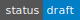
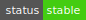
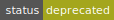

# Contributing Guidelines

You want to contribute to Tari, and we want you to contribute! So why is it sometimes hard to get this done?

This is financial software, so we have to take precautions to ensure that harmful code doesn't slip in anywhere. 
We know that _you_ are a great person and are just trying to help. But there are not-so-nice people 
out there that want to see the world burn. These guidelines are primarily for those miscreants, but everyone 
needs to 
follow them.

These guidelines are not cast in stone, or should we say, not committed to the blockchain. We are constantly 
evaluating what works, what doesn't work and will update the guidelines from time to time as we learn. We also draw 
inspiration from other successful open-source projects and adapt the best ideas for our purposes.

The goals of having these guidelines are fourfold:
1. To maintain a **secure and reliable codebase**. This is paramount.
2. To maintain **high-quality code**. This means thinking hard about 
  * fostering a fantastic developer experience, 
  * by writing beautiful, ergonomic APIs, 
  * using clean patterns, 
  * writing excellent documentation, 
  * producing very high code coverage on tests, 
  * having tests run in a reasonable time, 
  * and keeping technical debt to a minimum.
3. To keep the code **open** (as in free).
4. To keep the code open (as in **encouraging**). If we achieve #2, this comes for free. But have fun doing it. 

These guidelines are split up into a few main topics:

* [The Release Process](#the-tari-release-process). This explains how the release schedule for Tari works post-mainnet 
  launch. 
* The [Feature RFC process](#feature-rfc-process) describes how new features get into Tari, from conception 
  to implementation.
* [Pull requests](#pull-requests). This section offers guidelines on how to get your code merged into the code base 
  with the minimum of fuss. 
* [Code reviews](#code-reviews) are integral to keeping the code secure and performant. This section 
  offers tips for effective preventing bugs from scuttling past your gimlet gaze. 
* Bug bounty and disclosure policy.

# The MinoTari release process

The MinoTari release process draws inspiration from the Rust [compiler release process] and borrows some of its key 
ideas.

The process is well-suited for a large open-source project that desires a regular release schedule but also needs 
the flexibility of having features being "in development" over several cycles. See specifics about managing the [release cycle](./docs/src/branching_releases.md).

## Release branches

Post mainnet, there are 4 release branches in the MinoTari repo:

* `mainnet` - the code on this branch represents the latest "official release". Almost every commit on this branch 
  will be tagged with a version number.
* `development` - this is the cuttingest-of-edge branch. Almost all new code comes in via the `development` branch.
* `nextnet` - the code on this branch will become the `mainnet` branch on the next release. Feature code from 
  `Esmeralda` will be present here, but if they are not yet ready for release, they will be disabled behind a feature 
  gate.
* `Esmeralda` - this branch contains experimental features that might not work, be rigorously tested, or even break 
  consensus if the code were to run on mainnet.

Almost all new code enters the codebase via the `development` branch. Every release cycle, the `Esmeralda` branch is reset
to point to a recent `development` commit, along with the set of newly gated features that are ready for testing. This
process is described in more detail below.

Hotfixes and urgent updates can be made on 
other branches from time to time. These changes will then be cherry-picked into the other branches to keep 
the code base consistent.

## Testnets

There will also be three testnets in addition to mainnet:

* `mainnet` - the "real-money" network.
* `stagenet` - a testnet version of mainnet. Nodes on stagenet should all be running code built from the `mainnet`
  branch to replicate mainnet as close as possible. The base node version on `stagenet` will always match
  the latest `mainnet` release. Network resets (i.e. a new genesis block) should be very rare.
* `nextnet` - nodes on nextnet should be running code compiled from the `nextnet` branch. This is the last chance to
  battle-test new features before they hit mainnet. Network resets should be somewhat rare.
* `Esmeralda` - The Esmeralda network is the most experimental of the testnets. Things can break here. We hope they 
  won't, obviously, but the Esmeralda network is where we should be catching any and all major issues _before_ 
  the feature heads to nextnet. Nodes should be running code built from the `Esmeralda` branch. Network resets could 
  occur fairly frequently, perhaps several times a year.
  * `localnet` - While not strictly a testnet, this is the default testnet used when compiling and running the `development` branch. 

## Feature gates

When developing a new feature in Tari, it will initially be placed behind a feature gate. This offers the comfort and 
flexibility that should a feature not be ready in the first 6-8 months of development (i.e. by the time it first hits 
the `mainnet` branch), it will not be active on mainnet, since the feature will not be active.

The name of the feature gate is assigned in the tracking issue of the RFC that describes the feature. New features 
initially have a status of `New`. New features are only included in Esmeralda binaries. They are ignored in nextnet or 
mainnet builds. A feature can be tested on the `Esmeralda` testnet for as long as necessary. 

Once the feature is ready for final testing, it can be enabled in the next release of `nextnet`, by updating 
the feature status to `Testing`. All `Testing` features will be included in nextnet builds.  

Once the community feels that the feature is ready for mainnet, it will be activated by promoting the 
feature status to `Active`. The attributes marking the feature in the code are removed at this point. The 
feature record remains in `build.rs` with an `Active` state in perpetuity so that the history of feature development 
can be maintained.

If we decide to kill a feature, we do NOT remove the feature gate record in `build.rs`, but mark it as `Removed`. 
This maintains the record of the feature development history. The code marked by this attribute may be removed.

## Versioning

The release period is **TWO MONTHS**.

At every release period, 
* the HEAD of `development` becomes `Esmeralda`. New features that are ready for testing are created with a `New` status.
* the HEAD of `Esmeralda`  becomes `nextnet`. Any features that are in the stabilisation cycle are updated to `Testing`.
* Otherwise, all in-development features on `Esmeralda` remain behind feature gates. Features that are ready to go 
  live in the following release are updated to `Active`.
* the HEAD of `nextnet` becomes `mainnet`. A new version is tagged and this becomes the next mainnet release.

Each release is also versioned and tagged with a version number.

The version number roughly follows [semver semantics](https://semver.org/):
* Increase MAJOR version number on each hard fork.
* Increase MINOR version number on each release cycle. 
* Minor versions are reset to zero at each hard fork.
* Increase PATCH version for hotfixes.

There are some implications for this model:
* Hard-fork features MUST hit mainnet at least 2 months before the feature goes live. i.e., nodes and miners have 2 
months to upgrade their software.
* However, sometimes Monero forks happen in under 2 months, so there may be occasional “quick releases” where we 
  execute a release cycle outside the usual cadence.

Note that hard-fork activations are not necessarily triggered by feature gates. Hard forks are usually triggered by 
flag days based on block height. This means that if hard-fork code is behind a feature gate, this feature needs to 
be `Active` well before the flag day so that it will trigger at the appropriate time.

[compiler release process]: https://internals.rust-lang.org/t/release-channels-git-branching-and-the-release-process/1940

## Deployment tools

The release process is somewhat complex. There are a set of bots that help manage and automate this process.

_The dev community is currently evaluating bots to employ for this purpose_.

* TBD - release management bot
* TBC - binary release / CD bot

## Feature RFC process

Standard issue management is used for bug fixes, performance improvements, and technical debt repayments. Larger
features, and substantial changes to how Tari works get implemented via the RFC process.

A very rough outline of the flow goes as follows:

- Someone has an idea for an improvement or feature.
- They bring it up and discuss it with the community in the [Discord] #dev channel.
- Someone --usually the leading proponent-- writes up a detailed specification of the proposal as an RFC and submits it 
  as a PR to the [RFC repo].
- The community reviews and comments on the RFC. At this stage, a number for the RFC will be assigned.
- After several drafts and revisions, the PR gets merged, and the RFC enters
  .
- At this point, the RFC can still undergo changes via PRs. The RFC remains in
  , and the changes are logged in a _Change Log_  
  maintained at the bottom of the RFC.
- If someone wants to implement the RFC, usually the RFC author -- but it needn't be -- they will create a tracking 
  issue for the RFC. The tracking issue collects all the conversations around the implementation of the RFC in one 
  place. The status RFC will then change to . A feature gate 
  name will be assigned to the feature at this stage.
- Development for this feature happens behind the feature gate, and PRs are submitted against the `development` branch.
- Once the implementation is complete and active on Esmeralda, the RFC status can then be changed to
  .
- The RFC should be updated to match the implementation. The changes must be summarised in the Change Log. Once the 
  feature is stabilised and is live on mainnet, the status can be updated to
  .

If an RFC ever becomes redundant, DO NOT delete it. Mark the RFC as 
 and move it to the _Deprecated_ chapter of the RFC handbook.


The source code must ultimately be the source of truth for the Tari implementation.
If the code and RFC have deviated substantially, mark it .
Then file an issue asking someone to kindly update the RFC and bring it back in line with the code.

Taking on this thankless task is an excellent way for new contributors to learn the code base and quickly add value 
to the project!

[Discord]: https://discord.gg/q3Sfzb8S2V
[RFC repo]: https://github.com/tari-project/rfcs

## Pull requests

You're submitting your first, or hundredth, PR to the Tari codebase. Congratulations! The core team could really use 
the help. But they also need to be super careful since after mainnet launch, the Tari code is managing real money. 

It's therefore typical and even expected for Pull Requests to undergo several revisions before being merged. You 
can expect (constructive) feedback and suggestions for improvements that will typically reflect the ideas espoused 
in the following set of guidelines.

### PRs do one job
[do one job]: #prs-do-one-job

This is really important. A single PR needs to address a single thing. This is not Congress, where bills have 
dozens of unrelated things wadded into them in the hope that they're more likely to sneak through with the main 
proposal.

Keeping PRs focused on one thing has many benefits:
- It keeps PRs [small](#prs-are-small).
- It maintains focus. It would suck if an entire PR was blocked from being merged because some other unrelated 
  change was causing an issue.

If a PR tries to do too much multi-tasking, it will likely be labelled `CR-one_job` and parked. The solution is 
simple: Break the PR up into 2 or more PRs, each addressing a single issue. Mention in the git comments that you 
have done this.


### PRs are small

PRs should be under 400 lines long. 

Unit tests do not count towards this line count.

Documentation and RFCs do not contribute to line count. However, RFC PRs should generally not have any code in them 
at all (since PRs [do one job]). 

In some circumstances, green-field code can break this rule. But then you really MUST make reviewers' lives as easy 
as possible by offering multiple commits, reams of documentation, git commit messages and helpful tests.

The 400 line limit represents about an hour of solid code review time. Research indicates that spending more than 
this in a single session leads to significantly more bugs scuttling through the door.

If your PR is long, you can expect a reviewer to label it `CR-too_long` and ask you to break it up.

If you really, really, can't break it up, then do some [git commit farming] to break the PR up into PR-sized commits.

### Use git messages liberally

Before submitting your PR for the first time, use `git rebase` as described in [git commit farming] to edit and 
clean up your commit messages. The messages should supplement the documentation in the code, not just repeat it. 
This contains the meta-information; _why_ you are making a change, rather than _what_ it does.

For example, a lousy commit message is:

```text
Refactor signature check
```

We can see that you've changed the signature check code! But we don't know why. 

A better message is

```text
The signature check was checking each signature in the block independently. So for n signatures, the time-scaled by
O(n).
We can optimise this check by making use of an aggregated signature check, as described by 
[Alice and Bob](https://y.at/yat.coin). This was codified and included in tari_crypto PR #1234.
Changing the signature check to use this improved overall block validation times by 65% (see benchmarks in the
next commit). 

All tests still pass but could improve coverage by adding additional tests with large numbers of 
signatures (TODO - not in this PR)
```

You may find that a reviewer tags your PR with `CR-insufficient_context`. They are asking you to add 
additional context for the change. This can be submitted by tidying up and expanding your git commit messages, the 
PR description, or both.

The commit messages are combined to form the Pull Request's narrative when the PR is merged.
Ideally, if someone reads the `git log` for your PR, they'll have a clear picture of why and how the changes were 
introduced.

## Code reviews

Post-mainnet, PRs require 3 or more positive reviews from previous contributors, including at least one positive 
review from a contributor with write access to the repo.

When reviewing PRs, here are some guidelines and suggestions to help maintain the safety and quality of code:

* PULL the code and review and test it locally on your machine.
* Do not spend more than 1 hour reviewing a PR at a time. 
* Do not review more than 400 LOC in an hour.

If either of these guidelines cannot be met, you may label the PR `CR-too_long` and politely ask the contributor to 
revise their PR. Otherwise, take breaks and review the PR over multiple sessions or days.

* Obviously, your main goal of the review is to 
  * find bugs,
  * identify edge cases that aren't handled properly,
  * ensure that the stated goal of functions (as per the docstrings and/or RFC) matches the code as written.

All **public** methods and functions must have a decent docstring.
If docstrings are missing, and the purpose of a function or method is not clear, then ask the contributor to  
provide it by tagging the PR with `CR-docs`.

* Read the commit messages! They give the context for the change and why (according to the author) they are required.

If there is insufficient justification in your view, or the git messages are too ["haaaands"y], then label the PR 
`CR-insufficient_context` and ask the author to address this.

If the PR tends to change things arbitrarily  because the "author likes it that way" (e.g. they change from _this_ 
crate to _that_ crate, or names of things get changed seemingly arbitrarily), we should be wary of merging the PR 
unless there are substantial performance, security, or readability reasons. This justification must be 
provided in the commit messages. 
If not, label the PR `CR-insufficient_justification`. If the author does not provide 
additional justification AND the other reviewers agree with your assessment, then this is grounds for rejecting 
and closing the PR.

There are also some non-goals for a code review:
* Do NOT make comments related to formatting or linting. If our linter doesn't care, neither should you. If the 
  linter doesn't like something, the CI tasks will catch it and fail the PR.
* You MAY make Clippy-like suggestions for making code cleaner, more Rust-y, or more readable. But be aware that we 
  _do_ run Clippy as part of the CI process and require all errors to be resolved.
* There should be decent test coverage, but 100% coverage is an ideal, not a requirement.

If PR doesn’t have 100% coverage or breaks something non-critical, we may still merge it at our discretion as long as
* Issues have been generated and triaged to cover the gaps.
* The changes are behind a feature gate.

In your code review summary, please mention
* How much effort went into the review (e.g. full review, untested but looks ok - aka "UT ACK", Github review)
* Which areas you spent the most time on.

This can help inform other reviewers how much effort they should commit and which areas they should focus on. 

Some resources that may be useful:
* https://smartbear.com/learn/code-review/best-practices-for-peer-code-review/
* https://sourcelevel.io/pull-requests-checklists-metrics-and-best-practices-a-definitive-guide
* https://www.atlassian.com/blog/git/written-unwritten-guide-pull-requests

["haaaands"y]: https://xkcd.com/1296/

# Details

## PR labels

A reviewer may tag a PR with one or more labels during a review.

These labels indicate to the PR author and other reviewers,
* that *changes are required* to make reviewing the PR easier (`CR-*`)
* to *categorise* the PR, e.g. tests-only or consensus breaking. (`C-*`)
* where the PR is in the review process (`P-*`)

### Changes Requested (CR)

* `CR-too_long` - Your PR is too long. Follow [these tips](#prs-are-small) to resolve this and resubmit.
* `CR-one_job` - Your PR is not following the [do one job] rule. This should be 2 or more PRs.
* `CR-insufficient_context` - Your PRs commit messages don't provide enough context to justify accepting the
  change.
* `CR-insufficient_justification` - The PRs contain too many seemingly arbitrary changes (name changes, refactoring) 
  without giving sufficient justification as to why the changes make things better, safer or faster.
* `CR-docs` - Your PR would be improved by including documentation (docstrings, module documentation and/or judicious
  comments).
* `CR-needs_rfc` - This PR suggests a significant enough change to require a formal RFC.

### Categorisation (C)

Describes the type of PR or issue. E.g.

* `C-Documentation` - This PR is exclusively or dominantly adding to documentation. 
* `C-RFC` - This PR introduces or contributes to an RFC.
* `C-tests` - This PR exclusively adds new test cases.
* `C-benchmark` - This PR exclusively adds or fixes benchmark code.
* `C-formatting` - This PR is exclusively formatting related, e.g. the result of running `cargo fmt`. This tag
  should seldom be applied since the CI process already enforces Clippy and formatting compliance, but it is added
  for completeness.
* `C-tech_debt` - The PR tidies up technical debt. It will typically be attached to an issue carrying the same label.
* `C-performance` - The PR adds no new functionality but improves performance. Benchmarks will be included.
* `C-bug` - The PR fixes a bug, typically associated with an issue.
* `C-tracking_issue` - This is a tracking issue for an RFC implementation.

### Area (A)

Describes the functional area of the code the PR or issue covers predominantly. E.g.

* `A-base_node`
* `A-comms`
* `A-wallet`
* `A-templates`
* `A-dan`
* `A-tari_engine`

### Process-related (P)

"P" labels are process-related and used to identify where we are in the CI code/review/merge process. They are often
managed by the CI bots. E.g.

* `P-waiting_on_author` - The approval process is paused pending action from the PR author.
* `P-waiting_on_reviewer` - The approval process is paused pending action from a reviewer.
* `P-approved` - The PR has been approved and will be merged soon. 
* `P-queued_for_merge` - The PR is being merged by the CI process.

### Experience level (E)

These labels indicate the level or type of experience needed to address. Examples:

* `E-good_first_issue`
* `E-cryptographer`
* `E-medium`
* `E-expert`

### Warnings (W)

* `W-consensus_breaking` - This PR changes consensus rules and would require a hard-fork to implement.
* `W-network_breaking` - This PR changes networking messages and requires care when deploying.
* `W-transaction_breaking` - This PR changes data that wallets use to send transactions. This might not cause 
a hard fork, but wallets may not be able to recover funds or interact with each other.

[git commit farming]: https://www.tari.com/git-farming/ "The Tari Blog: Git farming or, How to get your PRs merged into Tari"

# Automated CI checks

The Tari CI process carries out several checks that must pass before a PR will be merged, or even reviewed:

* PR title
* Licence information
* Formatting
* Coding style
* Unit tests

## PR title

Commit messages, or more specifically, PR titles, need to conform to the 
[Conventional Commits](https://www.conventionalcommits.org/en/v1.0.0/) conventions.

If you fall afoul of this, simply edit your PR title, and the test will automatically run again.


## License information

All new source files MUST have relevant license information at the top of the file. Use the BSD-3 license for all 
Tari code.

Scripts, HTML, CSS, binary files, configuration files, and other non-source types are not subject to this
requirement. See the [license check script] for the complete list of extensions that are ignored for this check.

The following text is recommended:

```text
// Copyright 2022 The Tari Project
// SPDX-License-Identifier: BSD-3-Clause
```

You can run the [license check script] to help identify any files that are missing 
license info.

[license check script]: ./scripts/file_license_check.sh

## Formatting

PRs are checked for formatting using the command:

```
cargo fmt --all -- --check
```

If your tests fail here, simply run

```
cargo fmt --all
```

If this does not work:

* Is rust fmt installed? `rustup component add rustfmt` 
* It is installed, but the check still fails? Check that your rust version matches the one in our CI toolchain. You 
  can inspect this in the `env.toolchain` field in the [Github Action CI workflow](.github/workflows/ci.yml)

# Code style

Tari uses Clippy to encourage consistent and idiomatic Rust code.

Clippy does not support project-wide Clippy configuration files at the moment. Tari uses `cargo-lints` instead and 
defines global linting rules in `lints.toml`.

The CI enforces these lints, so check your code with:

```
cargo lint clippy --all-targets
```

**Note:** 
Generally, you should not put explicit crate level `deny` attributes in the code, and prefer to put them 
in the `lints.toml`. You SHOULD however, put crate level `allow` attributes, so that developers running `cargo clippy` 
will not encounter these warnings.

## Unit tests

Most importantly, all unit tests must pass. The CI uses the following command when running tests

```text
cargo test --all-features
```

Tests are run in both debug and release mode.