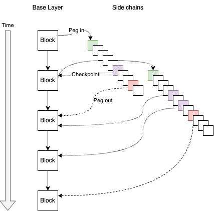

# RFC-0001/Overview

## Overview of Tari Network

**Maintainer(s)**: [Cayle Sharrock](https://github.com/CjS77)

# Licence

[ The 3-Clause BSD Licence](https://opensource.org/licenses/BSD-3-Clause).

Copyright 2018 The Tari Development Community

Redistribution and use in source and binary forms, with or without modification, are permitted provided that the
following conditions are met:

1. Redistributions of this document must retain the above copyright notice, this list of conditions and the following
   disclaimer.
2. Redistributions in binary form must reproduce the above copyright notice, this list of conditions and the following
   disclaimer in the documentation and/or other materials provided with the distribution.
3. Neither the name of the copyright holder nor the names of its contributors may be used to endorse or promote products
   derived from this software without specific prior written permission.

THIS DOCUMENT IS PROVIDED BY THE COPYRIGHT HOLDERS AND CONTRIBUTORS "AS IS", AND ANY EXPRESS OR IMPLIED WARRANTIES,
INCLUDING, BUT NOT LIMITED TO, THE IMPLIED WARRANTIES OF MERCHANTABILITY AND FITNESS FOR A PARTICULAR PURPOSE ARE
DISCLAIMED. IN NO EVENT SHALL THE COPYRIGHT HOLDER OR CONTRIBUTORS BE LIABLE FOR ANY DIRECT, INDIRECT, INCIDENTAL,
SPECIAL, EXEMPLARY OR CONSEQUENTIAL DAMAGES (INCLUDING, BUT NOT LIMITED TO, PROCUREMENT OF SUBSTITUTE GOODS OR
SERVICES; LOSS OF USE, DATA OR PROFITS; OR BUSINESS INTERRUPTION) HOWEVER CAUSED AND ON ANY THEORY OF LIABILITY,
WHETHER IN CONTRACT, STRICT LIABILITY OR TORT (INCLUDING NEGLIGENCE OR OTHERWISE) ARISING IN ANY WAY OUT OF THE USE OF
THIS SOFTWARE, EVEN IF ADVISED OF THE POSSIBILITY OF SUCH DAMAGE.

## Language

The keywords "MUST", "MUST NOT", "REQUIRED", "SHALL", "SHALL NOT", "SHOULD", "SHOULD NOT", "RECOMMENDED",
"NOT RECOMMENDED", "MAY" and "OPTIONAL" in this document are to be interpreted as described in
[BCP 14](https://tools.ietf.org/html/bcp14) (covering RFC2119 and RFC8174) when, and only when, they appear in all capitals, as
shown here.

## Disclaimer

This document and its content are intended for information purposes only and may be subject to change or update
without notice.

This document may include preliminary concepts that may or may not be in the process of being developed by the Tari
community. The release of this document is intended solely for review and discussion by the community of the
technological merits of the potential system outlined herein.

## Goals

The aim of this proposal is to provide a very high-level perspective of the moving parts of the Tari protocol.

## Related Requests for Comment

- [RFC-0100: Base layer](RFC-0100_BaseLayer.md)
- [RFC-0300: Digital asset network](RFCD-0300_DAN.md)
- [RFC-0310: Digital assets](RFC-0311_AssetTemplates.md)

## Description

### Abstract

The Tari network comprises two layers:

1. A base layer that deals with [Tari coin] [transaction]s. It governed by a proof-of-work (PoW) blockchain that is merged-mined with
   Monero. The base layer is highly secure, decentralized and relatively slow.
2. A digital assets network (DAN), consisting of multiple independent side-chains, that manage the state of the native digital assets.
   Usually, these side-chains favour liveness and scalability at the expense of decentralisation, but this need not be the
   case.

### Currency Tokens and Digital Assets

There are two major digital entities on the Tari network: the coins that are the unit of transfer for the Tari
cryptocurrency, and the digital assets that could represent anything from tickets to in-game items.

Tari coins are the fuel that drives the entire Tari ecosystem. They share many of the properties of money, so
security is a non-negotiable requirement. In a cryptocurrency context, this is usually achieved by employing a
decentralized network running a censorship-resistant protocol such as Nakamoto consensus over a proof-of-work blockchain.
As we know, PoW blockchains are not scalable or very fast.

On the other hand, the Tari network will be used to create and manage digital assets.

In Tari parlance, a digital asset is defined as a finite set of digital stateful tokens that are governed by predefined
rules. A single digital asset may define anything from one to thousands of tokens within its scope.

For example, in a ticketing context, an _event_ might be an asset. The asset definition will allocate tokens representing
the tickets for that event. The ticket tokens will have state, such as its current owner and whether or not it has been
redeemed. Users might be interacting with digital assets hundreds of times a second, and state updates need to be
propagated and agreed upon by the network very quickly. A blockchain-enabled ticketing system is practically useless if
a user has to wait for "three block confirmations" before the bouncer will let her into a venue. Users expect near-instant
state updates because centralized solutions offer them that today.

Therefore the Tari DAN must offer speed and scalability.

#### Multiple Layers

The [distributed system trilemma](https://en.wikipedia.org/wiki/CAP_theorem) tells us that these requirements are
mutually exclusive.

We can't have fast, cheap digital assets and also highly secure and decentralized currency tokens on a single system.

Tari overcomes this constraint by building two layers:

1. A base layer that provides a public ledger of Tari coin transactions, secured by PoW to maximize security.
2. A DAN consisting of multiple independent side-chains that each manage the state of a digital asset. They are typically
   very fast and cheap, at the expense of decentralization.

If required, the digital assets layer can refer back to the base layer to temporarily give up speed in exchange for
increased security. These commitments allow token owners to make attestations based on their asset state without relying completely on
the side-chain infrastructure.

### Base Layer

_Refer to [RFC-0100/BaseLayer](RFC-0100_BaseLayer.md) for more detail_.

The Tari base layer has the following primary features:

- PoW-based blockchain using Nakamoto consensus
- Transactions and blocks based on the [Mimblewimble] protocol

[Mimblewimble] is an exciting new blockchain protocol that offers some key advantages over other [UTXO]-based
cryptocurrencies such as Bitcoin:

- Transactions are private. This means that casual observers cannot ascertain the amounts being transferred or the
  identities of the parties involved.
- Mimblewimble has a different set of security guarantees to Bitcoin. The upshot of this is that you can throw away UTXOs
  away once they are spent and still verify the integrity of the ledger.
- Multi-signature transactions can be easily aggregated, making such transactions very compact, and completely hiding
  the parties involved, or the fact that there were multiple parties involved at all.

> "Mimblewimble is the most sound, scalable 'base layer' protocol we know" -- @fluffypony

#### Proof of Work

There are a few options for the PoW mechanism for Tari:

- Implement an existing PoW mechanism. This is a bad idea, because a nascent cryptocurrency that uses a non-unique
  mining algorithm is incredibly vulnerable to a 51% attack from miners from other currencies using the same algorithm.
  Bitcoin Gold and Verge have already experienced this, and it's a [matter of time](https://www.crypto51.app/) before it
  happens to others.
- Implement a unique PoW algorithm. This is a risky approach and comes close to breaking the number one rule of
  cryptocurrency design: never roll your own crypto.
- [Merged mining](https://tari-labs.github.io/tari-university/merged-mining/merged-mining-scene/MergedMiningIntroduction.html).
  This approach is not without its own risks, but offers the best trade-offs in terms of bootstrapping the network. It
  typically provides high levels of hash rate from day one, along with 51% attack resistance, assuming mining pools are
  well-distributed.
- A hybrid approach, utilizing two or more of the above mechanisms.

Ultimately, the community decided to employ a hybrid mining approach. On average, 60% of block rewards come from Monero merge-mining,
 while 40% come from standalone SHA-3-based mining algorithm.  More information on Tari's current approach can be found in [RFC-0131_Mining].

### Digital Assets Network

A more detailed proposal for the DAN is presented in [RFC-0300/DAN](RFCD-0300_DAN.md). Digital assets
_are discussed in more detail in [RFC-0310/Assets](RFC-0311_AssetTemplates.md)._

The DAN is focused on achieving high speed and scalability, without compromising on security. To achieve
this we make the explicit trade-off of sacrificing decentralization. Generally, the primary parties that have a stake in the
security of a given digital asset are the Asset Issuer and Token owners. This fact points to a natural centralization of control
of an asset by the Asset Issuer.

Digital Assets consist of a set of tokens and their associated state. The state of an asset's tokens will be managed on a side-chain
that will run in parallel to the Tari base layer. The consensus mechanism, ledger style and other characteristics of the side-chain
will be chosen and managed by the Asset Issuer.

There are many options for the nature of these side-chains. These are still under discussion but it will be possible to run
multiple types of side-chains in the DAN and an Asset Issuer can choose which best suits the asset type it is supporting.

Please refer to Tari Labs University (TLU) for detailed discussions on
[layer 2 scaling solutions](https://tlu.tarilabs.com/layer2scaling/layer2scaling-landscape/layer2scaling-survey.html)
and
[consensus mechanisms](https://tlu.tarilabs.com/consensus-mechanisms/BFT-consensus-mechanisms-applications/Introduction.html).

### The role of the base layer

The Base Layer fulfils these, and only these, major roles:

1. It manages and enforces the accounting and consensus rules of the base Tari (XTR) token. This includes standard payments,
   and simple smart contracts such as cross-chain atomic swaps.
2. It maintains the Digital Asset register. This includes functionality for side-chain management, checkpoints, and transfer
   of funds into and out of side-chains.
4. Maintain a register of smart contract templates. This allows users to verify that digital assets are running the code that they 
   expect and includes functionality like version tracking.

In general, the base layer knows _nothing about the specifics of what is happening on the side-chains_. It only cares
that no Tari is created or destroyed, and that the flow of funds in and out of side chains are carried out by the appropriate
authorised agents.

This is by design: the network cannot scale if details of digital asset contracts have to be tracked on the base layer.
We envisage that there could be hundreds of thousands of contracts deployed on Tari. Some of those contracts may be enormous;
imagine controlling every piece of inventory and their live statistics for a massively multiplayer online role-playing
game (MMORPG). The base layer is also too slow. If _any_ state relies on base layer transactions being confirmed, there
is an immediate lag before that state change can be considered final, which kills the liveness properties we seek for the DAN.

It is better to keep the two networks almost totally decoupled from the outset, and allow each network to play to its
strength.

That said, there are key interactions between the two layers. The base layer is a ledger and can be used as a
source of truth for the DAN. Asset side-chains will periodically commit to (a summary of) their state on the base layer.
These commitments make it possible for token owners to make attestations about their tokens at certain points in time
without relying on the side-chain. These commitments can also be used as a final court of appeal in the case of consensus disputes.
The checkpoints also serve as a mechanism to check that Validator Nodes are still alive and well.

The interplay between the base layer and the DAN is what incentivises every actor in the system to maintain an efficient and
well-functioning network, even while acting in their own self-interest.

### Summary

The following table summarizes the defining characteristics of the Tari network layers:

|                                      | Base Layer                  | Digital Assets Network |
|:-------------------------------------|:----------------------------|:-----------------------|
| Speed                                | Slow                        | Fast                   |
| Scalability                          | Moderate                    | Very high              |
| Security                             | High                        | Moderate               |
| Decentralization                     | High                        | Low - Med              |
| Processes digital asset instructions | Side-chains and checkpoints | Yes                    |

[tari coin]: Glossary.md#tari-coin
[transaction]: Glossary.md#transaction
[mimblewimble]: Glossary.md#mimblewimble
[utxo]: Glossary.md#unspent-transaction-outputs
[rfc-0131_mining]: RFC-0131_Mining.md

# Change Log

| Date        | Change                                                        | Author   |
|:------------|:--------------------------------------------------------------|:---------|
| 18 Dec 2018 | First outline                                                 | CjS77    |
| 30 Mar 2019 | First draft v0.0.1                                            | CjS77    |
| 19 Jun 2019 | Propose payment channel layer                                 | CjS77    |
| 22 Jun 2021 | Remove payment channel layer proposal                         | SimianZa |
| 14 Jan 2022 | Update image. Expound on Base layer responsibilities          | CjS77    |
