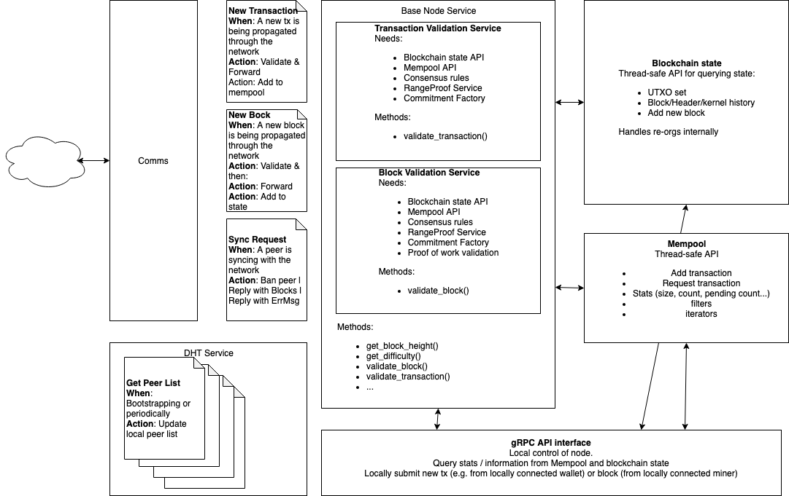

# RFC-0111/BaseNodesArchitecture

## Base Node Architecture

**Maintainer(s)**: [Cayle Sharrock](https://github.com/CjS77), [Philip Robinson](https://github.com/philipr-za)

# Licence

[ The 3-Clause BSD Licence](https://opensource.org/licenses/BSD-3-Clause).

Copyright 2021 The Tari Development Community

Redistribution and use in source and binary forms, with or without modification, are permitted provided that the
following conditions are met:

1. Redistributions of this document must retain the above copyright notice, this list of conditions and the following
   disclaimer.
2. Redistributions in binary form must reproduce the above copyright notice, this list of conditions and the following
   disclaimer in the documentation and/or other materials provided with the distribution.
3. Neither the name of the copyright holder nor the names of its contributors may be used to endorse or promote products
   derived from this software without specific prior written permission.

THIS DOCUMENT IS PROVIDED BY THE COPYRIGHT HOLDERS AND CONTRIBUTORS "AS IS", AND ANY EXPRESS OR IMPLIED WARRANTIES,
INCLUDING, BUT NOT LIMITED TO, THE IMPLIED WARRANTIES OF MERCHANTABILITY AND FITNESS FOR A PARTICULAR PURPOSE ARE
DISCLAIMED. IN NO EVENT SHALL THE COPYRIGHT HOLDER OR CONTRIBUTORS BE LIABLE FOR ANY DIRECT, INDIRECT, INCIDENTAL,
SPECIAL, EXEMPLARY OR CONSEQUENTIAL DAMAGES (INCLUDING, BUT NOT LIMITED TO, PROCUREMENT OF SUBSTITUTE GOODS OR
SERVICES; LOSS OF USE, DATA OR PROFITS; OR BUSINESS INTERRUPTION) HOWEVER CAUSED AND ON ANY THEORY OF LIABILITY,
WHETHER IN CONTRACT, STRICT LIABILITY OR TORT (INCLUDING NEGLIGENCE OR OTHERWISE) ARISING IN ANY WAY OUT OF THE USE OF
THIS SOFTWARE, EVEN IF ADVISED OF THE POSSIBILITY OF SUCH DAMAGE.

## Language

The keywords "MUST", "MUST NOT", "REQUIRED", "SHALL", "SHALL NOT", "SHOULD", "SHOULD NOT", "RECOMMENDED", 
"NOT RECOMMENDED", "MAY" and "OPTIONAL" in this document are to be interpreted as described in 
[BCP 14](https://tools.ietf.org/html/bcp14) (covering RFC2119 and RFC8174) when, and only when, they appear in all capitals, as 
shown here.

## Disclaimer

This document and its content are intended for information purposes only and may be subject to change or update
without notice.

This document may include preliminary concepts that may or may not be in the process of being developed by the Tari
community. The release of this document is intended solely for review and discussion by the community of the
technological merits of the potential system outlined herein.

## Goals

The aim of this Request for Comment (RFC) is to describe the high-level Base Node architecture.

## Architectural Layout

The Base Node architecture is designed to be modular, robust and performant.

The major components are separated into separate modules. Each module exposes a public Application Programming Interface
(API), which communicates with other modules using asynchronous messages via futures.

### Base Node Service

The Base Node Service fields requests for the local nodes chain state and also accepts newly mined blocks that are 
propagating across the network. The service subscribes to NewBlock and BaseNodeRequest messages via the P2P comms 
interface. These messages are propagated across the P2P network and can also be received directly from other nodes. The 
service also provides a local interface to its functionality via an asynchronous Request-Response API. 

The P2P message types this service subscribes to are: 

* **NewBlock:** A newly mined block is being propagated over the network. If the node has not seen the block before, the
  node will validate it. Its action depends on the validation outcome:
  * _Invalid block_ - drop the block.
  * _Valid block appending to the longest chain_ - add the block to the local state; propagate the block to peers.
  * _Valid block forking off main chain_ - add the block to the local state; propagate the block to peers.
  * _Valid block building off unknown block_ - add the orphan block to the local state.

* **BaseNodeServiceRequest:** A collection of requests for chain data from the node.

### Base Node State Machine Service

This service is essentially a finite state machine that synchronises its blockchain state with its peers. When the state 
machine decides it needs to synchronize its chain state with a peer it uses the Base Node Sync RPC service to do so. The
RPC service allows for streaming of headers and blocks in a far more efficient manner than using the P2P messaging.

This service does not provide a local API but does provide an event stream and Status Info watch channel for other 
modules to subscribe to.

### Mempool and Mempool Sync Services

The mempool service tracks valid transactions that the node knows about, but that have not yet been included in a
block. The mempool is ephemeral and non-consensus critical, and as such may be a memory-only data structure. Maintaining
a large mempool is far more important for Base Nodes serving miners than those serving wallets. The mempool structure 
itself is a set of hash maps as described in [RFC-0190]

When the node reboots the Mempool sync service will contact peers and sync valid mempool transactions from them. After 
it has synced this service runs to field such requests from other peers.

The Mempool service handles Mempool Service Requests which it can receive from the P2P comms stack via its 
subscriptions, via the Mempool RPC service and via an internal Request-Response API. All these interfaces provide the 
following calls:
- *SubmitTransaction*: Submit a transaction to be validated and included in the mempool. If the transaction is invalid 
  it will be rejected with a reason.
- *GetTxStateByExcess*: Request the state of a transaction if it exists in the mempool using its excess signature
- *GetStats* and *getState*: Request information about the current status of the mempool.

### Liveness Service

The Liveness service can be used by other modules to test the liveness of a specific peer and also periodically tests a 
set of its connected peers for liveness. This service subscribes to `Ping` P2P messages and responds with `Pong`s. The 
service gathers data about the monitored peer's liveness such as its latency. The `Ping` and Pong` messages also contain
a copy of this nodes current Chain Metadata for use by the receiving nodes Chain Metadata Service.

### Chain Metadata Service

The Chain Metadata Service maintains this nodes current Chain Metadata state to be sent out via `Ping` and `Pong` 
messages by the Liveness service. This node also monitors the Chain Metadata received from other peers in the `Ping` and
`Pong` messages received by the Liveness service. Once a full round of `Pong` messages are received this service will 
emit this data as an event which the Base Node State Machine monitors.

### Distributed Hash Table (DHT) Service

Peer discovery is a key service that blockchain nodes provide so that the peer mesh network can be navigated by the full
nodes making up the network.

In Tari, the peer-to-peer network is not only used by full nodes (Base Nodes), but also by Validator Nodes, and

Tari and Digital Assets Network (DAN) clients.

For this reason, peer management is handled internally by the Comms layer. If a Base Node wants to propagate a message, 
new block or transaction, for example, it simply selects a `BROADCAST` strategy for the message and the Comms layer
will do the rest.

When a node wishes to query a peer for its peer list, this request will be handled by the `DHTService`. It will
communicate with its Comms module's Peer Manager, and provide that information to the peer.

### Blockchain Database

The blockchain database module is responsible for providing a persistent storage solution for blockchain state data. 
This module is used by the Base Node Service, Base Node State Machine, Mempool Service and the RPC servers. For Tari, 
this is delivered using the Lightning Memory-mapped Database (LMDB). LMDB is highly performant, intelligent and
straightforward to use. An LMDB is essentially treated as a hash map data structure that transparently handles
memory caching, disk Input/Output (I/O) and multi-threaded access. This module is shared by many services and so must
be thread-safe.

## Communication Interfaces

### P2P communications
The Tari Peer to Peer messaging protocol is defined in [RFC-0172]. It is a fire-and-forget style protocol. Messages can 
be sent directly to a known peer, sent indirectly to an offline or unknown peer and broadcast to a set of peers. When
a message is sent to specific peer it is propagated to the peers local neighbourhood and stored by those peers until it
comes online to receive the message. Messages that are broadcast will be propagated around the network until the whole
network has received them, they are not stored.

### RPC Services
Fire-and-forget messaging is not efficient for point to point communications between online peers. For these applications
the Base Node provides RPC services that present an API for clients to interact with. These RPC services provide a
Request-Response interface defined by Profobuf for clients to use. RPC also allows for streaming of data which is much
more efficient when transferring large amounts of data.

Examples of RPC services running in 
Base Node are:
  - **Wallet RPC service**: An RPC interface containing methods used by wallets to submit and query transactions on a 
    Base Node
  - **Base Node Sync RPC Service**: Used by the Base Node State Machine Service to synchronize blocks
  - **Mempool RPC Service**: Provides the Mempool Service API via RPC

### gRPC Interface

Base Nodes need to provide a local communication interface in addition to the P2P and RPC communication interface. This 
is best achieved using [gRPC]. The Base Node gRPC interface provides access to the public API methods of the Base Node
Service, the mempool module and the blockchain state module, as discussed above.

gRPC access is useful for tools such as local User Interfaces (UIs) to a running Base Node; client wallets running on
the same machine as the Base Node that want a more direct communication interface to the node than the P2P network
provides; third-party applications such as block explorers; and, of course, miners.

A non-exhaustive list of methods the base node module API will expose includes:

* Blockchain state calls, including:
    * checking whether a given Unspent Transaction Output (UTXO) is in the current UTXO set;
    * requesting the latest block height;
    * requesting the total accumulated work on the longest chain;
    * requesting a specific block at a given height;
    * requesting the Merklish root commitment of the current UTXO set;
    * requesting a block header for a given height;
    * requesting the block header for the chain tip;
    * validating signatures for a given transaction kernel;
    * validating a new block without adding it to the state tree;
    * validating and adding a (validated) new block to the state, and informing of the result (orphaned, fork, reorg, etc.).
* Mempool calls
  * The number of unconfirmed transactions
  * Returning a list of transaction ranked by some criterion (of interest to miners)
  * The current size of the mempool (in transaction weight)
* Block and transaction validation calls
* Block synchronisation calls

# Change Log

| Date        | Change              | Author    |
|:------------|:--------------------|:----------|
| 2 Jul 2019  | First outline       | CjS77     |
| 11 Aug 2019 | Updates             | CjS77     |
| 15 Jun 2021 | Significant updates | SimianZa |

[gRPC]: https://grpc.io/
[RFC-0190]: RFC-0190_Mempool.md
[RFC-0172]: RFC-0172_PeerToPeerMessagingProtocol.md