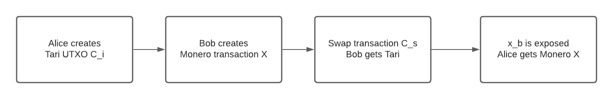
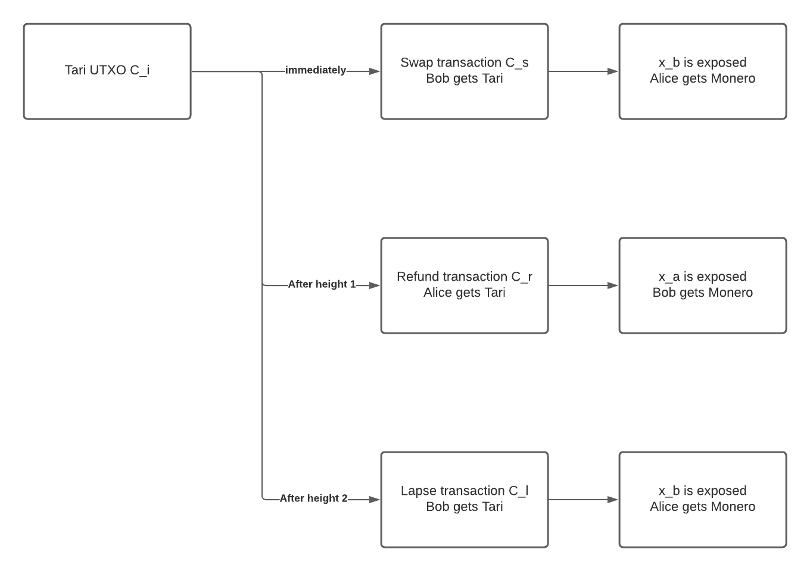

# RFC-0241/XMR Atomic Swap


**Maintainer(s)**: [S W van Heerden](https://github.com/SWvheerden)

# Licence

[The 3-Clause BSD Licence](https://opensource.org/licenses/BSD-3-Clause).

Copyright 2021 The Tari Development Community

Redistribution and use in source and binary forms, with or without modification, are permitted provided that the
following conditions are met:

1. Redistributions of this document must retain the above copyright notice, this list of conditions and the following
   disclaimer.
2. Redistributions in binary form must reproduce the above copyright notice, this list of conditions and the following
   disclaimer in the documentation and/or other materials provided with the distribution.
3. Neither the name of the copyright holder nor the names of its contributors may be used to endorse or promote products
   derived from this software without specific prior written permission.

THIS DOCUMENT IS PROVIDED BY THE COPYRIGHT HOLDERS AND CONTRIBUTORS "AS IS", AND ANY EXPRESS OR IMPLIED WARRANTIES,
INCLUDING, BUT NOT LIMITED TO, THE IMPLIED WARRANTIES OF MERCHANTABILITY AND FITNESS FOR A PARTICULAR PURPOSE ARE
DISCLAIMED. IN NO EVENT SHALL THE COPYRIGHT HOLDER OR CONTRIBUTORS BE LIABLE FOR ANY DIRECT, INDIRECT, INCIDENTAL,
SPECIAL, EXEMPLARY OR CONSEQUENTIAL DAMAGES (INCLUDING, BUT NOT LIMITED TO, PROCUREMENT OF SUBSTITUTE GOODS OR
SERVICES; LOSS OF USE, DATA OR PROFITS; OR BUSINESS INTERRUPTION) HOWEVER CAUSED AND ON ANY THEORY OF LIABILITY,
WHETHER IN CONTRACT, STRICT LIABILITY OR TORT (INCLUDING NEGLIGENCE OR OTHERWISE) ARISING IN ANY WAY OUT OF THE USE OF
THIS SOFTWARE, EVEN IF ADVISED OF THE POSSIBILITY OF SUCH DAMAGE.

## Language

The keywords "MUST", "MUST NOT", "REQUIRED", "SHALL", "SHALL NOT", "SHOULD", "SHOULD NOT", "RECOMMENDED",
"NOT RECOMMENDED", "MAY" and "OPTIONAL" in this document are to be interpreted as described in
[BCP 14](https://tools.ietf.org/html/bcp14) (covering RFC2119 and RFC8174) when, and only when, they appear in all capitals, as
shown here.

## Disclaimer

This document and its content are intended for information purposes only and may be subject to change or update
without notice.

This document may include preliminary concepts that may or may not be in the process of being developed by the Tari
community. The release of this document is intended solely for review and discussion by the community of the
technological merits of the potential system outlined herein.

## Goals

This Request for Comment (RFC) aims to describe how an Atomic swap between Tari and Monero will be created.

## Related Requests for Comment

* [RFC-0201: TariScript](RFC-0201_TariScript.md)
* [RFC-0202: TariScript Opcodes](RFC-0202_TariScriptOpcodes.md)


$$
\newcommand{\script}{\alpha} % utxo script
\newcommand{\input}{ \theta }
\newcommand{\cat}{\Vert}
\newcommand{\so}{\gamma} % script offset
\newcommand{\hash}[1]{\mathrm{H}\bigl({#1}\bigr)}
$$

## Comments

Any comments, changes or questions to this PR can be made in one of the following ways:

* Join the discussion on the [Github discussion page](https://github.com/tari-project/tari/discussions/3647).
* Create a new PR on the Tari project [Github pull requests](https://github.com/tari-project/tari/pulls).
* Create a new issue on the Tari project [Github issues](https://github.com/tari-project/tari/issues).

## Description

Doing atomic swaps with Monero is more complicated and requires a cryptographic dance to complete as Monero does not
implement any form of HTLC's or the like. This means that when doing an atomic swap with Monero, most of the logic will
have to be implemented on the Tari side. Atomic swaps between Monero and Bitcoin have been implemented by the [Farcaster  project](https://github.com/farcaster-project/RFCs)
and the [Comit team](https://github.com/comit-network/xmr-btc-swap). Due to the how TariScript works, we have a few
advantages over Bitcoin script regarding [adaptor signatures](https://tlu.tarilabs.com/cryptography/introduction-to-scriptless-scripts#adaptor-signatures), as the [script key] was explicitly designed with [scriptless scripts](https://tlu.tarilabs.com/cryptography/introduction-to-scriptless-scripts) in mind.

## Method

The primary, happy path outline of a Tari - Monero atomic swap is described here, and more detail will follow. We assume
that Alice wants to trade her XTR for Bob's XMR.

* Negotiation - Both parties negotiate the value and other details of the Monero and Tari UTXO's.
* Commitment - Both parties commit to the keys, nonces, inputs, and outputs to use for the transaction.
* XTR payment - Alice makes the XTR payment to a UTXO containing a "special" script described below.
* XMR Payment - The Monero payment is made to a multiparty [scriptless script](https://tlu.tarilabs.com/cryptography/introduction-to-scriptless-scripts) UTXO.
* Claim XTR - Bob redeems the XTR, and in doing so, reveals the XMR private key to Alice only.
* Claim XMR - Alice may claim the XMR using the revealed key.

Please take note of the notation used in [TariScript] and specifically notation used on the signatures on the [transaction inputs](RFC-0201_TariScript.md#transaction-input-changes) and on the signatures on the [transaction outputs](RFC-0201_TariScript.md#transaction-output-changes).
We will note other notations in the [Notation](#notation) section.

## TL;DR

The scheme revolves around Alice, who wants to exchange her Tari for Bob's Monero. Because they don't trust each other, 
they have to commit some information to do the exchange. And if something goes wrong here, we want to ensure that we can 
refund both parties either in Monero or Tari.

How this works is that Alice and Bob create a shared output on both chains. The Monero output is a simple aggregate key 
to unlock the UTXO, while multiple keys are needed to unlock the Tari UTXO. An aggregate key locks this Monero UTXO that 
neither Alice nor Bob knows, but they both know half of the key. The current Tari block height determines the unlocking 
key for the Tari UTXO.

The process is started by Alice and Bob exchanging and committing to some information. Alice is the first to publish a 
transaction, which creates the Tari UTXO. If Bob is happy that the Tari UTXO has been mined and verifies all the 
information, he will publish a transaction to create the Monero UTXO.

The TariScript script on the UTXO ensures that they will have to reveal their portion of the Monero key when either 
Alice or Bob spends this. This disclosure allows the other party to claim the Monero by being the only one to own the 
complete Monero aggregate key.

We can visualize the happy path flow with the image below. 


The script will ensure that at any point in time, at least someone can claim the Tari UTXO, and if that person does so, 
the other party can claim the Monero UTXO by looking at the spending data. It has two lock heights, determining who can 
claim the Tari UTXO if the happy path fails. Before the first lock height, only Bob can claim the Tari; we call this the 
swap transaction.

If Bob disappears after Alice has posted the Tari UTXO, Alice can claim the Tari after the first lock height and before 
the second lock height; we call this the refund transaction. It ensures that Alice can reclaim her Tari if Bob 
disappears, and if Bob reappears, he can reclaim his Monero.

That leaves us with the scenario where Alice disappears after Bob posts the Monero transaction, in which case we need to 
protect Bob. After the second lock height, only Bob can claim the Tari; we call this the lapse transaction. The lapse 
transaction will reveal Bob's Monero key so that if Alice reappears, she can claim the Monero.

The image below details the time flow of the Tari transactions spending the Tari UTXO. 


## Heights, Security, and other considerations

We need to consider a few things for this to be secure, as there are possible scenarios that can reduce the security in the atomic swap. 

When looking at the two lock heights, the first lock height should be sufficiently large enough to give ample time for Alice to post the Tari UTXO transaction and for it to be mined with a safe number of confirmations,
and for Bob to post the Monero transaction and for it to be mined with a safe number of confirmations. The second lock
height should give ample time for Alice after the first lock height to re-claim her Tari. Larger heights here might make
refunds slower, but it should be safer in giving more time to finalize this. 

Allowing both to claim the Tari after the second lock height is, on face value, a safer option. This can be done by enabling
either party to claim the script with the lapse transaction. The counterparty can then claim the Monero. However, this
will open up an attack vector to enable either party to claim the Monero while claiming the Tari. Either party could trivially
pull off such a scheme by performing a front-running attack and having a bit of luck. The counterparty monitors all broadcast 
transactions to base nodes. Upon identifying the lapse transaction, they do two things; in quick succession, broadcast 
their lapse transaction and the transaction to claim the Monero, both with sufficiently high fees. Base nodes will 
prefer to mine transactions with the higher fees, and thus the counterparty can walk away with both the Tari and the 
Monero.

It is also possible to prevent the transaction from being mined after being submitted to the mempool. This can be caused by a combination
of a too busy network, not enough fees, or a too-small period in the time locks. When one of these atomic swap transactions gets published to a mempool, we effectively already have all the details exposed. For the atomic swaps, it means we already revealed part of the Monero key, although
the actual Tari transaction has not been mined. But this is true for any HTLC or like script on any blockchain. But in the odd
chance that this does happen whereby the fees are too little and time locks not enough, it should be possible to do a child-pays-for-parent
transaction to bump up the fees on the transaction to get it mined and confirmed.

## Key construction

Using [multi-signatures](https://reyify.com/blog/flipping-the-scriptless-script-on-schnorr) with Schnorr signatures, we
need to ensure that the keys are constructed so that key cancellation attacks are not possible. To do this, we create new
keys from the chosen public keys \\(K_a'\\) and \\(K_b'\\)

$$
\begin{aligned}
K_a &=  \hash{\hash{K_a' \cat K_b'} \cat K_a' } * K_a' \\\\
k_a &=  \hash{\hash{K_a' \cat K_b'} \cat K_a' } * k_a' \\\\
K_b &=  \hash{\hash{K_a' \cat K_b'} \cat K_b' } * K_b' \\\\
k_b &=  \hash{\hash{K_a' \cat K_b'} \cat K_b' } * k_b' \\\\
\end{aligned}
\tag{1}
$$

## Key equivalence

Monero uses Ed25519, while Tari uses [Ristretto](https://ristretto.group/) as its curve of choice. While Ristretto and Ed25519 both works on Curve25519 and the Edward
points are the same, they differ when the points are encoded. In practice, this means the following:

$$
\begin{aligned}
Xm &= x \cdot G_m \\\\
X &= x \cdot G \\\\
X &\neq X_m \\\\
\end{aligned}
\tag{2}
$$

To use public keys across different implementations or curves, we must prove that the same private key created the "different" public keys. Because we exchange encoded points, we need some way of proving they are the same.
[Jepsen](https://projekter.aau.dk/projekter/files/260345149/Electronic_voting_application_based_on_public_verifiable_secret_sharing.pdf) designed a proof to prove Discrete Logarithm Equality (DLEQ) between two generator groups. But the proof here is not created for Elliptic Curve Cryptography (ECC) but can be adapted to ECC by:

$$
\begin{aligned}
e &= \hash{K_1 \cat K_2 \cat R_{1} \cat R_{2}} \\\\
s &= r + e(k) \\\\
R_{1} &= r \cdot G \\\\
R_{2} &= r \cdot G_m \\\\
K_{1} &= k \cdot G \\\\
K_{2} &= k \cdot G_m \\\\
\end{aligned}
\tag{3}
$$

The verification is then:
$$
\begin{aligned}
e &= \hash{K_1 \cat K_2 \cat R_{1} \cat R_{2}} \\\\
s \cdot G &= R_{1} + e(K_1) \\\\
s \cdot G_m &= R_{2} + e(K_2) \\\\
\end{aligned}
\tag{4}
$$

But this method has a problem with ECC keys as they are always used as \\(mod(n)\\) where n is the group size. With ECC, we cannot always use the method; it can only be used when the two curves are of the same group
size \\(n\\), or \\(s < n\\). If this is not the case, a [bit comparison](https://web.getmonero.org/resources/research-lab/pubs/MRL-0010.pdf) needs to be created to prove this.
But luckily, we use Ristretto and Ed25519, both on Curve25519, because it’s the same curve, same generator point, and just
different encodings. We can use this proof to know even though the encoded public keys do not match, they still share a private key

## Key security

The risk of publicly exposing part of the Monero private key is still secure because of how [ECC](https://cryptobook.nakov.com/asymmetric-key-ciphers/elliptic-curve-cryptography-ecc#private-key-public-key-and-the-generator-point-in-ecc) works. We can
add two secret keys together and share the public version of both. And at the same time, we know that no one can calculate
the secret key with just one part.

$$
\begin{aligned}
(k_a + k_b) \cdot G &= k_a \cdot G + k_b \cdot G\\\\
(k_a + k_b) \cdot G &= K_a + K_b \\\\
(k_a + k_b) \cdot G &= K \\\\
\end{aligned}
\tag{5}
$$

We know that \\(K\\), \\(K_a\\), \\(K_b\\) are public. While \\(k\\), \\(k_a\\), \\(k_b\\) are all private.

But if we expose \\(k_b\\), we can try to do the following:
$$
\begin{aligned}
(k_a + k_b) \cdot G &= K_a + K_b\\\\
k_a \cdot G &= (K_a + K_b - k_b \cdot G) \\\\
k_a \cdot G &= K_a \\\\
\end{aligned}
\tag{6}
$$

However, this is the Elliptic-Curve Discrete Logarithm Problem, and there is no easy solution to solve this on current computer
hardware. Thus this is still secure even though we leaked part of the secret key \\(k\\).

## Method 1

### Detail

This method relies purely on TariScript to enforce the exposure of the private Monero aggregate keys. Based on [Point Time Lock Contracts](https://suredbits.com/payment-points-part-1/), the script forces the spending party to supply their Monero
private key part as input data to the script, evaluated via the operation `ToRistrettoPoint`. This TariScript operation will
publicly reveal part of the aggregated Monero private key, but this is still secure: see [Key security](#key-security).

The simplicity of this method lies therein that the spending party creates all transactions on their 
own. Bob requires a pre-image from Alice to complete the swap transaction; Alice needs to verify that Bob published the 
Monero transaction and that everything is complete as they have agreed. If she is happy, she will provide Bob with the 
pre-image to claim the Tari UTXO.


### TariScript

The Script used for the Tari UTXO is as follows:
``` TariScript,ignore
   ToRistrettoPoint
   CheckHeight(height_1)
   LtZero
   IFTHEN
      PushPubkey(X_b)
      EqualVerify
      HashSha256 
      PushHash(HASH256{pre_image})
      EqualVerify
      PushPubkey(K_{Sb})
   Else
      CheckHeight(height_2)
      LtZero
      IFTHEN
         PushPubkey(X_a)
         EqualVerify
         PushPubkey(K_{Sa})
      Else
         PushPubkey(X_b)
         EqualVerify
         PushPubkey(K_{Sb})
      ENDIF
   ENDIF
```

Before `height_1`, Bob can claim the Tari UTXO by supplying `pre_image` and his private Monero key part `x_b`. After 
`height_1` but before `height_2`, Alice can claim the Tari UTXO by supplying her private Monero key part `x_a`. After 
`height_2`, Bob can claim the Tari UTXO by providing his private Monero key part `x_b`.

### Negotiation

Alice and Bob have to negotiate the exchange rate and the amount exchanged in the atomic swap. They also need to decide 
how the two UTXO's will look on the blockchain. To accomplish this, the following needs to be finalized:

* Amount of Tari to swap for the amount of Monero
* Monero public key parts \\(Xm_a\\), \\(Xm_b\\) ,and its aggregate form \\(Xm\\)
* DLEQ proof of \\(Xm_a\\) and \\(X_a\\)
* Tari [script key] parts \\(K_{Sa}\\), \\(K_{Sb}\\) 
* The [TariScript] to be used in the Tari UTXO
* The blinding factor \\(k_i\\) for the Tari UTXO, which can be a Diffie-Hellman between their Tari addresses.


### Key selection

Using (1), we create the Monero keys as they are multi-party aggregate keys.
The Monero key parts for Alice and Bob is constructed as follows:


$$
\begin{aligned}
Xm_a' &= xm_a' \cdot G_m \\\\
Xm_b' &= xm_b' \cdot G_m \\\\
xm_a &=  \hash{\hash{Xm_a' \cat Xm_b'} \cat Xm_a' } * xm_a' \\\\
xm_b &=  \hash{\hash{Xm_a' \cat Xm_b'} \cat Xm_b' } * xm_b' \\\\
xm_a &= x_a \\\\
xm_b &= x_b \\\\
Xm_a &=  \hash{\hash{Xm_a' \cat Xm_b'} \cat Xm_a' } * Xm_a' \\\\
Xm_b &=  \hash{\hash{Xm_a' \cat Xm_b'} \cat Xm_b' } * Xm_b' \\\\
xm &= xm_a + xm_b + k_i \\\\
Xm &= Xm_a + Xm_b + k_i \cdot G_m\\\\
x &= x_a + x_b + k_i \\\\
X &= X_a + X_b + k_i \cdot G\\\\
\end{aligned}
\tag{7}
$$


### Commitment phase

This phase allows Alice and Bob to commit to using their keys.

#### Starting values

Alice needs to provide Bob with the following:

* Script public key: \\( K_{Sa}\\)
* Monero public key \\( Xm_a'\\) with Ristretto encoding

Bob needs to provide Alice with the following:

* Script public key: \\( K_{Sb}\\)
* Monero public key \\( Xm_b'\\) with Ristretto encoding

Using the above equations in (7), Alice and Bob can calculate \\(Xm\\), \\(Xm_a\\), \\(Xm_b\\)

#### DLEQ proof

Alice needs to provide Bob with:

* Monero public key \\(X_a\\) encoding on Ristretto
* DLEQ proof for \\(Xm_a\\) and \\(X_a\\): \\((R_{ZTa}, R_{ZMa}, s_{Za})\\)

$$
\begin{aligned}
e &= \hash{X_a \cat Xm_a \cat R_{ZTa} \cat R_{ZMa}} \\\\
s_{Za} &= r + e(x_a) \\\\
R_{ZTa} &= r \cdot G \\\\
R_{ZMa} &= r \cdot G_m \\\\
\end{aligned}
\tag{8}
$$

Bob needs to provide Alice with:

* Monero public key \\(X_b\\) encoding on Ristretto
* DLEQ proof for \\(Xm_b\\) and \\(X_b\\): \\((R_{ZTb}, R_{ZMb}, s_{Zb})\\)

$$
\begin{aligned}
e &= \hash{X_b \cat Xm_b \cat R_{ZTb} \cat R_{ZMb}} \\\\
s_{Za} &= r + e(x_b) \\\\
R_{ZTa} &= r \cdot G \\\\
R_{ZMa} &= r \cdot G_m \\\\
\end{aligned}
\tag{9}
$$

Alice needs to verify Bob's DLEQ proof with:

$$
\begin{aligned}
e &= \hash{X_b \cat Xm_b \cat R_{ZTb} \cat R_{ZMb}} \\\\
s_{Zb} \cdot G &= R_{ZTb} + e(X_b) \\\\
s_{Zb} \cdot G_m &= R_{ZMb} + e(Xm_b) \\\\
\end{aligned}
\tag{10}
$$

Bob needs to verify Alice's DLEQ proof with:

$$
\begin{aligned}
e &= \hash{X_a \cat Xm_a \cat R_{ZTa} \cat R_{ZMa}} \\\\
s_{Za} \cdot G &= R_{ZTa} + e(X_a) \\\\
s_{Za} \cdot G_m &= R_{ZMa} + e(Xm_a) \\\\
\end{aligned}
\tag{11}
$$

### XTR payment

Alice will construct the Tari UTXO with the correct [script](#tariscript) and publish the containing transaction to the 
blockchain, knowing that she can reclaim her Tari if Bob vanishes or tries to break the agreement. This is done with 
standard Mimblewimble rules and signatures.

### XMR payment

When Bob sees that the Tari UTXO that Alice created is mined on the Tari blockchain with the correct script, Bob can
publish the Monero transaction containing the Monero UTXO with the aggregate key \\(Xm = Xm_a + Xm_b + k_i \cdot G_m \\).

### Claim XTR 

When Alice sees that the Monero UTXO that Bob created is mined on the Monero blockchain containing the correct aggregate 
key \\(Xm\\), she can provide Bob with the required `pre_image` to spend the Tari UTXO. She does not have the 
missing key \\(xm_b \\) to claim the Monero yet, but it will be revealed when Bob claims the Tari. 

Bob can now supply the `pre_image` and his Monero private key as transaction input to unlock the script.

### Claim XMR

Alice can now see that Bob spent the Tari UTXO, and by examining the `input_data` required to satisfy the script, she 
can learn Bob's secret Monero key. Although this private key \\( xm_b \\) is now public knowledge, her part of the Monero spend key 
is still private, and thus only she knows the complete Monero spend key. She can use this knowledge to claim the Monero 
UTXO.

### The refund

If something goes wrong and Bob never publishes the Monero or disappears, Alice needs to wait for the lock height
`height_1` to pass. This will allow her to reclaim her Tari, but in doing so, she needs to publish her Monero secret key 
as input to the script to unlock the Tari. When Bob comes back online, he can use this public knowledge to reclaim his 
Monero, as only he knows both parts of the Monero UTXO spend key.


### The lapse transaction

If something goes wrong and Alice never gives Bob the required `pre_image`, Bob needs to wait for the lock height
`height_2` to pass. This will allow him to claim the Tari he wanted all along, but in doing so, he needs to publish
his Monero secret key as input to the script to unlock the Tari. When Alice comes back online, she can use this public 
knowledge to claim the Monero she wanted all along as only she now knows both parts of the Monero UTXO spend key.


## Method 2

### Detail

This method is based on work by the [Farcaster project](https://github.com/farcaster-project/RFCs) and the [Comit team](https://github.com/comit-network/xmr-btc-swap). It utilizes adapter signatures and multi-party commitment signatures to ensure that
the spending party leaks their private Monero key part. Because all keys are aggregates keys, we need to ensure that the refund
and lapse transactions are negotiated and signed before Alice publishes the Tari UTXO. This will allow either Alice or Bob to
claim the refund and lapse transactions, respectively, without the other party being online. 

### TariScript

The Script used for the Tari UTXO is as follows:
``` TariScript,ignore
   CheckHeight(height_1)
   LtZero
   IFTHEN
      PushPubkey(K_{Ss})
   Else
      CheckHeight(height_2)
      LtZero
      IFTHEN
         PushPubkey(K_{Sr})
      Else
         PushPubkey(K_{Sl})
      ENDIF
   ENDIF
```

Before `height_1`, Bob can claim the Tari UTXO if Alice gives him the correct signature to complete the transaction.
After `height_1` but before `height_2`, Alice can claim the Tari UTXO. After `height_2,` Bob can claim the Tari UTXO.

### Negotiation

Alice and Bob have to negotiate the exchange rate and the amount exchanged in the atomic swap. 
They also need to decide how the two UTXO's will look on the blockchain. To accomplish this, the following needs to be finalized:

* Amount of Tari to swap for the amount of Monero
* Monero public key parts \\(Xm_a\\), \\(Xm_b\\), and its aggregate form \\(X\\)
* Tari [script key] parts \\(K_{Ssa}\\), \\(K_{Ssb}\\), and its aggregate form \\(K_{Ss}\\) for the swap transaction
* Tari [script key] parts \\(K_{Sra}\\), \\(K_{Srb}\\), and its aggregate form \\(K_{Sr}\\) for the refund transaction
* Tari [script key] parts \\(K_{Sla}\\), \\(K_{Slb}\\), and its aggregate form \\(K_{Sl}\\) for the lapse transaction
* Tari [sender offset key] parts  \\(K_{Osa}\\), \\(K_{Osb}\\), and its aggregate form \\(K_{Os}\\) for the swap transaction
* Tari [sender offset key] parts  \\(K_{Ora}\\), \\(K_{Orb}\\), and its aggregate form \\(K_{Or}\\) for the refund transaction
* Tari [sender offset key] parts  \\(K_{Ola}\\), \\(K_{Olb}\\), and its aggregate form \\(K_{Ol}\\) for the lapse transaction
* All of the nonces used in the script signature creation and Metadata signature for the swap, refund, and lapse transactions
* The [script offset] used in both the swap, refund, and lapse transactions
* The [TariScript] to be used in the Tari UTXO
* The blinding factor \\(k_i\\) for the Tari UTXO, which can be a Diffie-Hellman between their addresses.


### Key selection

Using (1), we create the Monero keys as they are multi-party aggregate keys.

The [script key] parts for Alice and Bob is constructed as follows:

$$
\begin{aligned}
k_{Ssa} &=  \hash{\hash{K_{Ssa}' \cat K_{Ssb}'} \cat K_{Ssa}' } * k_{Ssa}' \\\\
k_{Ssb} &=  \hash{\hash{K_{Ssa}' \cat K_{Ssb}'} \cat K_{Ssb}' } * k_{Ssb}' \\\\
k_{Ss} &= k_{Ssa} + k_{sb} \\\\
k_{Sra} &=  \hash{\hash{K_{Sra}' \cat K_{Srb}'} \cat K_{Sra}' } * k_{Sra}' \\\\
k_{Srb} &=  \hash{\hash{K_{Sra}' \cat K_{Srb}'} \cat K_{Srb}' } * k_{Srb}' \\\\
k_{Sr} &= k_{Sra} + k_{Srb} \\\\
k_{Sla} &=  \hash{\hash{K_{Sla}' \cat K_{Slb}'} \cat K_{Sla}' } * k_{Sla}' \\\\
k_{Slb} &=  \hash{\hash{K_{Sla}' \cat K_{Slb}'} \cat K_{Slb}' } * k_{Slb}' \\\\
k_{Sl} &= k_{Sla} + k_{Slb} \\\\
\end{aligned}
\tag{12}
$$

The [sender offset key] parts for Alice and Bob is constructed as follows:

$$
\begin{aligned}
k_{Osa} &=  \hash{\hash{K_{Osa}' \cat K_{Osb}'} \cat K_{Osa}' } * k_{Osa}' \\\\
k_{Osb} &=  \hash{\hash{K_{Osa}' \cat K_{Osb}'} \cat K_{Osb}' } * k_{Osb}' \\\\
k_{Os} &= k_{Osa} + k_{Ssb} \\\\
k_{Ora} &=  \hash{\hash{K_{Ora}' \cat K_{Orb}'} \cat K_{Ora}' } * k_{Ora}' \\\\
k_{Orb} &=  \hash{\hash{K_{Ora}' \cat K_{Orb}'} \cat K_{Orb}' } * k_{Orb}' \\\\
k_{Or} &= k_{Ora} + k_{Srb} \\\\
k_{Ola} &=  \hash{\hash{K_{Ola}' \cat K_{Olb}'} \cat K_{Ola}' } * k_{Ola}' \\\\
k_{Olb} &=  \hash{\hash{K_{Ola}' \cat K_{Olb}'} \cat K_{Olb}' } * k_{Olb}' \\\\
k_{Ol} &= k_{Ola} + k_{Slb} \\\\
\end{aligned}
\tag{13}
$$

The Monero key parts for Alice and Bob is constructed as follows:

$$
\begin{aligned}
xm_a' &= x_a' \\\\
xm_b' &= x_b' \\\\
Xm_a' &= x_a' \cdot G_m \\\\
Xm_b' &= x_b' \cdot G_m \\\\
X_a' &= x_a' \cdot G \\\\
X_b' &= x_b' \cdot G \\\\
x_a &=  \hash{\hash{X_a' \cat X_b'} \cat X_a' } * x_a' \\\\
x_b &=  \hash{\hash{X_a' \cat X_b'} \cat X_b' } * x_b' \\\\
x &= x_a + x_b + k_i \\\\
Xm &= Xm_a + Xm_b + k_i \cdot G_m \\\\
X &= X_a + X_b + k_i \cdot G\\\\
\end{aligned}
\tag{14}
$$


### Commitment phase

Similar to method 1, this phase allows Alice and Bob to commit to using their keys and requires more than one round to 
complete. Some of the information that needs to be committed depends on previous knowledge. 

#### Starting values

Alice needs to provide Bob with the following:

* Output commitment \\(C_r\\) of the refund transaction's output
* Output features  \\( F_r\\) of the refund transaction's output
* Output script  \\( \\script_r\\) of the refund transaction's output
* Output commitment \\(C_l\\) of the lapse transaction's output
* Output features  \\( F_l\\) of the lapse transaction's output
* Output script  \\( \\script_l\\) of the lapse transaction's output
* Public keys: \\( K_{Ssa}'\\), \\( K_{Sra}'\\), \\( K_{Sla}'\\), \\( K_{Osa}'\\), \\( K_{Ora}'\\), \\( K_{Ola}'\\), \\( X_a'\\)
* Nonces: \\( R_{Ssa}\\), \\( R_{Sra}\\), \\( R_{Sla}\\), \\( R_{Msa}\\), \\( R_{Mra}\\), \\( R_{Mla}\\)

Bob needs to provide Alice with the following:

* Output commitment \\(C_s\\) of the swap transaction's output
* Output features  \\( F_s\\) of the swap transaction's output
* Output script  \\( \\script_s\\) of the swap transaction's output
* Public keys: \\( K_{Ssb}'\\), \\( K_{Srb}'\\), \\( K_{Slb}'\\), \\( K_{Osb}'\\), \\( K_{Orb}'\\), \\( K_{Olb}'\\), \\( X_b'\\)
* Nonces: \\( R_{Ssb}\\), \\( R_{Srb}\\), \\( R_{Slb}\\), \\( R_{Msb}\\), \\( R_{Mrb}\\), \\( R_{Mlb}\\)

After Alice and Bob have exchanged the variables, they start trading calculated values. 

#### Construct adaptor signatures and DLEQ proofs

Alice needs to provide Bob with the following values:

* Adaptor signature part \\(b_{Sra}'\\) for \\(b_{Sra}\\)
* Signature part \\(a_{Sra}\\)
* Monero public key \\(X_a\\) encoded with Ristretto 
* Monero public key \\(Xm_a\\) encoded with ed25519
* DLEQ proof for \\(Xm_a\\) and \\(X_a\\): \\((R_{ZTa}, R_{ZMa}, s_{Za})\\)

Alice constructs the **adaptor signature** of the [input script signature](RFC-0201_TariScript.html#transaction-input-changes) 
parts for the refund transaction ( \\(a_{Sra}\\) and \\(b_{Sra}'\\) ) with:

$$
\begin{aligned}
a_{Sra} &= r_{Sra_a} +  e_r(v_{i}) \\\\
b_{Sra}' &= r_{Sra_b} +  e_r(k_{Sra}+k_i) \\\\
e_r &= \hash{ (R_{Sr} + (X_a)) \cat \alpha_r \cat \input_r \cat (K_{Sra} + K_{Srb}) \cat C_i} \\\\
R_{Sr} &= r_{Sra_a} \cdot H + r_{Sra_b} \cdot G + R_{Srb} \\\\
X_a &= x_a \cdot G \\\\
\end{aligned}
\tag{15}
$$

Alice constructs the DLEQ proof:

$$
\begin{aligned}
e &= \hash{X_a \cat Xm_a \cat R_{ZTa} \cat R_{ZMa}} \\\\
s_{Za} &= r + e(x_a) \\\\
R_{ZTa} &= r \cdot G \\\\
R_{ZMa} &= r \cdot G_m \\\\
\end{aligned}
\tag{16}
$$

Bob needs to provide Alice with the following values:

* Adaptor signature part \\(b_{Ssb}'\\) for \\(b_{Ssb}\\)
* Signature part \\(a_{Ssb}\\)
* Adaptor signature part \\(b_{Slb}'\\) for \\(b_{Slb}\\)
* Signature part \\(a_{Slb}\\)
* Monero public key \\(X_b\\) encoded with Ristretto 
* Monero public key \\(Xm_b\\) encoded with ed25519
* DLEQ proof for \\(Xm_b\\) and \\(X_b\\): \\((R_{ZTb}, R_{ZMb}, s_{Zb})\\)

Bob constructs the **adaptor signatures** of the [input script signature](RFC-0201_TariScript.html#transaction-input-changes) 
parts for the swap transaction ( \\(a_{Ssb}\\), \\(b_{Ssb}'\\) ) and the lapse transaction 
( \\(a_{Slb}\\) and \\(b_{Slb}'\\) ) with

$$
\begin{aligned}
a_{Ssb} &= r_{Ssb_a} +  e_s(v_{i}) \\\\
b_{Ssb}' &= r_{Ssb_b} +  e_s(k_{Ssb}+k_i) \\\\
e_s &= \hash{ (R_{Sr} + (X_b)) \cat \alpha_i \cat \input_i \cat (K_{Ssa} + K_{Ssb}) \cat C_i} \\\\
R_{Ss} &= r_{Ssb_a} \cdot H + r_{Ssb_b} \cdot G + R_{Ssa} \\\\
a_{Slb} &= r_{Slb_a} +  e_l(v_{i}) \\\\
b_{Slb}' &= r_{Slb_b} +  e_l(k_{Slb}+k_i) \\\\
e_l &= \hash{ (R_{Sl} + (X_b)) \cat \alpha_i \cat \input_i \cat (K_{Sla} + K_{Slb}) \cat C_i} \\\\
R_{Sl} &= r_{Slb_a} \cdot H + r_{Slb_b} \cdot G + R_{Sla} \\\\
X_b &= x_b \cdot G \\\\
\end{aligned}
\tag{17}
$$

Bob constructs the DLEQ proof:

$$
\begin{aligned}
e &= \hash{X_b \cat Xm_b \cat R_{ZTb} \cat R_{ZMb}} \\\\
s_{Zb} &= r + e(x_b) \\\\
R_{ZTb} &= r \cdot G \\\\
R_{ZMb} &= r \cdot G_m \\\\
\end{aligned}
\tag{18}
$$

#### Verify adaptor signatures and DLEQ proofs

Alice needs to verify Bob's adaptor signatures with:

$$
\begin{aligned}
a_{Ssb} \cdot H + b_{Ssb}' \cdot G &= R_{Ssb} + (C_i+K_{Ssb})*e_s \\\\
a_{Slb} \cdot H + b_{Slb}' \cdot G &= R_{Slb} + (C_i+K_{Slb})*e_l \\\\
\end{aligned}
\tag{19}
$$

Alice needs to verify Bob's Monero public keys using the zero-knowledge proof:

$$
\begin{aligned}
e &= \hash{X_b \cat Xm_b \cat R_{ZTb} \cat R_{ZMb}} \\\\
s_{Zb} \cdot G &= R_{ZTb} + e(X_b) \\\\
s_{Zb} \cdot G_m &= R_{ZMb} + e(Xm_b) \\\\
\end{aligned}
\tag{20}
$$

Bob needs to verify Alice's adaptor signature with:

$$
\begin{aligned}
a_{Sra} \cdot H + b_{Sra}' \cdot G &= R_{Sra} + (C_i+K_{Sra})*e_r \\\\
\end{aligned}
\tag{21}
$$

Bob needs to verify Alice's Monero public keys using the zero-knowledge proof:

$$
\begin{aligned}
e &= \hash{X_a \cat XM_a \cat R_{ZTa} \cat R_{ZMa}} \\\\
s_{Za} \cdot G &= R_{ZTa} + e(X_a) \\\\
s_{Za} \cdot G_m &= R_{ZMa} + e(Xm_a) \\\\
\end{aligned}
\tag{22}
$$

#### Swap out refund and lapse transactions

If Alice and Bob are happy with the verification, they need to swap out refund and lapse transactions.

Alice needs to provide Bob with the following:

* [Input script signature](RFC-0201_TariScript.html#transaction-input-changes) for lapse transaction (\\( (a_{Sla}, b_{Sla}), R_{Sla}\\) )
* [Output metadata signature](RFC-0201_TariScript.html#transaction-output-changes) for lapse transaction (\\( b_{Mla}, R_{Mla}\\) )
* [Script offset](RFC-0201_TariScript.html#script-offset) for lapse transaction \\( \so_{la} \\)

Alice constructs for the lapse transaction signatures.
$$
\begin{aligned}
a_{Sla} &= r_{Sla_a} +  e_l(v_{i}) \\\\
b_{Sla} &= r_{Sla_b} +  e_l(k_{Sla}) \\\\
e_l &= \hash{ (R_{Sl} + (X_b)) \cat \alpha_i \cat \input_i \cat (K_{Sla} + K_{Slb}) \cat C_i} \\\\
R_{Sl} &= r_{Sla_a} \cdot H + r_{Sla_b} \cdot G + R_{Slb}\\\\
b_{Mla} &= r_{Mla_b} + e(k\_{Ola}) \\\\
R_{Mla} &= b_{Mla} \cdot G \\\\
e &= \hash{ (R_{Mla} + R_{Mlb}) \cat \script_l \cat F_l \cat (K_{Ola} + K_{Olb}) \cat C_l} \\\\
\so_{la} &= k_{Sla} - k_{Ola} \\\\
\end{aligned}
\tag{23}
$$

Bob needs to provide Alice with the following:

* [Input script signature](RFC-0201_TariScript.html#transaction-input-changes) for refund transaction (\\( (a_{Srb}, b_{Srb}), R_{Srb}\\) )
* [Output metadata signature](RFC-0201_TariScript.html#transaction-output-changes) for refund transaction (\\( b_{Mrb}, R_{Mrb}\\) )
* [Script offset](RFC-0201_TariScript.html#script-offset) for refund transaction \\( \so_{rb} \\)

Bob constructs for the refund transaction signatures.
$$
\begin{aligned}
a_{Srb} &= r_{Srb_a} +  e_r(v_{i}) \\\\
b_{Srb} &= r_{Srb_b} +  e_r(k_{Srb}) \\\\
e_r &= \hash{ (R_{Sr} + (X_a)) \cat \alpha_i \cat \input_i \cat (K_{Sra} + K_{Srb}) \cat C_i} \\\\
R_{Sl} &= r_{Srb_a} \cdot H + r_{Srb_b} \cdot G + R_{Sra}\\\\
b_{Mrb} &= r_{Mrb_b} + e(k\_{Orb}) \\\\
R_{Mrb} &= b_{Mrb} \cdot G \\\\
e &= \hash{ (R_{Mra} + R_{Mrb}) \cat \script_r \cat F_r \cat (K_{Ora} + K_{Orb}) \cat C_r} \\\\
\so_{rb} &= k_{Srb} - k_{Orb} \\\\
\end{aligned}
\tag{24}
$$

Although the script validation on output \\(C_i\\)  will not pass due to the lock height, both Alice and Bob need to
verify that the total aggregated signatures and script offset for the refund and lapse transaction are valid should they
need to publish them at a future date without the other party’s presence.

### XTR payment

If Alice and Bob are happy with all the committed values, Alice will construct the Tari UTXO with the correct 
[script](#tariscript) and publish the containing transaction to the blockchain. Because Bob already gave her the 
required signatures for his part of the refund transaction, Alice can easily compute the required aggregated signatures 
by adding the parts together. She has all the knowledge to spend this after the lock expires. 

### XMR Payment

When Bob sees that the Tari UTXO that Alice created is mined on the Tari blockchain with the correct script, he can go 
ahead and publish the Monero UTXO with the aggregate key \\(Xm = Xm_a + Xm_b \\).

### Claim XTR 

When Alice sees that the Monero UTXO that Bob created is mined on the Monero blockchain containing the correct aggregate 
key \\(Xm\\), she can provide Bob with the following allowing him to spend the Tari UTXO:

* Script signature for the swap transaction \\((a_{Ssa}\\, b_{Ssa}), R_{Ssa}\\)
* Metadata signature for swap transaction \\((b_{Msa}, R_{Msa})\\)
* Script offset for swap transaction \\( \so_{sa} \\)

She does not have the missing key \\(x_b \\) to claim the Monero yet, but it will be revealed when Bob claims the Tari. 

Alice constructs for the swap transaction.
$$
\begin{aligned}
a_{Ssa} &= r_{Ssa_a} +  e_s(v_{i}) \\\\
b_{Ssa} &= r_{Ssa_b} +  e_s(k_{Ssa}) \\\\
e_s &= \hash{ (R_{Ss} + (X_b)) \cat \alpha_i \cat \input_i \cat (K_{Ssa} + K_{Ssb}) \cat C_i} \\\\
R_{Ss} &= r_{Ssa_a} \cdot H + r_{Ssa_b} \cdot G + R_{Ssb}\\\\
b_{Msa} &= r_{Msa_b} + e(k\_{Osa}) \\\\
R_{Msa} &= b_{Msa} \cdot G \\\\
e &= \hash{ (R_{Msa} + R_{Msb}) \cat \script_s \cat F_s \cat (K_{Osa} + K_{Osb}) \cat C_s} \\\\
\so_{sa} &= k_{Ssa} - k_{Osa} \\\\
\end{aligned}
\tag{25}
$$

Bob constructs the swap transaction.
$$
\begin{aligned}
a_{Ssb} &= r_{Ssb_a} +  e_s(v_{i}) \\\\
b_{Ssb} &= r_{Ssb_b} + x_b + e_s(k_{Ssb} + k_i) \\\\
e_s &= \hash{ (R_{Ss} + (X_b)) \cat \alpha_i \cat \input_i \cat (K_{Ssa} + K_{Ssb}) \cat C_i} \\\\
a_{Ss} &= a_{Ssa} + a_{Ssb} \\\\
b_{Ss} &= b_{Ssa} + b_{Ssb} \\\\
R_{Ss} &= r_{Ssa_b} \cdot H + r_{Ssb_b} \cdot G + R_{Ssa}\\\\
a_{Msb} &= r_{Msb_a} + e(v_{s}) \\\\
b_{Msb} &= r_{Msb_b} + e(k\_{Osb}+k_s) \\\\
R_{Msb} &= a_{Msb} \cdot H + b_{Msb} \cdot G \\\\
e &= \hash{ (R_{Msa} + R_{Msb}) \cat \script_s \cat F_s \cat (K_{Osa} + K_{Osb}) \cat C_s} \\\\
R_{Ms} &= R_{Msa} + R_{Msb} \\\\
\so_{sb} &= k_{Ssb} - k_{Osb} \\\\
\so_{s} &= \so_{sa} +\so_{sb} \\\\
\end{aligned}
\tag{26}
$$

Bob's transaction now has all the required signatures to complete the transaction. He will then publish the transaction.

### Claim XMR

Because Bob has now published the transaction on the Tari blockchain, Alice can calculate the missing Monero key \\(x_b\\)
as follows:

$$
\begin{aligned}
b_{Ss} &= b_{Ssa} + b_{Ssb} \\\\
b_{Ss} - b_{Ssa} &= b_{Ssb} \\\\
b_{Ssb} &= r_{Ssb_b} + x_b + e_s(k_{Ssb} + k_i) \\\\
b_{Ssb} - b_{Ssb}' &= r_{Ssb_b} + x_b + e_s(k_{Ssb} + k_i) -(r_{Ssb_b} +  e_s(k_{Ssb}+k_i))\\\\
b_{Ssb} - b_{Ssb}' &= x_b \\\\
\end{aligned}
\tag{27}
$$

With \\(x_b\\) in hand, she can calculate \\(X = x_a + x_b\\), and with this, she claims the Monero.

### The refund

If something goes wrong and Bob never publishes the Monero, Alice needs to wait for the lock height
`height_1` to pass. This will allow her to create the refund transaction to reclaim her Tari.  

Alice constructs the refund transaction with

$$
\begin{aligned}
a_{Sra} &= r_{Sra_a} +  e_s(v_{i}) \\\\
b_{Sra} &= r_{Sra_b} + x_a + e_s(k_{Sra} + k_i) \\\\
e_r &= \hash{ (R_{Sr} + (X_a)) \cat \alpha_i \cat \input_i \cat (K_{Sra} + K_{Srb}) \cat C_i} \\\\
a_{Sr} &= a_{Sra} + a_{Srb} \\\\
b_{Sr} &= b_{Sra} + b_{Srb} \\\\
R_{Sr} &= r_{Sra_a} \cdot H + r_{Sra_b} \cdot G + R_{Srb}\\\\
a_{Mra} &= r_{Mra_a} + e(v_{r}) \\\\
b_{Mra} &= r_{Mra_b} + e(k\_{Ora}+k_r) \\\\
R_{Mra} &= a_{Mra} \cdot H + b_{Mra} \cdot G \\\\
e &= \hash{ (R_{Mra} + R_{Mrb}) \cat \script_s \cat F_s \cat (K_{Ora} + K_{Orb}) \cat C_r} \\\\
R_{Mr} &= R_{Mra} + R_{Mrb} \\\\
\so_{ra} &= k_{Sra} - k_{Ora} \\\\
\so_{r} &= \so_{ra} +\so_{rb} \\\\
\end{aligned}
\tag{28}
$$

This allows Alice to claim back her Tari, but it also exposes her Monero key \\(x_a\\)
This means if Bob did publish the Monero UTXO, he could calculate \\(X\\) using:
$$
\begin{aligned}
b_{Sr} &= b_{Sra} + b_{Srb} \\\\
b_{Sr} - b_{Sra} &= b_{Sra} \\\\
b_{Sra} &= r_{Sra_b} + x_a + e_r(k_{Sra} + k_i) \\\\
b_{Sra} - b_{Sra}' &= r_{Sra_b} + x_a + e_r(k_{Sra} + k_i) -(r_{Sra_b} +  e_r(k_{Sra}+k_i))\\\\
b_{Sra} - b_{Sra}' &= x_a \\\\
\end{aligned}
\tag{29}
$$


### The lapse transaction

If something goes wrong and Alice never publishes her refund transaction, Bob needs to wait for the
lock height `height_2` to pass. This will allow him to create the lapse transaction to claim the Tari. 

Bob constructs the lapse transaction with
$$
\begin{aligned}
a_{Slb} &= r_{Slb_a} +  e_l(v_{i}) \\\\
b_{Slb} &= r_{Slb_b} + x_b + e_l(k_{Slb} + k_i) \\\\
e_l &= \hash{ (R_{Sl} + (X_b)) \cat \alpha_i \cat \input_i \cat (K_{Sla} + K_{Slb}) \cat C_i} \\\\
a_{Sl} &= a_{Sla} + a_{Slb} \\\\
b_{Sl} &= b_{Sla} + b_{Slb} \\\\
R_{Sl} &= r_{Slb_a} \cdot H + r_{Slb_b} \cdot G + R_{Sla}\\\\
a_{Mlb} &= r_{Mlb_a} + e(v_{l}) \\\\
b_{Mlb} &= r_{Mlb_b} + e(k\_{Olb}+k_l) \\\\
R_{Mlb} &= a_{Mlb} \cdot H + b_{Mlb} \cdot G \\\\
e &= \hash{ (R_{Mla} + R_{Mlb}) \cat \script_l \cat F_l \cat (K_{Ola} + K_{Olb}) \cat C_l} \\\\
R_{Ml} &= R_{Mla} + R_{Mlb} \\\\
\so_{lb} &= k_{Slb} - k_{Olb} \\\\
\so_{r} &= \so_{la} +\so_{lb} \\\\
\end{aligned}
\tag{30}
$$

This allows Bob to claim the Tari he originally wanted, but it also exposes his Monero key \\(x_b\\)
This means if Alice ever comes back online, she can calculate \\(X\\) and claim the Monero she wanted all along using:
$$
\begin{aligned}
b_{Sl} &= b_{Slb} + b_{Slb} \\\\
b_{Sl} - b_{Slb} &= b_{Slb} \\\\
b_{Slb} &= r_{Slb_b} + x_a + e_r(k_{Slb} + k_i) \\\\
b_{Slb} - b_{Slb}' &= r_{Slb_b} + x_b + e_r(k_{Slb} + k_i) -(r_{Slb_b} +  e_r(k_{Slb}+k_i))\\\\
b_{Slb} - b_{Slb}' &= x_b \\\\
\end{aligned}
\tag{31}
$$

## Notation

Where possible, the "usual" notation is used to denote terms commonly found in cryptocurrency literature. Lower case 
characters are used as private keys, while uppercase characters are used as public keys. New terms introduced here are 
assigned greek lowercase letters in most cases. Some terms used here are noted down in [TariScript]. 

| Name                        | Symbol                | Definition |
|:----------------------------|-----------------------| -----------|
| subscript s                 | \\( _s \\)            | The swap transaction |
| subscript r                 | \\( _r \\)            | The refund transaction |
| subscript l                 | \\( _l \\)            | The lapse transaction |
| subscript a                 | \\( _a \\)            | Belongs to Alice |
| subscript b                 | \\( _b \\)            | Belongs to Bob |
| Monero key                  | \\( X \\)             | Aggregate Monero public key encoded with Ristretto |
| Alice's Monero key          | \\( X_a \\)           | Alice's partial  Monero public key encoded with Ristretto |
| Bob's Monero key            | \\( X_b \\)           | Bob's partial  Monero public key encoded with Ristretto   |
| Monero key                  | \\( Xm \\)            | Aggregate Monero public key encoded with Ed25519 |
| Alice's Monero key          | \\( Xm_a \\)          | Alice's partial  Monero public key encoded with Ed25519 |
| Bob's Monero key            | \\( Xm_b \\)          | Bob's partial  Monero public key encoded with Ed25519   |
| Script key                  | \\( K_s \\)           | The [script key] of the utxo |
| Alice's Script key          | \\( K_sa \\)          | Alice's partial [script key]  |
| Bob's Script key            | \\( K_sb \\)          | Bob's partial [script key]  |
| Alice's adaptor signature   | \\( b'_{Sa} \\)       | Alice's adaptor signature for the signature \\( b_{Sa} \\) of the script_signature of the utxo |
| Bob's adaptor signature     | \\( b'_{Sb} \\)       | Bob's adaptor signature for the \\( b_{Sb} \\) of the script_signature of the utxo |
| Ristretto G generator       | \\(k \cdot G  \\)     | Value k over Curve25519 G generator encoded with Ristretto|
| Ristretto H generator       | \\(k \cdot H  \\)     | Value k over Tari H generator encoded with Ristretto|
| ed25519 G generator         | \\(k \cdot G_m  \\)   | Value k over Curve25519 G generator encoded with Ed25519|


[HTLC]: Glossary.md#hashed-time-locked-contract
[Mempool]: Glossary.md#mempool
[Mimblewimble]: Glossary.md#mimblewimble
[TariScript]: Glossary.md#tariscript
[TariScript]: Glossary.md#tariscript
[script key]: Glossary.md#script-keypair
[sender offset key]: Glossary.md#sender-offset-keypair
[script offset]: Glossary.md#script-offset
