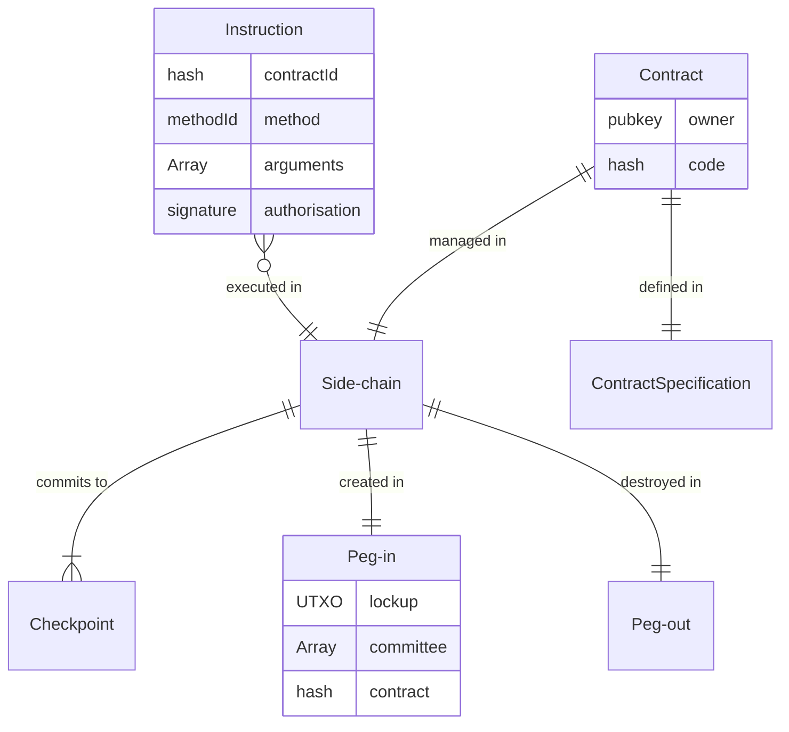

# RFC-0312/DANSpecification

## High level Digital Asset Network Specification

**Maintainer(s)**: [Cayle Sharrock](https://github.com/CjS77)

# Licence

[The 3-Clause BSD Licence](https://opensource.org/licenses/BSD-3-Clause).

Copyright 2019 The Tari Development Community

Redistribution and use in source and binary forms, with or without modification, are permitted provided that the
following conditions are met:

1. Redistributions of this document must retain the above copyright notice, this list of conditions and the following
   disclaimer.
2. Redistributions in binary form must reproduce the above copyright notice, this list of conditions and the following
   disclaimer in the documentation and/or other materials provided with the distribution.
3. Neither the name of the copyright holder nor the names of its contributors may be used to endorse or promote products
   derived from this software without specific prior written permission.

THIS DOCUMENT IS PROVIDED BY THE COPYRIGHT HOLDERS AND CONTRIBUTORS "AS IS", AND ANY EXPRESS OR IMPLIED WARRANTIES,
INCLUDING, BUT NOT LIMITED TO, THE IMPLIED WARRANTIES OF MERCHANTABILITY AND FITNESS FOR A PARTICULAR PURPOSE ARE
DISCLAIMED. IN NO EVENT SHALL THE COPYRIGHT HOLDER OR CONTRIBUTORS BE LIABLE FOR ANY DIRECT, INDIRECT, INCIDENTAL,
SPECIAL, EXEMPLARY OR CONSEQUENTIAL DAMAGES (INCLUDING, BUT NOT LIMITED TO, PROCUREMENT OF SUBSTITUTE GOODS OR
SERVICES; LOSS OF USE, DATA OR PROFITS; OR BUSINESS INTERRUPTION) HOWEVER CAUSED AND ON ANY THEORY OF LIABILITY,
WHETHER IN CONTRACT, STRICT LIABILITY OR TORT (INCLUDING NEGLIGENCE OR OTHERWISE) ARISING IN ANY WAY OUT OF THE USE OF
THIS SOFTWARE, EVEN IF ADVISED OF THE POSSIBILITY OF SUCH DAMAGE.

## Language

The keywords "MUST", "MUST NOT", "REQUIRED", "SHALL", "SHALL NOT", "SHOULD", "SHOULD NOT", "RECOMMENDED",
"NOT RECOMMENDED", "MAY" and "OPTIONAL" in this document are to be interpreted as described in
[BCP 14](https://tools.ietf.org/html/bcp14) (covering RFC2119 and RFC8174) when, and only when, they appear in all capitals, as
shown here.

## Disclaimer

This document and its content are intended for information purposes only and may be subject to change or update
without notice.

This document may include preliminary concepts that may or may not be in the process of being developed by the Tari
community. The release of this document is intended solely for review and discussion by the community of the
technological merits of the potential system outlined herein.

## Goals

This document describes the high level specification for how digital assets are created, managed, secured, and wound-
down on the Tari digital asset network (DAN).

The document covers, among other things:

* The relationship of side-chains to digital assets,
* Required characteristics of side-chains,
* Peg-in and peg-out mechanisms,
* Digital asset template minimum requirements,
* Validator node requirements,
* Checkpoint and refund mechanisms

This RFC covers a lot of ground. Therefore the intent is not to provide a detailed, code-ready specification for the
entire DAN infrastructure; those are left to other RFCs; but to establish a foundation onto which the rest of the DAN
specifications can be built.

This RFC supersedes and deprecates several older RFCs:
  - [RFC-0300: Digital Assets Network](RFCD-0300_DAN.md)
  - [RFC-0301: Namespace Registration](RFCD-0301_NamespaceRegistration.md)
  - [RFC-0302: Validator Nodes](RFCD-0302_ValidatorNodes.md)
  - [RFC-0304: Validator Node committee selection](RFCD-0304_VNCommittees.md)
  - [RFC-0345: Asset Life cycle](RFC-0345_AssetLifeCycle.md)

Several RFC documents are in the process of being revised in order to fit into this proposed framework:

* [RFC-0300: The Digital Assets Network](RFCD-0300_DAN.md)
* [RFC-0340: Validator Node Consensus](RFC-0340_VNConsensusOverview.md)

### Motivation
There are many ways to skin a cat.
The philosophy guiding the approach in the RFC is one that permits
scaling of the network to handle in the region of **1 billion messages per day** network-wide and
**1 million digital assets** with **near real-time user experience** on asset state retrieval, updating and transfer,
on a sufficiently decentralised and private basis.

The definition of _sufficient_ here is subjective, and part of the design philosophy of Tari is that we leave it up to the
user to determine what that means, keeping in mind that there is always a trade-off between decentralisation, performance,
and cost.

For some assets, decentralisation and censorship resistance will be paramount, and users will be willing to live with a
more laggy experience. Gamers in a Web 3.0-MMORPG on the other hand, want cheap, fast transactions with verifiable ownership, and
therefore will generally be happy to sacrifice decentralisation for that.

The goal of the DAN is for asset issuers to be able to configure the side-chain for their project to suit their particular
needs.

## Description

### The role of the Layer 1 base chain

The Tari Overview RFC describes [the role of the base layer].
In summary, the base layer maintains the integrity of the Tari cryptocurrency token, and maintains registers of the side-chains,
validator nodes and contract templates.

It does not know about or care about what happens in the side chains as long as the Tari consensus, side-chain and
validator node rules are kept.

One can view the base layer blocks and transactions as an immutable, append-only document which is the physical manifestation
of a traditional database. The rows are represented by the UTXOs and we can infer which table the row belongs to by inspecting
the output features of the UTXO.

Whereas a standard RDMS manages access control and permissions via policy, we must also take care to ensure proper access control
via consensus rules, lock scripts, covenants, signatures and kernels.

### Top-level requirements for side-chains

The guiding principle of Tari contracts are that they are managed on a dedicated side-chain. One side-chain,
one contract.
Other RFCs will discuss ways to overcome the apparent limitations this rule implies, including inter-contract
interactions and asset hibernation.

#### Asset issuer - validator node agreements

The fundamental relationship of Tari contracts is between the asset issuer and the validator node(s) that manage
the contract's side-chain. This relationship is somewhat adversarial by nature: Issuers want high quality service at
the lowest possible price; Validators want to be compensated for their services and under some circumstances may want
to cheat on contracts for their own gain.

Tari seeks to address this in the lightest way possible by requiring the absolute minimum in terms of base layer governance
while providing options for side-chain governance that suits the needs of the parties involved.

For example, an asset
issuer that wants to issue a highly decentralised, censorship-resistant _high-value_ contract on a side-chain would likely
seek to recruit dozens of validator nodes and run a proof-of-stake consensus model with a confidential asset specification.

In contrast, an asset issuer that wants to participate in the Tari ecosystem, but is not interested in decentralisation
could run their own validator node; with no consensus, or staking, or validator node compensation contracts -- these
would be unnecessary; and provide a high performance, real-time contract. Games with realistic embedded economics would
follow this model, as well as early on in the transition from tradFi to deFi.

A set of Validator nodes that manage the same contract is called the _validator node committee_ for the contract.

##### Contract instantiation

* Every contract MUST be governed by one, and only one, Tari [side-chain]. A contract MAY define one or more digital assets.
  This contract can be very simple or highly complex.
* The contract is defined in a [contract definition transaction].
  * The contract defintion transaction MUST provide the full contract specification, or a hash of the full contract
    specification. This is immutable for the lifetime of the contract.
* Validator nodes MUST cryptographically [acknowledge and agree] to manage the contract.
* Side-chains MUST be initiated by virtue of a [peg-in] transaction.
  * The validator node committee MUST sign and broadcast the peg-in transaction.
  * The peg-in transaction MUST reference the contract that is being managed by the side-chain.
  * There is a minimum [side-chain deposit] that MUST be included in the peg-in UTXO. This is a nominal quantity of
    Tari that is locked up for the duration of the contract and serves as a spam deterrent.
    It is not related to any stakes or contract funding deposits that may be required by the contract itself.
  * There MUST also be a funding UTXO associated with the peg-in transaction. This UTXO represents the total initial
    balance of all Tari [contract user accounts] in the side-chain. This is a standard Pedersen commitment, so the value
    is unknown, and it MAY be zero, if Tari accounts are not required in the side-chain contract.
    This UTXO MUST only be spendable in a checkpoint transaction.

##### Contract management

* Validator nodes SHOULD diligently and accurately [process all instructions] related to the contract.
* The committee SHOULD reach consensus on every instruction related to the contract. This specification does NOT dictate how this
  consensus is reached. If the committee contains one member, then consensus is trivial, and does not require any complicated
  consensus algorithms. A standard web-based application stack will suffice in most cases.
  Larger committees can choose from any manner of consensus algorithms, including PBFT, HotStuff, proof-of-stake or
  proof-of-work.

**OPEN QUESTION**: The asset issuer has no in-band way to know how the VNs are reaching consensus. Even out-of-band,
there could be one server and a bunch of proxies that merely relay messages. Only proof of work (because it is permissionless)
and proof of stake (maybe?) work around this problem. We need some sort of proof-of-uniqueness mechanism here... :thinking:

* The validator node committee MUST post periodic [checkpoints] onto the base layer.
  * The checkpoint MUST include a [summary of the contract state]. This summary SHOULD be in the form of a Merklish Root.
  * The checkpoint MUST include [refund information] for Tari holders in the side-chain.
  * The checkpoint MUST spend the old contract funding UTXO into a new funding UTXO, taking any withdrawals and new deposits
    into account.
* If a valid checkpoint is not posted within the maximum allowed timeframe, the contract is [abandoned]. This COULD lead
  to penalties and stake slashing if enabled within the contract specification.
* A checkpoint MAY define [validator node committee updates].

The Tari base layer does not get involved in governance issues. However, many asset issuers may want to include mechanisms
that, for example, require a Tari stake to act as a validator node. Validator nodes may also desire a compensation
mechanism so that they get paid for managing the contract. These mechanisms form part of the contract itself, and are
opaque to the machinery of the base layer, side-chain and associated peg transactions.

### The (side-chain)-(contract)-(validator node) relationship

Every contract MUST be governed by one, and only one, Tari side-chain.

Every digital asset MUST be governed by a single smart contract. This contract can be very simple or highly complex.

Side-chains MUST be initiated by Asset Issuers at the time of contract creation.

The side-chain consensus MUST be maintained by one or more Validator Nodes.

#### Tari contracts
[contract]: #tari-contracts
[smart contract]: #tari-contracts

1. The asset issuer publishes a [contract creation transaction] that specifies exactly what the contract does, the types
   of assets it will manage, as well as some metadata.
2. The issuer must then find a set of validator nodes that will manage the contract. This is typically done out-of-band,
   via a DEX, DAO or other marketplace. The VNs could also be owned by the issuer itself.
3. A new side-chain for the contract is created via the publishing of a [peg-in transaction].

#### Contract creation transaction
[contract creation transaction]: #contract-creation-transaction

* Every contract MUST be registered on the base layer.
* Contracts MUST be registered by publishing a `contract creation` transaction.
* The following information must be captured as part of the `contract creation` transaction
  * the asset issuer, also known as the owner public key, `<PublicKey>`.
  * The contract id -- `<u256 hash>`. This is immutable for the life of the contract and is calculated as
    `H(contract_name || contract specification hash || Initial data hash)`.
  * A contract name -- `utf-8 char[32]`(UTF-8 string) 32 bytes. This is for informational purposes only, so it shouldn't
    be too long, but not too short that it's not useful (this isn't DOS 3.1 after all). 32 bytes is the same length as
    a public key or hash, so feels like a reasonable compromise.
* The [contract definition]. This is either the full contract definition, or the hash of the full contract definition.

_Thought_: Should we also allow registration of contracts themselves on the base layer? You notarise the code / github
commit / `.so hash` so that nodes can verify that they're running the right code; and there's a clear upgrade path, since
there's a code-chain from one version of a contract template to the next. Does this live on the base layer, or as a side-chain?

#### Asset issuer
[asset issuer]: #asset_issuer

The asset issuer, otherwise known as the contract owner, is the entity that publishes a [contract creation transaction].

* The asset issuer MAY transfer ownership of a contract to a new entity.
* The asset issuer MAY migrate a contract to a new version.

OPEN QUESTION: What rights are unquestionably given to the owner? Maybe the covenant should be somewhat flexible.
Contracts that do not allow the owner to deregister it will be more trustworthy than those that do.

The owner collateral is a small staked amount of at least `MINIMUM_OWNER_COLLATERAL`. The amount is hard-coded into
consensus rules and is a nominal amount to prevent spam, and encourages asset owners to tidy up after themselves when
a contract winds down.

Initially, `MINIMUM_OWNER_COLLATERAL` is set at 200 Tari, but MAY be changed across network upgrades.

The owner collateral MUST be locked up in the [contract creation transaction].

Assuming the collateral is represented by the UTXO commitment $C = kG + vH$, the minimum requirement is verified by
having the range-proof commit to $(k, v - v_\mathrm{min})$ rather than the usual  $(k, v)$. Note that this change requires us to modify the
`TransactionOutput` definition to include a `minimum_value_commitment` field, defaulting to zero, to capture this extra information.

* The owner collateral UTXO MUST have the `OWNER_COLLATERAL` output feature flag set.
* The owner collateral MUST include a covenant that only permits it to be spent to a new `OWNER_COLLATERAL` UTXO (when
  transferring ownership of a contract), or as an unencumbered UTXO in a `CONTRACT_DEREGISTRATION` transaction.

#### Validator node
[Validator node]: #validator-node

Validator nodes:

* MUST register on the base-chain. Validator Nodes will not be able to be nominated as [authorised signers] on side-chains
  if they have not registered on the base-chain.
* MUST stake a nominal amount of Tari in a UTXO as part of the node registration transaction. This is an anti-spam
  measure and is not related to any finds a node must stake as part of its obligations in managing a contract.

Validator nodes should expect to have to stake Tari for each contract they validate. Asset issuers will determine the
nature and amount of stake required. The contract stake should be variable on a contract-to-contract basis so that an efficient market
between asset issuers and validator nodes can develop. This market is not defined on the Tari blockchain at all and
would be implemented as a DAO on the DAN itself.

Similarly, it has been suggested in the past that Validator Nodes should post hardware benchmarks when registering. The problem
with this requirement is that it is fairly trivial to game. We cannot enforce that the machine that posted the benchmark
is the same as the one that is running validations.

A better approach is to leave this to the market. A reputation contract can be built, on Tari, of course, that
periodically and randomly asks Validator Nodes to perform cryptographically signed benchmarks in exchange for performance
certificates. Nodes can voluntarily sign up for such a service and acts as a form of credential. Nodes that do not sign
up may have trouble finding contracts to validate and might have to lower their price to get work.

#### Side-chain specifications
[side-chain]: #side-chain-specifications

* Every side chain MUST be registered on the base layer.
* Side-chains MUST be created by publishing a [peg-in] transaction.
* The following information must be captured as part of the peg-in transaction
  * the owner authority (PublicKey) - could be a multisig key
  * ?a chain id (scalar) - deterministic hash of initial contract metadata. Immutable for the life of the SC
* contract name (UTF-8 string) 32 bytes
* checkpoint number - 0 when creating SC
* checkpoint hash
* ?contract definition

#### Peg-in transaction
[peg-in]: #peg-in-transaction
[acknowledge and agree]: #peg-in-transaction

#### Contract user accounts
[contract user accounts]: #contract-user-accounts

Tari uses the UTXO model in its ledger accounting. On the other hand Tari side-chains SHOULD use an account-based system
to track balances and state.

The reasons for this are:
* An account-based approach leads to fewer outputs on peg-in transactions. There is roughly a 1:1 ratio of users
  to balances in an account-based system. On the other hand there are O(n) UTXOs in an output-based system where `n` are
  the number of transactions carried out on the side-chain. When a side-chain wants to shut down, they must record a new
  output on the base layer for every account or output (as the case may be) that they track in the peg-out transaction(s).
  It should be self-evident that account-based systems are far scalable in the vast majority of use-cases.
* Following on from this, Accounts scale better for micro-payment applications, where hundreds or thousands of tiny payments
  flow between the same two parties.
* Many DAN applications will want to track state (such as NFTs) as well as currency balances. Account-based ledgers make
  this type of application far simpler.

Tari side-chain accounts MUST be representable as, or convertible to, a valid base layer UTXO.

When a side-chain pegs out, either partially (when users withdraw funds) or completely (when the side-chain shuts down),
all balances MUST be returned to the base layer in a manner that satisfies the Tari base layer consensus rules.

#### Pedersen commitments and account-based ledgers

Standard Pedersen commitments are essentially useless in account-based ledgers.

The reason being that since the spending keys would be common to all transactions involving a given account, it is trivial
to use the accounting rules to cancel out the `k.G` terms from transactions and to use a pre-image attack to unblind all
the values.

An alternative approach is to rather maintain a map of public keys to a single-balance UTXOs. Thus the primary side-chain
ledger would be a map of

$$
  k_i \cdot J = J_i \Rightarrow
  \begin{cases}
        j, \; \text(account update counter) \\\\
        C_j = k_j \cdot G + v_j \cdot H, \\\\
        d_j = \text{data}_j  
  \end{cases}
$$

where $J_i$ represents the i-th account public key, and the private key is known only by the account holder,
$C_j$ is balance for account _i_ after the j-th update. There is also an associated field $d_j$ that holds arbitrary
state for the account after the j-th update.

Updates to an account from a transaction involving _n_ accounts require

$$
\sum_{i, \text{before}}^n C_i + \mathrm{fee} = \sum_{i, \text{after}}^n C_i + \text{excess}
$$

### External references

### TODO

### Contract creation flow

The [Asset Owner] creates and owns a contract. Each contract runs in its own side-chain, and is managed by one or more
[Validator nodes].

There are several steps that are required to launch a new contract. They are discussed in detail below and in the various
sub-RFCs, but the basic flow is

//TODO Insert creation flow

To complete the contract creation flow, two transactions will be published on the main chain.
The first is the [Peg-in transaction] which formally coincides with the genesis of the side-chain.

The peg-in transaction contains a list of [authorised signers] that have the authority to broadcast the peg-out transactions.
Once a critical threshold of signers have acknowledged this responsibility _on-chain_, the side-chain can be considered
live and the second, [Asset Registration transaction], can be broadcast.

#### Metadata specification

#### Owner Collateral

#### Peg-in transaction

[Peg-in transaction]: #peg-in-transaction
The first of the two transactions required to bring a digital asset into existence is the peg-in transaction.

The purpose of the peg-in is to:

* Identify the authorised signers. This is a list of public keys and a critical threshold that determines who can
  authorise transaction spending fund out of the side-chain back onto the base-chain ([peg-out transaction]s).
* Offer proof that the [Asset owner] has posted some minimum amount of funding capital.

The peg-in transaction requires

* a [funding commitment]. This represents a source of funds that will be paid over to validator nodes for managing the contract.
* a list of [peg-out signers]. These are a set of public keys that are authorised to sign the peg-out transaction.

This transaction MUST be signed by the [Asset owner] private key.

* Value is seed amount
* range proof on (k, v - v_seed)
* Output type is `PEG-IN`
* Funding address - the public key that accepts 'deposits' for this contract. MUST be one-sided payments
* The contract ID (Do we know this yet [??])
* [Authorised signer] - A TariScript providing the requirements for peg outs and `UpdateSigner`. [?? Probably should be 2 different scripts]

To be more specific, the transaction is composed as follows:

| Transaction component | Details              |                            | Comments / Restrictions         |
| :-------------------- | :------------------- | :------------------------- | :------------------------------ |
| Inputs                |                      |                            | Any valid inputs                |
| Output                | description          | Funding commitment         |                                 |
|                       | Commitment           | hold funds for funding VNs |                                 |
|                       | Range proof          |                            | Commit to$(k, v_\mathrm{seed})$ |
|                       | Output Feature flags | `CONTRACT_SEED`            |                                 |
|                       | Output feature       | $v_\mathrm{seed}$          | Minimum seed amount             |
|                       | script               | [???]                      |                                 |
|                       | covenant             |                            |                                 |
| Kernel                |                      |                            |                                 |

#### Asset registration transaction

The registration transaction requires the following data:

* [Asset metadata],
* [Owner collateral],
* [Initial contract state], or more correctly, the hash of the initial contract state,
* [The checkpoint number], which is always zero for new assets.

The transaction requires all [signers] to have commited their stake.

The UTXO output type is `ASSET_REGISTRATION`. This is an implicit or explicit (implemenation dependent) covenant that
the UTXO can only be spent to a `CHECKPOINT` UTXO. `ASSET_REGISTRATION` is implicity also a `CHECKPOINT` and always has
checkpoint number 0.

* The value is the collateral ?
* Rangeproof is on (k, v - v_min) rather than (k, v)
* Output features
  - Full asset metadata
  - a checkpoint covenant
  - Checkpoint # (0)
  - Initial state hash [??]
  - v_min
  - contract id - Hash(metadata || Commitment || Initial state hash)
  - refund info [??]

#### Side-chain funding transaction

#### Refund transaction

#### Checkpoint transaction

#### Slashing authorised signers

#### Updating authorised signers

#### Contract-creation time-out

Signers have `STAKE_ALLOWANCE_TIMEOUT` blocks to sign and stake their collateral. Initially this period is set to
30\*24\*7 = 5040 blocks (1 week).

If this period elapsed and not all signer signatures have been collected, the asset owner MAY spend the peg-in output
back to himself to recover his funds.

#### Validator Node collateral

[Validator Node collateral]: #validator-node-collateral
Validator Nodes MUST stake collateral as part of their registration. The amount staked can be any amount, as long as it
is greater than `VALIDATOR_NODE_COLLATERAL`. This value is specified in the consensus code and is initially set
at least 2,500 Tari. This value can be changed as part of a network upgrade.

The collateral stake is locked up for the entire period that the Validator Node is registered.
The stake MUST be recovered when the validator node de-registers.

This collateral cannot be slashed. There are individual contract stakes that can be slashed in response to byzantine
validator behaviour.

The primary purpose of the stake is to act as a Sybil attack deterrent.

The stake is locked up for a minimum period of `MINIMUM_VALIDATION_PERIOD`. This value is initially set at three months.

The requirements MUST be present in the [Validator Node registration] transaction and are enforced by consensus.

#### DAN contract template specification

[RFC-0001]: RFC-0001_overview.md
[the role of the base layer]: RFC-0001_overview.md#the-role-of-the-base-layer
[Zether]: https://eprint.iacr.org/2019/191.pdf
[comms network]: RFC-0172_PeerToPeerMessagingProtocol.md
