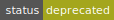

# RFC-0010/CodeStructure

## Tari Code Structure and Organization

**Maintainer(s)**: [Cayle Sharrock](https://github.com/CjS77) and [Byron Hambly](https://github.com/delta1)

# Licence

[The 3-Clause BSD Licence](https://opensource.org/licenses/BSD-3-Clause).

Copyright 2018 The Tari Development Community

Redistribution and use in source and binary forms, with or without modification, are permitted provided that the
following conditions are met:

1. Redistributions of this document must retain the above copyright notice, this list of conditions and the following
   disclaimer.
2. Redistributions in binary form must reproduce the above copyright notice, this list of conditions and the following
   disclaimer in the documentation and/or other materials provided with the distribution.
3. Neither the name of the copyright holder nor the names of its contributors may be used to endorse or promote products
   derived from this software without specific prior written permission.

THIS DOCUMENT IS PROVIDED BY THE COPYRIGHT HOLDERS AND CONTRIBUTORS "AS IS", AND ANY EXPRESS OR IMPLIED WARRANTIES,
INCLUDING, BUT NOT LIMITED TO, THE IMPLIED WARRANTIES OF MERCHANTABILITY AND FITNESS FOR A PARTICULAR PURPOSE ARE
DISCLAIMED. IN NO EVENT SHALL THE COPYRIGHT HOLDER OR CONTRIBUTORS BE LIABLE FOR ANY DIRECT, INDIRECT, INCIDENTAL,
SPECIAL, EXEMPLARY OR CONSEQUENTIAL DAMAGES (INCLUDING, BUT NOT LIMITED TO, PROCUREMENT OF SUBSTITUTE GOODS OR
SERVICES; LOSS OF USE, DATA OR PROFITS; OR BUSINESS INTERRUPTION) HOWEVER CAUSED AND ON ANY THEORY OF LIABILITY,
WHETHER IN CONTRACT, STRICT LIABILITY OR TORT (INCLUDING NEGLIGENCE OR OTHERWISE) ARISING IN ANY WAY OUT OF THE USE OF
THIS SOFTWARE, EVEN IF ADVISED OF THE POSSIBILITY OF SUCH DAMAGE.

## Language

The keywords "MUST", "MUST NOT", "REQUIRED", "SHALL", "SHALL NOT", "SHOULD", "SHOULD NOT", "RECOMMENDED",
"NOT RECOMMENDED", "MAY" and "OPTIONAL" in this document are to be interpreted as described in
[BCP 14](https://tools.ietf.org/html/bcp14) (covering RFC2119 and RFC8174) when, and only when, they appear in all capitals, as
shown here.

## Disclaimer

This document and its content are intended for information purposes only and may be subject to change or update
without notice.

This document may include preliminary concepts that may or may not be in the process of being developed by the Tari
community. The release of this document is intended solely for review and discussion by the community of the
technological merits of the potential system outlined herein.

## Goals

The aim of this Request for Comment (RFC) is to describe and explain the Tari codebase layout.

## Related Requests for Comment

None.

## Description

The code follows a Domain-driven Design ([DDD]) layout, with top-level directories falling into infrastructure, domain
and application layers.

### Infrastructure Layer

The infrastructure layer provides a set of crates that have general infrastructural utility. The rest of the Tari codebase can make use
of these crates to obtain persistence, communication and cryptographic services. The infrastructure layer doesn't know
anything about blockchains, transactions or digital assets.

We recommend that code in this layer generalizes infrastructure services behind abstraction layers as much as is
reasonable, so that specific implementations can be swapped out with relative ease.

### Domain Layer

The domain layer houses the Tari "business logic". All protocol-related concepts and procedures are defined and
implemented here.

This means that any and all terms defined in the [Glossary] will have a software implementation here, and only here.
They can be _used_ in the application layer, but must be _implemented_ in the domain layer.

The domain layer can make use of crates in the infrastructure layer to achieve its goals.

### Application Layer

In the application layer, applications build on top of the domain layer to produce the executable software that is
deployed as part of the Tari network.

As an example, the following base layer applications may be developed as part of the Tari protocol release:

- A base node executable (tari_base_node)
- A Command Line Interface (CLI) wallet for the Tari cryptocurrency (tari_console_wallet)
- A standalone miner (tari_miner)
- A mining proxy to enable merge mining Monero (tari_merge_mining_proxy)
- An Application Programming Interface (API) server for the base node (REST, gRPC, etc.)

### Code Layout

1. Tari Protocol

Github: [tari-project/tari]

The Tari Protocol code repository is a Rust [workspace] consisting of multiple packages. A package is a set of [crates], which is the source code of a binary or library.

The source code is organized into the following directories.

- `applications` contains crates for all the application-layer executables that form part of the Tari codebase.

  - `tari_base_node` - the Base Node application
  - `tari_console_wallet` - the CLI Wallet application
  - `tari_miner` - the SHA3 Miner (CPU)
  - `tari_merge_mining_proxy` - the Merge Mining Proxy
  - `tari_explorer` - a local web based block explorer

- `base_layer` is the fundamental domain-layer directory and contains multiple packages and crates.

  - `core` - core classes and traits, such as [Transaction]s, [Block]s, and consensus, mempool, and blockchain database code;
  - `key_manager` - construction and storage of key derivations and mnemonic seed phrases;
  - `mmr` - an independent implementation of a Merkle Mountain Range;
  - `p2p` - the block and transaction propagation module;
  - `service_framework` - asynchronous service stack builder;
  - `wallet` - a wallet library including services and storage classes to create Tari wallets;
  - `wallet_ffi` - a [Foreign Function Interface](https://en.wikipedia.org/wiki/Foreign_function_interface) (FFI) library to create Tari wallets in other programming languages;

- `comms` is the networking and messaging subsystem, used across the base layer and applications;

- `infrastructure` contains application-layer code and is not Tari-specific. It holds the following crates:

  - `derive` - a crate to contain `derive(...)` macros;
  - `shutdown` - a convenient way for threads to let each other know to stop working;
  - `storage` - data persistence services, including a Lightning Memory-mapped Database (LMDB) persistence implementation;

- other utility and test libraries.

2. Tari Cryptography

Github: [tari-project/tari-crypto]

Tari Crypto was refactored into its own [crate], for ease of use and integration across different projects.
It includes all cryptographic services, including a Curve25519 implementation.

[glossary]: ../Glossary.md "Glossary"
[ddd]: https://en.wikipedia.org/wiki/Domain-driven_design "Wikipedia: Domain Driven Design"
[transaction]: ../Glossary.md#transaction
[block]: ../Glossary.md#block
[tari-project/tari]: https://github.com/tari-project/tari
[tari-project/tari-crypto]: https://github.com/tari-project/tari-crypto
[workspace]: https://doc.rust-lang.org/book/ch14-03-cargo-workspaces.html
[crates]: https://doc.rust-lang.org/book/ch07-01-packages-and-crates.html
[crate]: https://crates.io/crates/tari_crypto

# Change Log

| Date        | Description                    | Author |
|:------------|:-------------------------------|:-------|
| 21 Dec 2018 | First draft                    | CjS77  |
| 14 Jan 2022 | Deprecated in favour of README | CjS77  |
