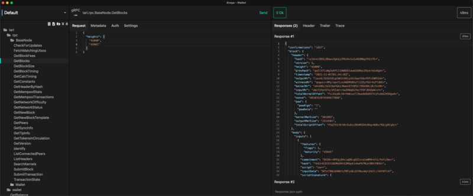
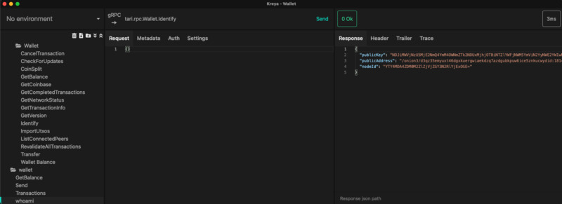
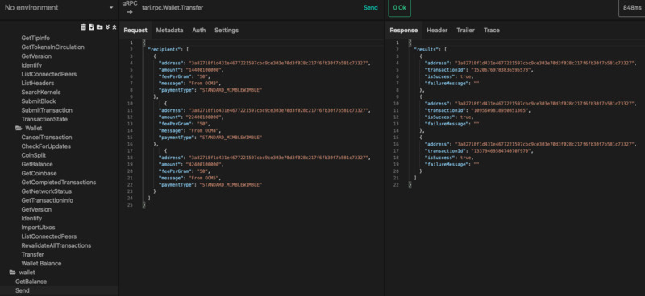

# Tari Launchpad - CLI edition

a.k.a. _Tari one-click miner_.

Currently this only works on MacOS and Linux.
Contributions for  `quick_start.bat` are welcomed.

## Prerequisites

1. [Docker](https://docs.docker.com/get-docker/)
2. Set up some environment variables:
  - `DATA_FOLDER` (required). The path to store the Tari configuration files and logs. You can create multiple
     network setups, each in their own sandbox.
  - `TARI_NETWORK` (optional). Default=weatherwax. Specify the Tari network to connect to.
  - `START_TOR` (optional). Default=1. Whether we should start a Tor instance
  - `START_BASE_NODE` (optional). Default=1. Whether we should start a base node instance
  - `START_WALLET` (optional). Default=1. Whether we should start a wallet instance (GRPC only)
  - `START_MINER` (optional). Default=1. Whether we should fire up a SHA_3 solo miner.
  - `USE_OWN_MODEROD` (optional). Default=0. Whether we should start and sync our own Monero node.
  - `START_MONERO_MM` (optional). Default=1. Whether we should start merge-mining on Monero.

  - `TARI_WALLET_PASSWORD` (optional). Highly recommended. Default: tari. The password for your Tari wallet.
  - `TARI_WALLET__WEATHERWAX__TOR_CONTROL_AUTH` (optional). Default: tari. The password for the Tor control auth.
  - `TARI_MONERO_WALLET_ADDRESS` (optional). Though you'll donate funds to some random address if you don't set it.

## Quick Start

`./quick-start.sh`

And you should be golden.

## Interacting with the wallet and base node.

Any Tari client that supports gRPC can be connected to the node setup. With the default configuration, the base node
will be at `http://127.0.0.1:18142` and the wallet will be at `http://127.0.0.1:18143`.

[Kreya](https://kreya.app/) is a fairly user-friendly gRPC client that can give you a rudimentary UI to the docker rig
out of the box:

#### Getting block information



#### Wallet - whoami



#### Wallet - send transactions



## Viewing logs and configuration files

Logs and configuration files are stored in `{DATA_FOLDER}/{app}/log/*.log`.

So assuming your data folder is `/tmp/tari1/, the generated file structure looks like:

```text
/tmp/tari1$ ll -R
drwxr-xr-x user user 128 B Wed Nov  3 15:56:53 2021   base_node/ 
drwxr-xr-x user user  96 B Wed Nov  3 15:56:53 2021   config/    
drwxr-xr-x user user 128 B Mon Nov  1 12:55:50 2021   mm_proxy/  
drwxr-xr-x user user 128 B Mon Nov  1 12:55:58 2021   sha3_miner/
drwxr-xr-x user user  64 B Wed Nov  3 15:56:53 2021   tor/       
drwxr-xr-x user user 192 B Mon Nov  1 12:56:17 2021   wallet/    
drwxr-xr-x user user  96 B Mon Nov  1 12:20:31 2021   xmrig/     

./base_node:
drwxr-xr-x user user 128 B Fri Oct 29 17:44:56 2021   config/
drwxr-xr-x user user 320 B Wed Nov  3 15:40:55 2021   log/   

./base_node/config:
.rw-r--r-- user user 312 B Mon Nov  1 20:09:38 2021   base_node_id.json 
.rw-r--r-- user user 211 B Mon Nov  1 20:09:38 2021   base_node_tor.json

./base_node/log:
.rw-r--r-- user user  3.3 MB Wed Nov  3 15:54:20 2021   core.log   
.rw-r--r-- user user    1 MB Wed Nov  3 15:53:10 2021   network.log
.rw-r--r-- user user    0 B  Mon Nov  1 13:01:33 2021   other.log  

./config:
.rw-r--r-- user user 4.1 KB Mon Nov  1 20:12:10 2021   log4rs.yml

./mm_proxy:
drwxr-xr-x user user 128 B Mon Nov  1 12:53:33 2021   config/
drwxr-xr-x user user 352 B Wed Nov  3 14:10:04 2021   log/   

./mm_proxy/config:
.rw-r--r-- user user 8.7 KB Mon Nov  1 12:53:33 2021   config.toml
.rw-r--r-- user user 1.1 KB Mon Nov  1 12:53:33 2021   log4rs.yml 

./mm_proxy/log:
.rw-r--r-- user user 8.4 MB Wed Nov  3 15:53:53 2021   core.log   
.rw-r--r-- user user   0 B  Mon Nov  1 13:01:38 2021   network.log
.rw-r--r-- user user   0 B  Mon Nov  1 13:01:38 2021   other.log  

./sha3_miner:
drwxr-xr-x user user 192 B Mon Nov  1 13:01:36 2021   log/   

./sha3_miner/log:
.rw-r--r-- user user 677.7 KB Wed Nov  3 15:49:31 2021   core.log    
.rw-r--r-- user user     0 B  Mon Nov  1 13:01:36 2021   network.log 
.rw-r--r-- user user     0 B  Mon Nov  1 13:01:36 2021   other.log   

./wallet:
drwxr-xr-x user user 192 B Mon Nov  1 12:56:17 2021   ./         
drwxr-xr-x user user 288 B Wed Nov  3 15:56:53 2021   ../        
drwxr-xr-x user user 256 B Wed Nov  3 15:23:19 2021   log/       
drwxr-xr-x user user 128 B Wed Nov  3 15:54:10 2021   weatherwax/

./wallet/log:
.rw-r--r-- user user 564.2 KB Wed Nov  3 15:54:20 2021   core.log   
.rw-r--r-- user user 280.3 KB Wed Nov  3 15:54:08 2021   network.log
.rw-r--r-- user user     0 B  Mon Nov  1 13:01:24 2021   other.log  

./xmrig:
drwxr-xr-x user user    96 B  Mon Nov  1 12:20:31 2021   ./       
drwxr-xr-x user user   288 B  Wed Nov  3 15:56:53 2021   ../      
.rw-r--r-- user user 212.9 KB Wed Nov  3 15:53:53 2021   xmrig.log
```

You can edit the network configuration (requires a container restart) and log configuration (takes effect within 30s)
by editing the files in the top-level `config` folder.


##  Current shortcomings and TODOs

* It's a CLI only. Next step is to build a nice UI wrapper around this.

* TODO - Windows support.

* The blockchain data is stores in docker volumes, and not on the host machine directly. This is due to crippling performance
limitations one suffers when mounting host file system from Windows or MacOS into docker containers.
This isn't a big drawback, since you seldom want or need to access the raw blockchain database files anyway. Are they're
[still accessible](#accessing-blockchain-data). But **ensure that you reserve enough space to store the Tari, and optionally,
Monero blockchains inside the Docker VM**.

* TODO - Multi-network sandboxing. Sandboxing currently doesn't work across different networks (e.g. weatherwax and mainnet). This should be fixed soon.

* Local MoneroD support. The merge-miner proxy doesn't actually use the local MoneroD container if it is running. This
  is left as a TODO for the UI version.

* Tor control password. For now, you set this manually. In the UI edition, this will be ephemeral and configured automatically.

* GRPC addresses. The code only supports IPv4 addresses as gRPC configuration parameters. This makes the docker networking
  fragile since the IP addresses must be guessed. TODO - accept DNS names in gRPC configs to make this more robust.


### Accessing blockchain data

The blockchain data is stored in a docker volume for performance reasons. If you need to back up or access the LMDB
a blockchain data, you can use something like this to extract it to the host filesystem:

`docker run --rm -v $(pwd):/backup -v blockchain:/blockchain ubuntu tar czvf /backup/backup.tar.gz /blockchain`


## Layout

      +-----------------------+
      |                       |
+---->|    Console Wallet     +------------------+
|     |                       |                  |
|     +----------+------------+                  |
|                |                               |
|                | gRPC                          |
|                |                               |
|                |                               |
|     +----------v------------+           +------v-----+
|     |                       |  Socks5   |            |
|     |       Base Node       +---------->|     Tor    |----> Network
|     |                       |           |            |
|     +----------^------------+           +------------+
|                |
|                |
|                |
|     +----------+------------+
|     |                       |
+-----+      SHA3-Miner       |
|     |                       |
|     +-----------------------+
|
|
|
|     +-----------------------+
|     |                       |
+-----+        XMRRig etc     |
      |                       |
      +-----------------------+

#### Notes

Building docker images:

```
cd buildtools/docker_rig
docker build -t quay.io/tarilabs/tor:latest -f base_node.Dockerfile .
docker build -t quay.io/tarilabs/tari_base_node:latest -f base_node.Dockerfile ../../
```

Base node/Wallet config for using the Tor docker container:

```toml
tcp_listener_address = "/ip4/0.0.0.0/tcp/18189"
transport = "tor"
tor_control_address = "/dns4/tor/tcp/9051"
tor_control_auth = "password=asdf" # replace with your configured password
tor_onion_port = 18141
tor_forward_address = "/ip4/0.0.0.0/tcp/18189"
tor_socks_address_override="/dns4/tor/tcp/9050"
```

When attaching to a running container:

To detach the tty without exiting the shell/program, use the escape sequence ^P^Q (Ctrl+P followed by Ctrl+Q).
