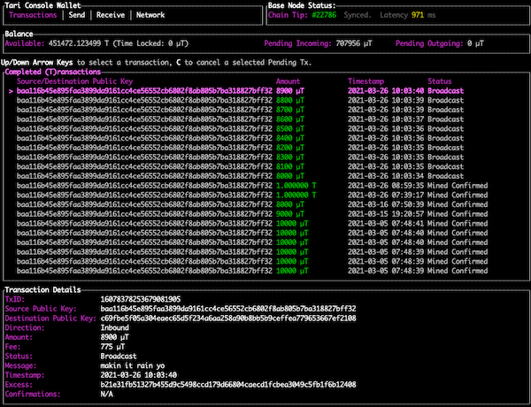

# Minotari Console Wallet

The Minotari Console Wallet is a terminal based wallet for sending and receiving Minotari. It can be run in a few different modes.

## Terminal UI (TUI) mode

The standard operating mode, TUI mode is the default when starting `minotari_console_wallet`. Displays a UI in the terminal to interact with the wallet.



## Non-interactive (GRPC) mode

Run as a server with no UI, but exposing the GRPC interface with `minotari_console_wallet --non-interactive`.

## Command mode

Run a once off command with the `--command` argument:

- **get-balance**

Get your wallet balance

`minotari_console_wallet --command "get-balance"`

example output:

```
Available balance: 1268922.299856 T
Pending incoming balance: 6010 µT
Pending outgoing balance: 1.337750 T
```

- **send-minotari**

Send an amount of Tari to a public key or emoji id.

`minotari_console_wallet --command "send-minotari <amount> <pubkey> <optional message>"`

example:

```
$ minotari_console_wallet --command "send-minotari 1T c69fbe5f05a304eaec65d5f234a6aa258a90b8bb5b9ceffea779653667ef2108 coffee"

1. send-minotari 1.000000 T c69fbe5f05a304eaec65d5f234a6aa258a90b8bb5b9ceffea779653667ef2108 coffee

Monitoring 1 sent transactions to Broadcast stage...
Done! All transactions monitored to Broadcast stage.
```

- **send-one-sided**

Send an amount of Minotari to a public key or emoji id in a one-sided transaction.

`minotari_console_wallet --command send-one-sided <amount> <pubkey> <optional message>"`

example:

```
$ minotari_console_wallet --command "send-one-sided 1T c69fbe5f05a304eaec65d5f234a6aa258a90b8bb5b9ceffea779653667ef2108 coffee"

1. send-minotari 1.000000 T c69fbe5f05a304eaec65d5f234a6aa258a90b8bb5b9ceffea779653667ef2108 coffee

Monitoring 1 sent transactions to Broadcast stage...
Done! All transactions monitored to Broadcast stage.
```

- **make-it-rain**

Make it rain! Send many transactions to a public key or emoji id.

`minotari_console_wallet --command "make-it-rain <tx/sec> <duration> <amount> <increment> <start time or now> <pubkey> <transaction type> <optional message>"`

`<type>` can be `negotiated` or `one_sided`

`<start time>` is a string in RFC3339 format or `now`

example:

```
$ minotari_console_wallet --command "make-it-rain 1 10 8000 100 now c69fbe5f05a304eaec65d5f234a6aa258a90b8bb5b9ceffea779653667ef2108 negotiated makin it rain yo"

1. make-it-rain 1 10 8000 µT 100 µT 2021-03-26T10:03:30Z c69fbe5f05a304eaec65d5f234a6aa258a90b8bb5b9ceffea779653667ef2108 negotiated makin it rain yo

Monitoring 10 sent transactions to Broadcast stage...
Done! All transactions monitored to Broadcast stage.
```

- **coin-split**

Split one or more unspent transaction outputs into many.
Creates a transaction that must be mined before the new outputs can be spent.

`minotari_console_wallet --command "coin-split <amount per coin> <number of coins> <fee per gram(default 5µT)>"`

example:

```
$ minotari_console_wallet --command "coin-split 10000 9"

1. coin-split 10000 µT 9 5 µT

Coin split succeeded
Monitoring 1 sent transactions to Broadcast stage...
Done! All transactions monitored to Broadcast stage.
```

- **set-base-node**

Sets the base node peer that the wallet should connect to (not persisted after exit, normally used in a script).

`minotari_console_wallet --command "set-base-node <public key or emoji id> <network address>"`

example:

```
$ minotari_console_wallet --command "set-base-node 3883ab92d91eb70155d1d471c9e569d2bcae10ee3f196b8dfdaade1e7546c520 /onion3/wlyt2p4ft4mtj6zs2fdgw6hwfqvf5i4hhia4y6ffk6oybfsbrwqcpead:18141"

1. set-base-node 3883ab92d91eb70155d1d471c9e569d2bcae10ee3f196b8dfdaade1e7546c520 /onion3/wlyt2p4ft4mtj6zs2fdgw6hwfqvf5i4hhia4y6ffk6oybfsbrwqcpead:18141

Setting base node peer...
3883ab92d91eb70155d1d471c9e569d2bcae10ee3f196b8dfdaade1e7546c520::/onion3/wlyt2p4ft4mtj6zs2fdgw6hwfqvf5i4hhia4y6ffk6oybfsbrwqcpead:18141
```

- **set-custom-base-node**

Sets the custom base node peer that the wallet should connect to, and persists the peer to the wallet database.

`minotari_console_wallet --command "set-custom-base-node <public key or emoji id> <network address>"`

example:

```
$ minotari_console_wallet --command "set-custom-base-node 3883ab92d91eb70155d1d471c9e569d2bcae10ee3f196b8dfdaade1e7546c520 /onion3/wlyt2p4ft4mtj6zs2fdgw6hwfqvf5i4hhia4y6ffk6oybfsbrwqcpead:18141"

1. set-custom-base-node 3883ab92d91eb70155d1d471c9e569d2bcae10ee3f196b8dfdaade1e7546c520 /onion3/wlyt2p4ft4mtj6zs2fdgw6hwfqvf5i4hhia4y6ffk6oybfsbrwqcpead:18141

Setting base node peer...
3883ab92d91eb70155d1d471c9e569d2bcae10ee3f196b8dfdaade1e7546c520::/onion3/wlyt2p4ft4mtj6zs2fdgw6hwfqvf5i4hhia4y6ffk6oybfsbrwqcpead:18141
Saving custom base node peer in wallet database.
```

- **clear-custom-base-node**

Clears the custom base node peer from the wallet database.

`minotari_console_wallet --command "clear-custom-base-node"`

example:

```
$ minotari_console_wallet --command clear-custom-base-node

1. clear-custom-base-node

Clearing custom base node peer in wallet database.
```

- **export-utxos**

Export all the unspent transaction outputs (UTXOs) in the wallet. This can either list the UTXOs directly in the
console, or write them to a CSV file. Exports never contain private keys: the commitment mask and script private key
of a wallet output are enough to recover the wallet's spend key, so they are not exported in any form. Use
`export-spent-utxos` for the same listing of spent outputs.

```
minotari_console_wallet --command "export-utxos"
minotari_console_wallet --command "export-utxos --output-file <file name>"
```

example output - console only:

```
$ minotari_console_wallet --command "export-utxos"

1. export-utxos

1. Value: 6000 µT, Features: ..., Commitment: 22514e27..., isMultisig: false
2. Value: 10000 µT, Features: ..., Commitment: 88f4e721..., isMultisig: false
...
Total number of UTXOs: 5230
Total value of UTXOs: 1268921.295856 T
```

example output - `--output-file` (console output):

```
$ minotari_console_wallet --command "export-utxos --output-file utxos.csv"

1. export-utxos --output-file utxos.csv

Total number of UTXOs: 11
Total value of UTXOs: 36105.165440 T
```

The CSV file has the columns `index`, `version`, `value`, `commitment`, `output_type`, `maturity`, `coinbase_extra`,
`script`, `covenant`, `input_data`, `sender_offset_public_key`, `ephemeral_commitment`, `ephemeral_nonce`,
`signature_u_x`, `signature_u_a`, `signature_u_y`, `script_lock_height`, `encrypted_data`, `minimum_value_promise`
and `range_proof`.

- **count-utxos**

Count the number of unspent transaction outputs (UTXOs) in the wallet.

`minotari_console_wallet --command "count-utxos"`

example output:

```
1. count-utxos

Total number of UTXOs: 5230
Total value of UTXOs : 1268921.295856 T
Minimum value UTXO   : 6000 µT
Average value UTXO   : 242.623575 T
Maximum value UTXO   : 5538.616395 T
```

- **discover-peer**

Discover a peer on the network by public key or emoji id.

`minotari_console_wallet --command "discover-peer <public key or emoji id or tari address>"`

example output:

```
1. discover-peer c69fbe5f05a304eaec65d5f234a6aa258a90b8bb5b9ceffea779653667ef2108

Waiting for connectivity... ✅
🌎 Peer discovery started.
⚡️ Discovery succeeded in 16420ms.
[dbb4bfde6a67a8e0] PK=c69fbe5f05a304eaec65d5f234a6aa258a90b8bb5b9ceffea779653667ef2108 (/onion3/zs2wpll7zdvxunfnxyhkhan4ntjsps72zutfybssnobvpff63pg6j4qd:18101) - . Type: WALLET. User agent: tari/wallet/0.8.5. Last connected at 2021-03-26 09:07:15.
```

- **whois**

Look up a public key or emoji id, useful for converting between the two formats.

`minotari_console_wallet --command "whois <public key or emoji id>"`

example output:

```
1. whois c69fbe5f05a304eaec65d5f234a6aa258a90b8bb5b9ceffea779653667ef2108

Public Key: c69fbe5f05a304eaec65d5f234a6aa258a90b8bb5b9ceffea779653667ef2108
Emoji ID  : 📈👛➕🎾🐋🥊🎯👍🚀⚽🔥🚓🍳🤡🤠🍕🐵🐼💡💦🎺👘🚚🚿👻🐛⚽🍵🏥🚚🍑🌕🍾
```

## Script mode

Run a series of commands from a given script. The commands should be formatted the same way as Command mode, one per line in a text file.

`minotari_console_wallet --script /path/to/script`

## Recovery mode

todo docs
