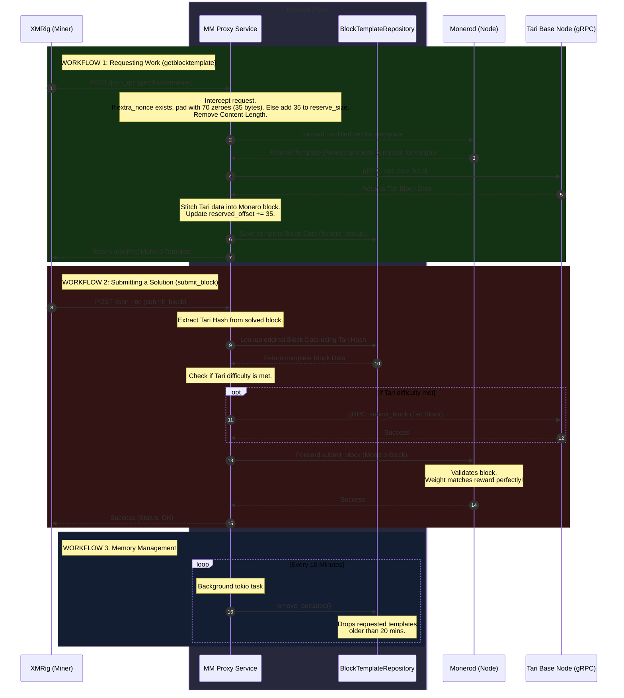

```mermaid
sequenceDiagram
    autonumber
    participant Miner as XMRig (Miner)
    box rgb(40, 40, 60) Minotari Proxy
    participant Proxy as MM Proxy Service
    participant Repo as BlockTemplateRepository
    end
    participant Monerod as Monerod (Node)
    participant Tari as Tari Base Node (gRPC)

    %% ----------------------------------------------------
    rect rgb(20, 50, 20)
    note right of Miner: WORKFLOW 1: Requesting Work (getblocktemplate)
    
    Miner->>Proxy: POST /json_rpc (getblocktemplate)
    
    note over Proxy: Intercept request.<br/>If extra_nonce exists, pad with 70 zeroes (35 bytes). Else add 35 to reserve_size.<br/>Remove Content-Length.
    
    Proxy->>Monerod: Forward modified getblocktemplate
    Monerod-->>Proxy: Returns Template (Reward properly penalized for weight)
    
    Proxy->>Tari: gRPC: get_new_block
    Tari-->>Proxy: Returns Tari Block Data
    
    note over Proxy: Stitch Tari data into Monero block.<br/>Update reserved_offset += 35.
    
    Proxy->>Repo: Save complete Block Data (for later lookup)
    
    Proxy-->>Miner: Return modified Monero Template
    end

    %% ----------------------------------------------------
    rect rgb(50, 20, 20)
    note right of Miner: WORKFLOW 2: Submitting a Solution (submit_block)
    
    Miner->>Proxy: POST /json_rpc (submit_block)
    
    note over Proxy: Extract Tari Hash from solved block.
    
    Proxy->>Repo: Lookup original Block Data using Tari Hash
    Repo-->>Proxy: Return complete Block Data
    
    note over Proxy: Check if Tari difficulty is met.
    
    opt If Tari difficulty met
        Proxy->>Tari: gRPC: submit_block (Tari Block)
        Tari-->>Proxy: Success
    end
    
    Proxy->>Monerod: Forward submit_block (Monero Block)
    note over Monerod: Validates block.<br/>Weight matches reward perfectly!
    Monerod-->>Proxy: Success
    
    Proxy-->>Miner: Success (Status: OK)
    end

    %% ----------------------------------------------------
    rect rgb(20, 30, 50)
    note right of Miner: WORKFLOW 3: Memory Management
    
    loop Every 10 Minutes
        note over Proxy: Background tokio task
        Proxy->>Repo: remove_outdated()
        note over Repo: Drops requested templates<br/>older than 20 mins.
    end
    end
```
