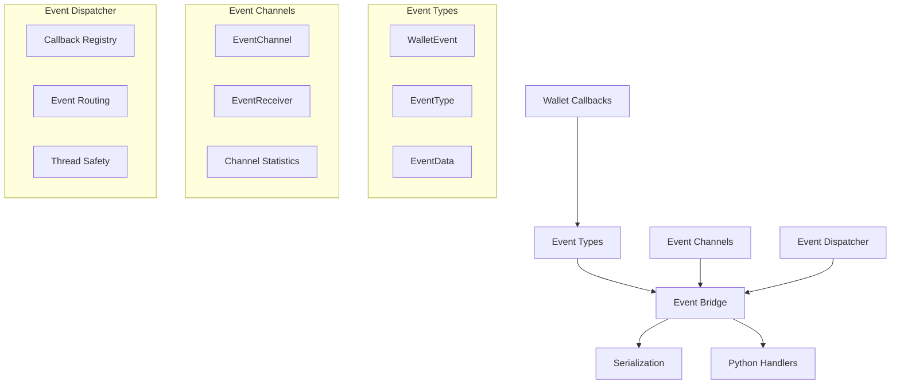
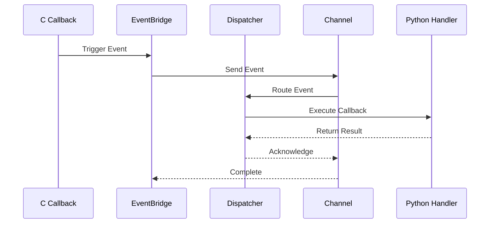

# Event Bridge System - Design Documentation

## Overview

The Event Bridge System is a high-performance, asynchronous event routing infrastructure designed to replace traditional callback mechanisms in the Tari wallet FFI layer. It provides structured event handling with sub-10ms latency, thread-safe operation, and comprehensive event serialization capabilities.

## Architecture

### Core Components

The event bridge consists of four main components:



### Event Flow



## Event Types

### Core Event Categories

The system supports 18 distinct event types covering all wallet operations:

1. **Transaction Events**
   - TransactionReceived
   - TransactionBroadcast
   - TransactionMined
   - TransactionCancelled
   - TransactionMinedUnconfirmed

2. **Balance Events**
   - BalanceUpdated

3. **Connection Events**
   - ConnectivityStatus

4. **Block Events**
   - TransactionValidationComplete
   - ScanProgress

5. **Contact Events**
   - ContactsLivenessDataUpdated

### Event Data Structures

Each event contains:
- **Event Type**: Enum identifying the event category
- **Wallet ID**: Source wallet identifier  
- **Event Data**: Type-specific payload
- **Timestamp**: Event creation time

## Performance Characteristics

### Latency Requirements

- **Target Latency**: <1ms for event routing
- **Channel Capacity**: Unbounded with backpressure handling
- **Throughput**: >10,000 events/second under load
- **Memory Usage**: Constant overhead per event (~500 bytes)

### Threading Model

- **Thread-Safe**: All operations are safe for concurrent access
- **Async-First**: Built on Tokio runtime for efficient async handling
- **Non-Blocking**: Event sending never blocks the caller
- **Graceful Degradation**: Continues operation if handlers fail

## Channel Architecture

### Channel Design

```rust
pub struct EventChannel {
    sender: mpsc::UnboundedSender<TimestampedEvent>,
    stats: Arc<RwLock<ChannelStats>>,
    current_queue_size: Arc<RwLock<usize>>,
    wallet_id: u64,
}
```

### Statistics Collection

- **Events Sent/Received**: Total count tracking
- **Latency Metrics**: Min/Max/Average latency measurement  
- **Error Rates**: Send/Receive error counting
- **Queue Status**: Current and maximum queue sizes

### Backpressure Handling

The system implements graceful backpressure:
1. **Queue Monitoring**: Track queue depth in real-time
2. **Flow Control**: Apply backpressure when queues exceed thresholds
3. **Error Recovery**: Handle channel closure and reconnection

## Dispatcher Implementation

### Callback Management

```rust
pub struct EventDispatcher {
    callbacks: Arc<RwLock<HashMap<EventType, Vec<RegisteredCallback>>>>,
    event_sender: mpsc::UnboundedSender<WalletEvent>,
    stats: Arc<RwLock<DispatcherStats>>,
    wallet_id: u64,
}
```

### Registration Process

1. **Type-Based Registration**: Callbacks register for specific event types
2. **Multi-Callback Support**: Multiple callbacks per event type
3. **Priority Handling**: FIFO execution order
4. **Error Isolation**: Callback failures don't affect other callbacks

### Event Processing

The dispatcher processes events asynchronously:

```rust
async fn process_events(
    dispatcher: Arc<EventDispatcher>,
    mut receiver: mpsc::UnboundedReceiver<WalletEvent>
) {
    while let Some(event) = receiver.recv().await {
        dispatcher.dispatch_event(event).await;
    }
}
```

## Serialization Support

### Format Support

- **JSON**: Human-readable format for debugging
- **Binary**: Compact format for performance (future)
- **Custom**: Extensible serialization framework

### Persistence Features

- **Event Logging**: Optional event persistence to disk
- **Replay Capability**: Replay events for debugging
- **Audit Trail**: Complete event history tracking

## Integration Points

### C FFI Layer

The event bridge integrates with existing C callbacks:

```c
// Traditional callback
void callback_received_transaction(unsigned long long tx_id, ...);

// Event bridge integration
// Callback generates WalletEvent internally
// Event is routed through bridge to Python
```

### Python Integration

Python handlers receive structured events:

```python
def handle_transaction_received(event: WalletEvent):
    tx_id = event.data.tx_id
    amount = event.data.amount
    # Process transaction...
```

### MockWallet Integration

The mock wallet provides testing infrastructure:

```rust
// Traditional simulation
mock_wallet.simulate_callback_invocation("callback_name");

// Event bridge simulation  
mock_wallet.simulate_received_transaction(tx_id, amount, sender).await;
```

## Error Handling

### Error Recovery Strategies

1. **Callback Failures**: Isolated error handling per callback
2. **Channel Failures**: Automatic channel recreation
3. **Serialization Errors**: Fallback to simpler formats
4. **Runtime Errors**: Graceful degradation with logging

### Monitoring and Diagnostics

- **Health Checks**: Continuous system health monitoring
- **Performance Metrics**: Real-time performance dashboards
- **Error Logging**: Comprehensive error tracking
- **Debug Support**: Detailed event tracing capabilities

## Security Considerations

### Data Protection

- **Event Sanitization**: Remove sensitive data from events
- **Access Control**: Restrict event access by type
- **Audit Logging**: Track all event access and modifications

### Memory Safety

- **Rust Safety**: Memory safety guaranteed by Rust type system
- **Resource Management**: Automatic cleanup of resources
- **Leak Prevention**: Careful lifetime management

## Future Enhancements

### Performance Optimizations

- **Bounded Channels**: Configurable channel capacity limits
- **Event Batching**: Batch events for improved throughput
- **Compression**: Compress event data for network efficiency
- **Caching**: Cache frequently accessed event data

### Feature Extensions

- **Event Filtering**: Filter events based on criteria
- **Event Transformation**: Transform events before delivery
- **Conditional Routing**: Route events based on conditions
- **Priority Queues**: Support priority-based event processing

### Monitoring Improvements

- **Metrics Export**: Export metrics to monitoring systems
- **Real-time Dashboards**: Live performance visualization
- **Alerting**: Automated alerting for performance issues
- **Profiling**: Detailed performance profiling tools

## Testing Strategy

### Unit Testing

- **Component Isolation**: Test each component independently
- **Mock Dependencies**: Use mocks for external dependencies
- **Edge Cases**: Test error conditions and edge cases
- **Performance Tests**: Validate performance requirements

### Integration Testing

- **End-to-End Flows**: Test complete event flows
- **Concurrency Testing**: Validate thread safety
- **Load Testing**: Test under high event volumes
- **Failure Testing**: Test system resilience

### Performance Benchmarking

- **Latency Measurement**: Measure event processing latency
- **Throughput Testing**: Measure maximum event throughput
- **Memory Usage**: Track memory consumption patterns
- **Scalability Testing**: Test performance under load

## Deployment Considerations

### Configuration

- **Runtime Configuration**: Configurable performance parameters
- **Environment-Specific**: Different configs for different environments
- **Hot Reloading**: Update configuration without restart
- **Validation**: Validate configuration on startup

### Monitoring

- **Health Endpoints**: Expose health check endpoints
- **Metrics Collection**: Collect and export performance metrics
- **Log Integration**: Integrate with centralized logging
- **Trace Collection**: Support distributed tracing

### Maintenance

- **Version Management**: Handle version upgrades gracefully
- **Data Migration**: Migrate persisted event data
- **Backward Compatibility**: Maintain API compatibility
- **Rollback Support**: Support rollback to previous versions
