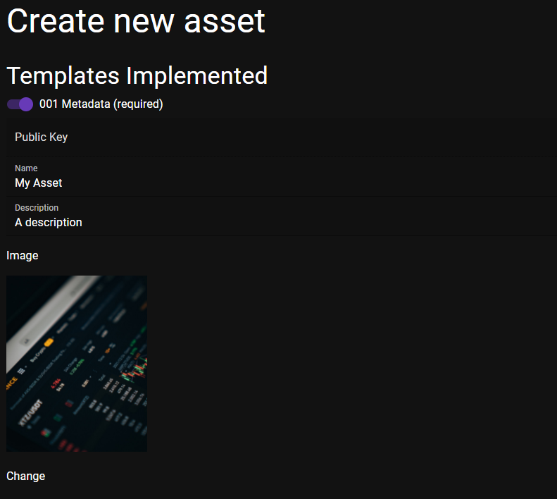
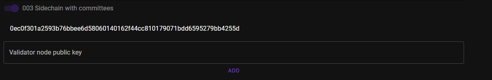
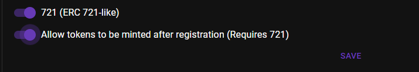
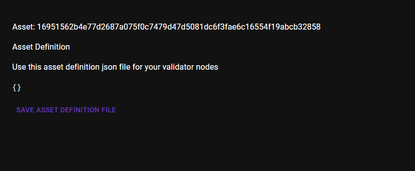
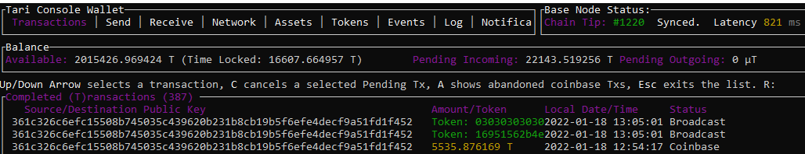
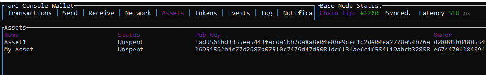
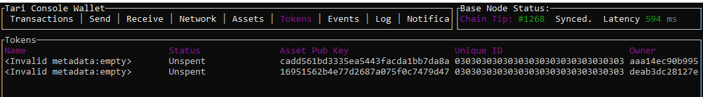
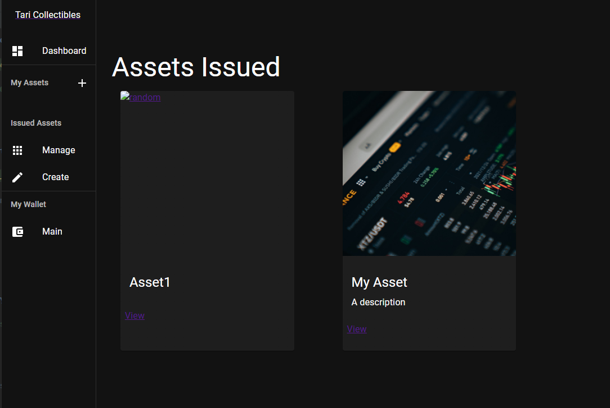
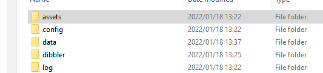

# How to create an NFT Asset on Tari

This guide will help you set up an NFT on Tari.

Before you start, download the latest build from Tari

For this guide, we'll create a set of NFT for Blockies. If you already have some images to use, you can use those, but for this
tutorial, I'll generate 5 unique images using an online image generator.

The first step is to create the asset definition and register it on the base layer. For this step you'll need:
1. A tari console wallet with some funds in it.
2. A base node
3. A validator node
4. `tari_collectibles`

Open up `tari_base_node`, `tari_console_wallet` and `tari_collectibles`. If you get an error 
saying that `tari_collectibles` cannot connect to the base node, check your GRPC settings in 
the base node and reopen `tari_collectibles`. You land on the Dashboard showing some of the 
assets already minted on Tari `Dibbler` testnet.

 In `tari_collectibles`, under `Issued Assets`, click `Create`. If this is your first time running
`tari_collectibles`, you will need to create a password
> TODO! Get error `Internal storage error:The password is incorrect`

> TODO! Fix the seed words screen

In `Create New Asset`, fill in the name and optionally a description and link to an image.



> TODO! Auto retrieve the validator node public key from GRPC

Under `003 Side chain with committee`, add the public key from the validator node and click `Add`. The validator node public key is shown
when it starts.

If you want to run multiple validator nodes, you can add their public keys as well.



Make sure `721 (ERC 721-like)` and `Allow tokens to be minted after registration` are enabled.



Click `Save`.


You will now be taken to the Asset Definition page, it may take a while for your asset to be mined. 

> TODO! Add heading and better notification of the progress on this page




You should also see it in the `Console Wallet`, under `Assets` and you should see the first sidechain checkpoint under `Tokens`. 


    

The checkpoint has a default unique id of 0303030303030303030303030303. You can change it, but that is outside the scope of this tutorial.

The asset registration and sidechain checkpoints are UTXOs that allow the validator nodes to commit the state of the sidechain.

Once the asset and checkpoint are showing as mined in the console wallet, you can should see the full asset definition in `tari_collectibles`.
Click on "Issued Assets > Manage" in the sidebar, and then select your asset. 




Before we can start minting tokens, we'll need to tell our validator node to run this asset. This is done by saving the JSON definition to 
a `.asset` file and putting it in the `assets` folder of the validator node.



> TODO! Save Asset definition file saves to the wrong place
> TODO! Enable importing of asset definition via GRPC
> TODO! Remove Get tokens

Restart your validator node and 

> TODO! Remove debug of asset definition on validator start up
> TODO! Output line saying which assets it is processing

# Minting some tokens

At this point you may want to start minting and then transfering your tokens. You can do this either through Tari Collectibles
or through a client application with gRPC

## Through Collectibles

Minting a token in collectibles is done through Issued Assets > Manage > `[Your Asset]`

And then specifying the text of the NFT 


And pressing mint. Adding metadata is not yet supported

## Interacting via gRPC
To mint via gRPC is just invoking the Mint method on tip004. In fact, you can call any method on any template in the same way

> Tip004 is a template that is intended to be used with tip721, but allows the asset issuer to mint tokens at a later stage.

If we look at the [protobuf specification for tip004](https://github.com/tari-project/tari/blob/development/dan_layer/common_types/proto/tips/tip004.proto),
we can see that the `MintRequest` is defined as:

```protobuf
message MintRequest {
  string token =1;
  bytes owner = 2;
}
```

You'll need to find out how to serialize protobuf in your specific language, but here's an example for Javascript:

```javascript
let payload = {
    token: "My First NFT",
    owner /* Owner public key */
};

await protobuf.load("proto/tip004.proto").then(function (root) {
let MintRequest = root.lookupType("tip004.MintRequest");

var errMsg = MintRequest.verify(payload);
if (errMsg) {
    throw new Error(errMsg);
}
var message = MintRequest.create(payload);
var buffer = MintRequest.encode(message);
let arr = buffer.finish();
```

Now you can call `InvokeMethod` via GRPC on the validator node, specifying the template `4` and method `mint`. 
The instruction will be queued and executed by the committee. 


