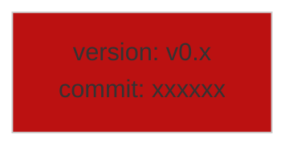
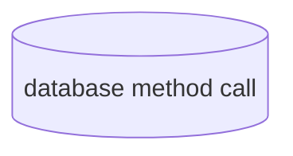
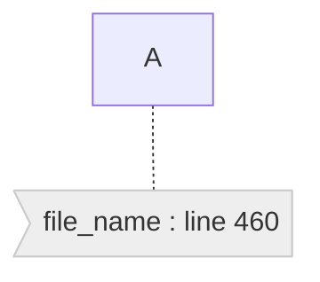
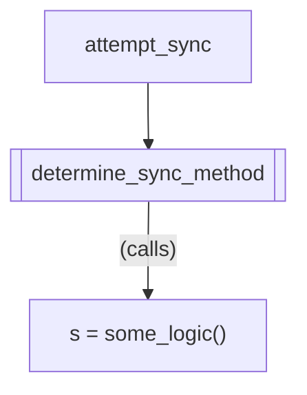
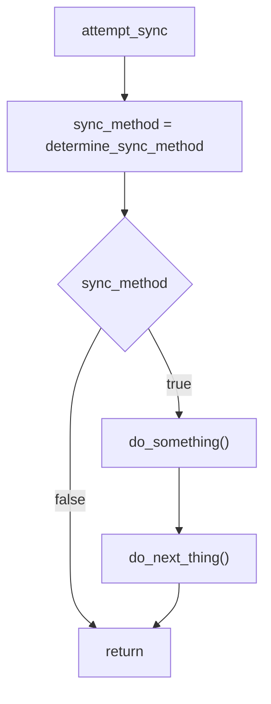

  

# Top level triggers
1. New message on messaging layer
    1. [Comms](comms/index.md) 
    2. [Incoming blocks](incoming_blocks.md) 
    3. [metadata service](chain_metadata_service.md)
2. New RPC messages
3. Timed triggers
    1. [state machine](state_machine.md)
4. Start up triggers
5. New GRPC messages
6. New CLI messages

# Schema/Diagram key/legend Notation

Commit link and diagram version


Data access is denoted like this, 


Source code link


## Calling a method vs next method in flow

In a flow diagram it's not always clear if an arrow leading to another method or process  is called (as in step into) or if it is the next method called in sequence. 
We suggest using the following notation to make it clear.

For example, consider this code:

```rust
fn attempt_sync() {
    let sync_method = determine_sync_method();
    if sync_method {
        do_something();
        do_next_thing();
    }
}

fn determine_sync_method() -> bool {
    let sync_method = some_logic();
    if sync_method {
        some_other_logic();
    }
    sync_method
}
```





> A subgraph can also be used, but sometimes it might be easier to use the "(calls)" notation to show that a process is
> inside of a method call, and not the next one in sequence.
