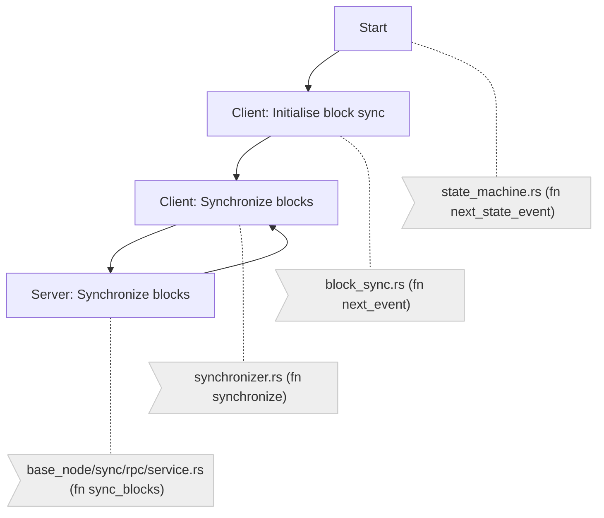

# Block Sync

## Overview

Block sync (`BlockSync::next_event(..)`) is triggered when the state machine (`BaseNodeStateMachine`) transitions into `BaseNodeState::BlockSync(peers)`. It utilizes an asynchronous event driven synchronizer pattern implemented in `BlockSynchronizer` to synchronize blocks with the latter employing three dynamic function closures (`Hooks`) for `on_starting`, `on_progress` and `on_complete`

### Flow

### Sequence

