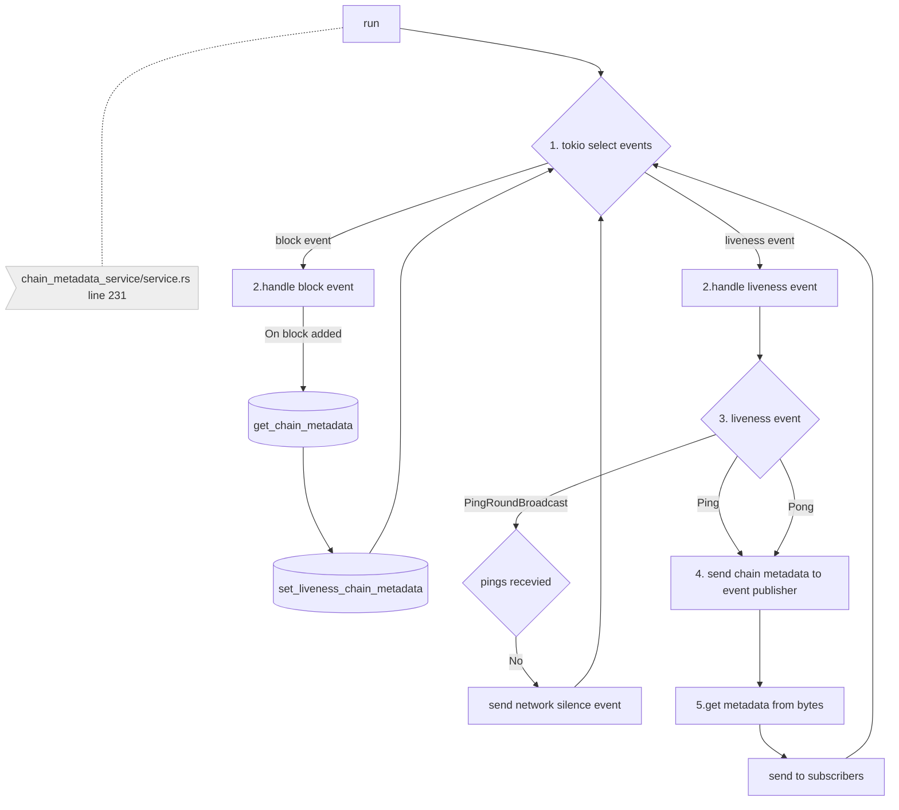

## chain metadata service

```mermaid
flowchart TD
    A -..- N1>chain_metadata_service/service.rs line 231]
    A[run] --> B{1. tokio select events}
    B --> |block event| C[2.handle block event]
    B --> |liveness event| D[2.handle liveness event]
    C --> |On block added|E[(get_chain_metadata)]
    E --> F[(set_liveness_chain_metadata)]
    D --> G{3. liveness event}
    G --> |PingRoundBroadcast|I{pings recevied}
    I --> |No|J[send network silence event]
    G --> |Ping|H[4. send chain metadata to event publisher]
    G --> |Pong|H[4. send chain metadata to event publisher]
    H --> K[5.get metadata from bytes]
    K --> L[send to subscribers]
    F --> B
    J --> B
    L --> B

    N1:::note
    classDef note fill:#eee,stroke:#ccc
    
```