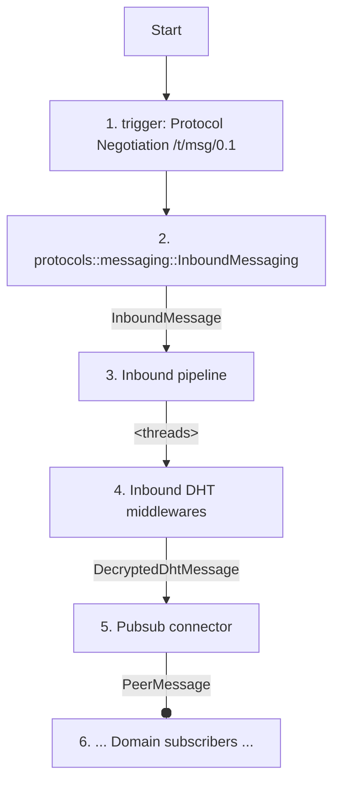
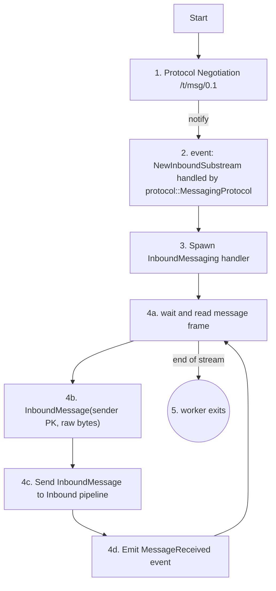
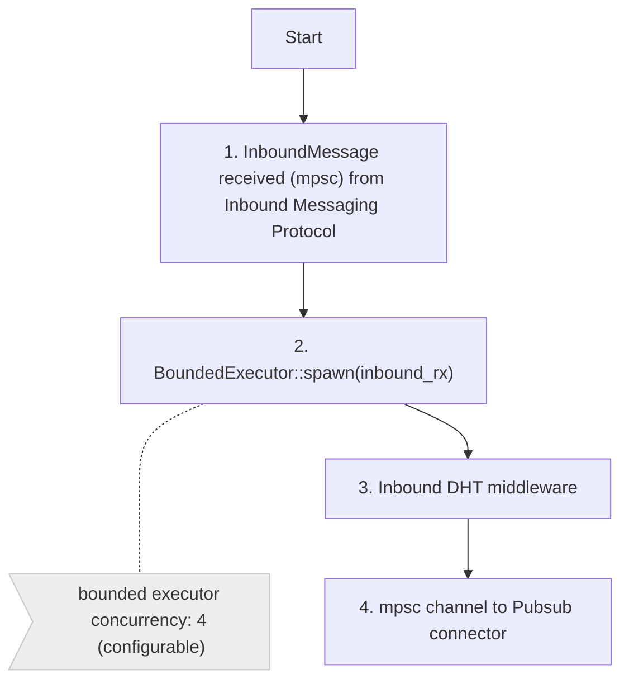
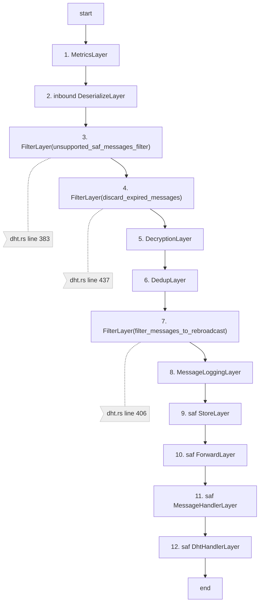
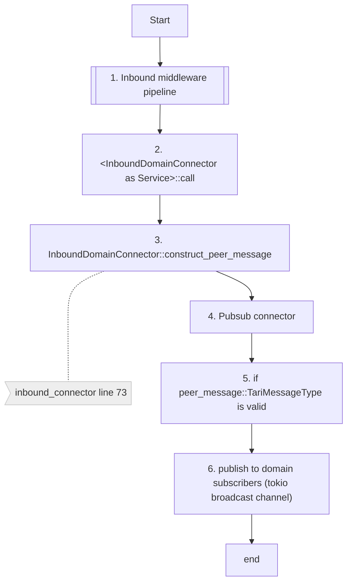
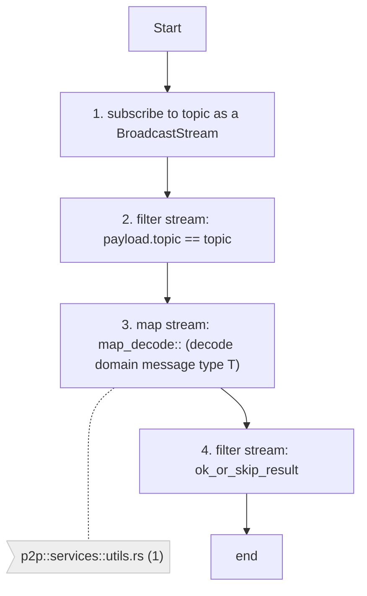

# Inbound message pipeline

## Overview
Inbound messaging covers the raw messages being read off the substream and passed through the inbound pipeline
to the domain pubsub connector. Each message that comes in is processed by the inbound DHT messaging middlewares
in its own tokio task. The number of concurrent tasks spawned is limited by the BoundedExecutor. From there they arrive
at the pubsub connector which 
Services that are interested in network messages, in the _minotari node_ and _minotari console wallet_ subscribe to a
particular `TariMessageType`s 

> TODO: Add in overview diagram of bigger system and where this fits in

<figcaption>Fig. 1. Inbound message stack overview</figcaption>

### Inbound Messaging Protocol 

<figcaption>Fig. 2. Yamux substream to inbound messaging</figcaption>

### Inbound Message Pipeline

<figcaption>Fig. 3</figcaption>

### Inbound DHT middleware

<figcaption>Fig. 4. Inbound message pipeline</figcaption>

# pubsub connector

<figcaption>Fig. 5</figcaption>

Subscribing to message topics (TariMessageType) sent by the PubsubConnector.
This is the general process followed however this is up to the domain implementer.

<figcaption>Fig. 6 - subscription to inbound messages coming from the pubsub connector _Fig. 4_</figcaption>

* (1) [p2p/services/utils.rs:43](https://github.com/tari-project/tari/blob/08ba91af3031aa2a3c5357a5f494f95f9c8a0049/base_layer/p2p/src/services/utils.rs#L43)
* 

