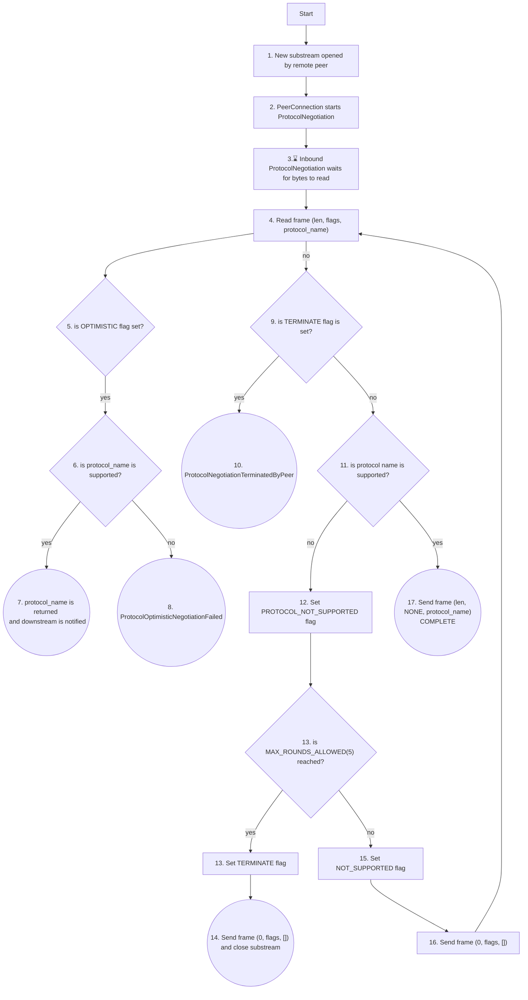

# Protocol negotiation

## Overview
Protocol negotiation occurs when a peer is interested in speaking a particular protocol with another peer
over a yamux substream. Each protocol MUST have a unique variable-length byte-string identifier. Once a 
substream is opened, either outbound or inbound, the protocol negotiation message must be sent within a specific timeout.

If a peer has prior knowledge of the protocols supported by a peer, the node MAY set the OPTIMISTIC flag which,
if successful, incurs almost zero additional time to complete. This is because the negotiation message is sent and 
the upstream protocol immediately continues. If unsuccessful, the remote peer immediately closes the substream.

The non-optimistic case can be used otherwise, however this requires a reply from the responder before the upstream
protocol can begin. This allows peers to negotiate protocol substreams without prior knowledge of the other peer's 
supported protocols. This is typically occurs when a node has never contacted a peer before. This process may proceed 
for a maximum of 5 rounds before terminating the substream.

The protocol is coded in comms/core/src/protocol/negotiation.rs

### Inbound Protocol negotiation 

Messages are the tuple (length (u8), flags (u8), protocol_name (variable 255 (0xff) max))

<figcaption>Fig. 1. Inbound protocol negotiation</figcaption>