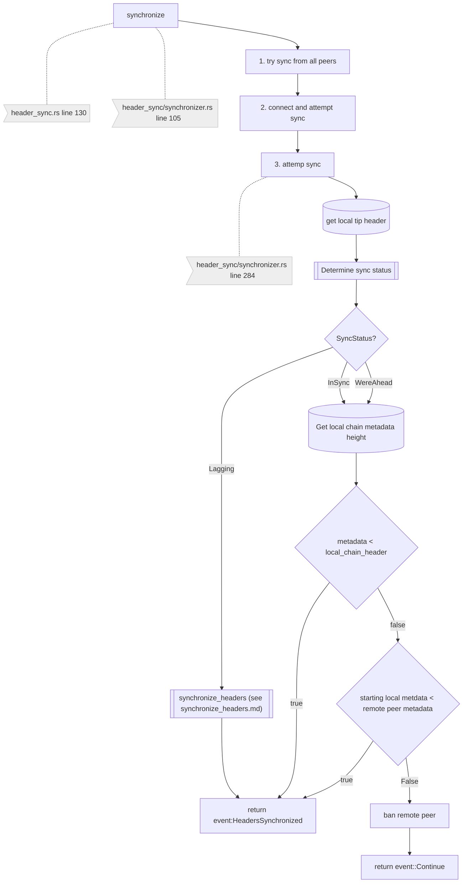
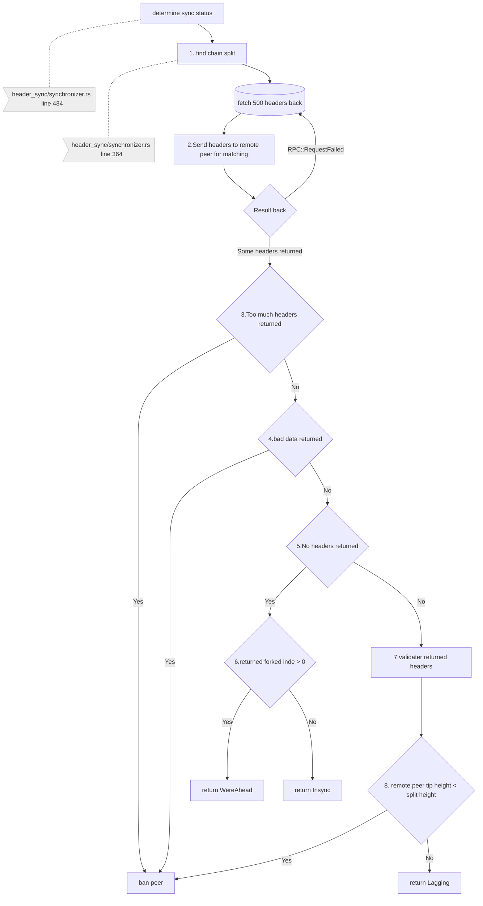
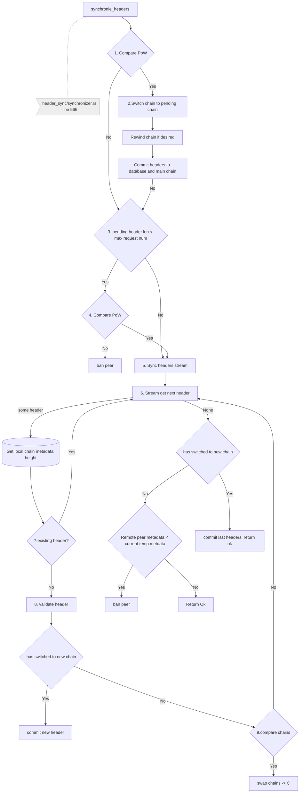

## header sync

## determine sync status


## synchronise headers


```mermaid
flowchart TD
    A[attempt_sync] -->B[determine_sync_status]
    A -..- DB>DB access featch last header]
    B -..- N1>synchronizer.rs line 434]

    B --> C[fn find_chain_split]
    C -..- N2>synchronizer.rs line 364]

    C -->|remote peer| D[fn find_chain_split]
    D -..- N3>sync/rpc/service.rs line 364]

    D -->|GRAPH REMOTE|E[[fn determine_sync_status]]    
    E -..- N1>synchronizer.rs line 434]

    E -->|empty_headers|K[Is fork hash > 0]
    K --> |true| L[Return we are ahread]
    K --> |false|G[Return insync]
    E -->|too many returned|F[ban peer]
    E -->|index >= hashes returned|F[Return ban peer]
    L --> |Check if our meta data has changed|M[ban peer on true]
    G --> |Check if our meta data has changed|M[ban peer on true]
    E -->|iterate over returned headers| H[Validate initial headers]
    H --> I[is split height greater than claimed height]
    I -->|No|F[Return ban peer]
    I --> J[Lagging state]
    J --> N[fn Synchroize_headers]
    N -..- N4>synchronizer.rs line 566]

    N --> O[is intial headers pow's higher than current chain]
    O --> |Yes|P[swap to chain to intial headers]    
    O --> |No|Q[Has peer sent max headers]
    P --> Q[Has peer sent max headers]
    Q --> |No|R[is intial headers pow's higher than current chain]
    R --> |No|S[ban peer]
    R --> |Yes|T[Exit header sync, go to block sync]
    Q --> |Yes|U[iterate over header stream]
    U --> V[Does it follow prev header]
    V --> |No|W[ban peer]
    V --> |Yes|X[Does it already exist in chain] 
    X --> |Yes|W[ban peer]
    X --> |No|Y[validate] 
    Y --> |No|W[ban peer]
    Y --> |Yes|Z[Have we swapped to new chain]
    Z --> |Yes|AA[Add to main chain]
    Z --> |No|AB[is the new temp chain's pow higher than the local chain]
    AB --> |Yes|AC[Swap to new chain]
    AC --> AD[End of header stream]
    Z --> AD[End of header stream]
    AD --> |No|U
    AD --> |Yes|AE[Have we swapped chains]
    AE --> |No|AF[is the temp chains'pow less than originally claimed by the peer]
    AF --> |Yes|W
    AF --> |No|AG[local chain is higher, exit sync]
    AE --> AH[is new chains'pow less than originally claimed by the peer]
    AH --> |Yes|W
    AH --> |No|AI[Go on to block sync]

    N1:::note
    N2:::note
    N3:::note
    N4:::note
    DB:::note
    classDef note fill:#eee,stroke:#ccc
    ```