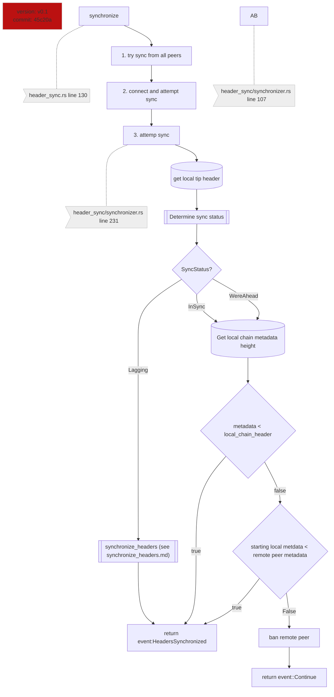
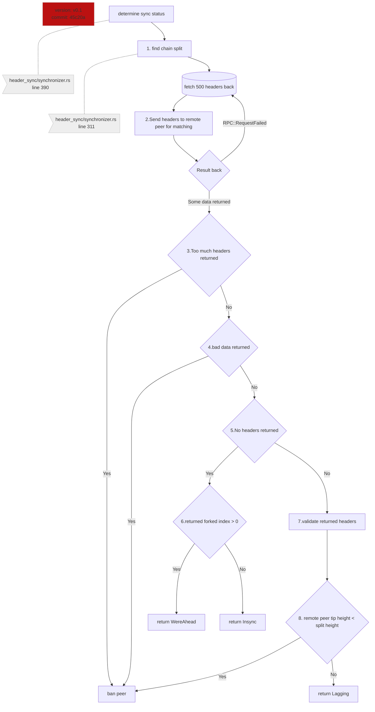
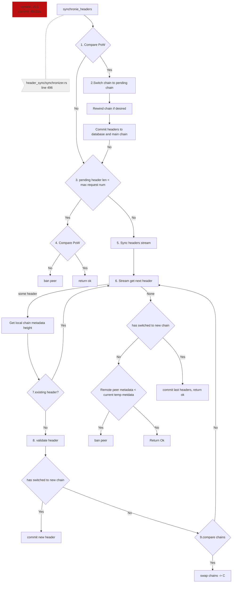

## header sync

```mermaid
flowchart TD
    META[version: v0.1</br>commit: 45c20a]
    A -..- N1>header_sync.rs line 130]
    AB-..- N2>header_sync/synchronizer.rs line 107]
    A[synchronize] --> B[1. try sync from all peers]
    B --> C[2. connect and attempt sync]
    C --> D[3. attemp sync]
    D -..- N3>header_sync/synchronizer.rs line 231]
    D --> E[(get local tip header)]
    E --> F[["Determine sync status"]]
    F--> G{SyncStatus?}    
    G --> |Lagging|M[["synchronize_headers (see synchronize_headers.md)"]]
    G --> |InSync|H[(Get local chain metadata height)]
    G --> |WereAhead|H[(Get local chain metadata height)]
    H --> I{metadata < local_chain_header}
    I --> |true|J[return event:HeadersSynchronized]
    I --> |false|K{starting local metdata < remote peer metadata}
    K --> |true|J
    K --> |False| L[ban remote peer]
    L --> N[return event::Continue]
    M --> J


    N1:::note
    N2:::note
    N3:::note
    META:::meta
   classDef note fill:#eee,stroke:#ccc
   classDef meta fill:#b11,stroke:#ccc
```
## determine sync status

```mermaid
flowchart TD
    META[version: v0.1</br>commit: 45c20a]
    A -..- N1>header_sync/synchronizer.rs line 390]
    A[determine sync status] --> B[1. find chain split]
    B -..- N2>header_sync/synchronizer.rs line 311]
    B --> C[(fetch 500 headers back)]
    C --> D[2.Send headers to remote peer for matching]
    D --> E{Result back}
    E -->|RPC::RequestFailed|C  
    E -->|Some data returned|F{3.Too much headers returned}
    F --> |Yes| G[ban peer]
    F --> |No|I{4.bad data returned}
    I --> |Yes| G
    I --> |No|J{5.No headers returned}
    J --> |Yes|K{6.returned forked index > 0}
    K --> |Yes|L[return WereAhead]
    K --> |No|M[return Insync]
    J --> |No|N[7.validate returned headers]
    N --> O{8. remote peer tip height < split height}
    O --> |Yes| G
    O --> |No|P[return Lagging]


    N1:::note
    N2:::note
    META:::meta
   classDef note fill:#eee,stroke:#ccc
   classDef meta fill:#b11,stroke:#ccc
```

## synchronise headers

```mermaid
flowchart TD
    META[version: v0.1</br>commit: 45c20a]
    A -..- N1>header_sync/synchronizer.rs line 496]
    A[synchronie_headers] --> B{1. Compare PoW}
    B --> |Yes| C[2.Switch chain to pending chain]
    C --> D[Rewind chain if desired]
    D --> E[Commit headers to database and main chain]
    B --> |No|F{3. pending header len < max request num}
    E --> |No|F
    F --> |Yes|G{4. Compare PoW}
    G --> |No|H[ban peer]
    F --> |No| I[5. Sync headers stream]
    G --> |Yes| IA[return ok]
    I --> J[6. Stream get next header]
    J -->|some header| K[Get local chain metadata height]
    K --> L{7.existing header?}
    L --> |Yes|J
    L --> |No|M[8. validate header]
    M --> N{has switched to new chain}
    N --> |Yes|O[commit new header]
    N --> |No| P{9.compare chains}
    P --> |Yes| Q[swap chains -> C]
    P --> |No| J
    J --> |None| R{has switched to new chain}
    R --> |No|S{Remote peer metadata < current temp metdata}
    R --> |Yes|V[commit last headers, return ok]
    S --> |Yes|T[ban peer]
    S --> |No| U[Return Ok]

    N1:::note
    META:::meta
   classDef note fill:#eee,stroke:#ccc
   classDef meta fill:#b11,stroke:#ccc
```
