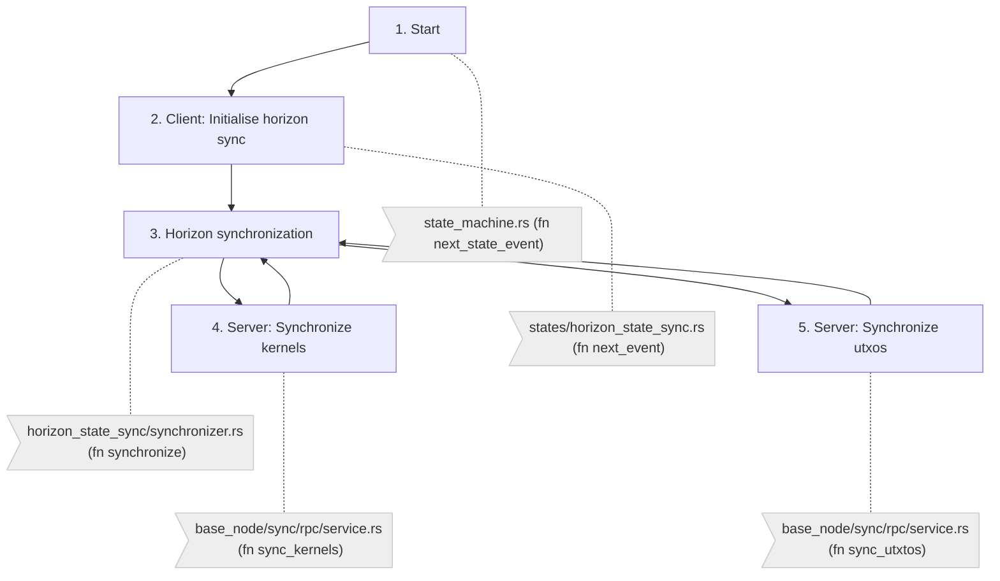
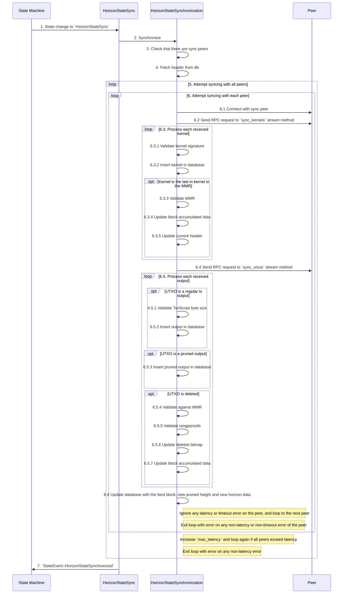

# Horizon sync

## Overview

Horizon sync triggers when the state machine (`state_machine_service/state_machine.rs`) transitions from `DecideNextSync` to `ProceedToHorizonSync`. This happens after the header is successfully synchronized (`HeaderSynchronized` event happens) and the base node is in **pruning mode** (i.e. `pruning_horizon` is > `0`).

Then, the state machine transitions from `ProceedToHorizonSync` to the `HorizonStateSync` state, where we check that we are not already synchronized (in that case we exit the horizon state with a successful `HorizonStateSynchronized` event).

If we are not already synchronized, the `HorizonStateSync` starts an event driven synchronizer (`HorizonStateSynchronization`) to synchronize with peers from tip header back to pruning horizon. At a high level, the horizon synchronizer performs:
* **Kernel** synchronization: fetches all required kernels from peers (RPC `sync_kernels`) and validates the merkle root
* **Output** synchronization: fetches all required outputs from peers (RPC `sync_utxos`) and validates the rangeproofs

After the horizon is synchronized, the state machine will transition to:
* `BlockSync` state if the horizon sync was successful (`HorizonStateSynchronized` event)
* `Waiting` state if the horizon sync failed (`HorizonStateSyncFailure` event)

## Flow diagram

## Sequence diagram

