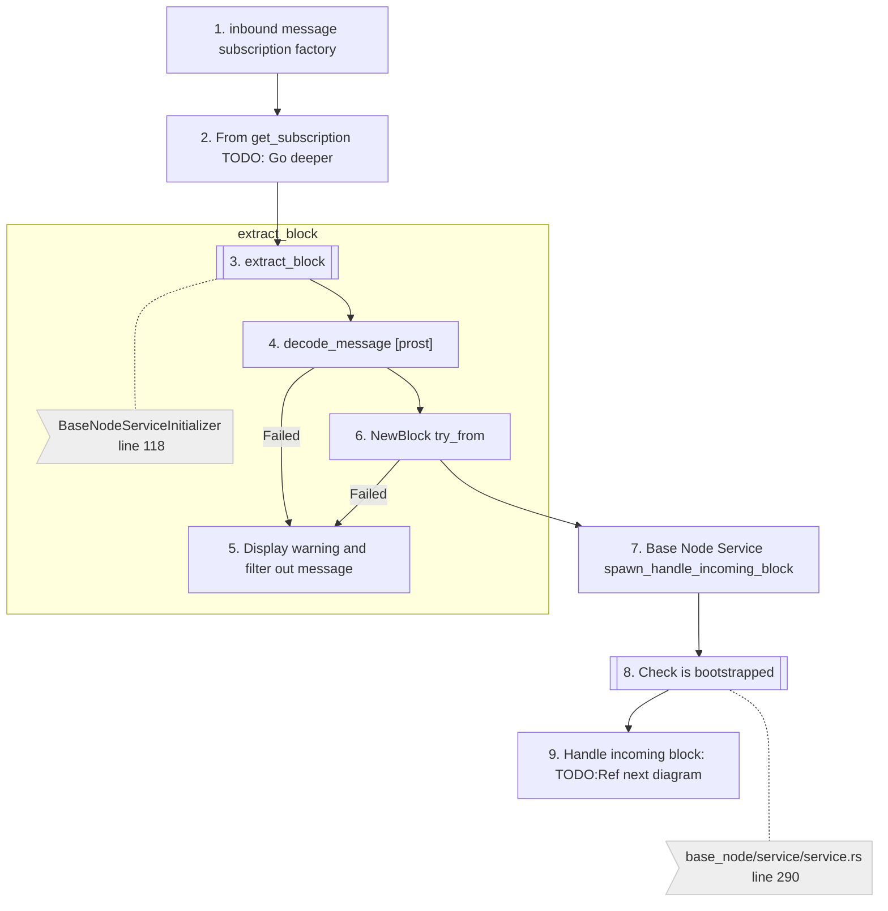
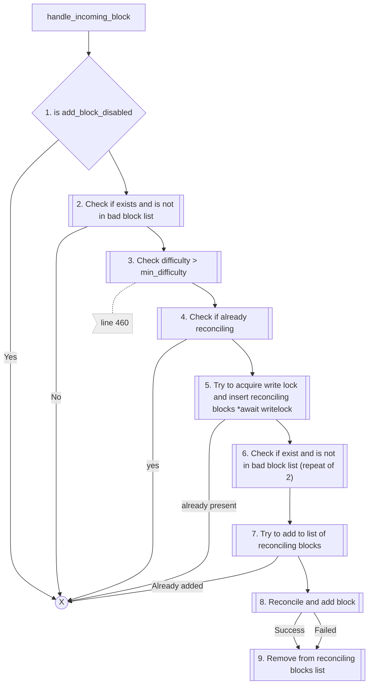

# Incoming Blocks

## Overview
This process handles any incoming blocks that are propagated to a base node. This is different from the sync process 
where the node is actively requesting blocks from other nodes. 

## Prerequisites

See [Common message pipeline](common_message_pipeline.md) for details about how the messages are received and passed to this process.

## Incoming block preprocessing
After the pubsub connector has received the message, it is extracted as block and passed to the base node service.

## Incoming block handling

