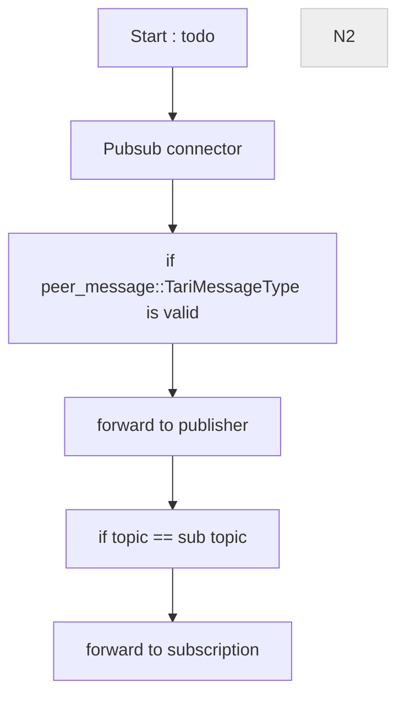

# pubsub connector

```mermaid

flowchart TD
   A[Start : todo]--> B[Pubsub connector]
   B --> C[if peer_message::TariMessageType is valid ]
   C --> D[forward to publisher]
   D --> E[if topic == sub topic]
   E --> F[forward to subscription]

    N2:::note
    classDef note fill:#eee,stroke:#ccc


```

# incoming block pre.

```mermaid

flowchart TD
    A[inbound message subscription factory] --> B["From get_subscription TODO: Go deeper"]
    B --> C[[extract_block]]
    subgraph extract_block 
   
    C -..- N1>BaseNodeServiceInitializer line 118]
    C --> D["decode_message [prost]"]
    D --Failed --> S[Display warning and filter out message]
    D --> E[NewBlock try_from]
    E --Failed--> S
    
    end
    E -->E1[Base Node Service spawn_handle_incoming_block] --> F[[Check is bootstrapped]]
    F -..- N2>"base_node/service/service.rs line 290"]
    F --> G[Handle incoming block: TODO:Ref next diagram]
    N1:::note
    N2:::note
    classDef note fill:#eee,stroke:#ccc

```

# Incoming block flow

```mermaid
flowchart TD
    A[handle_incoming_block] --> B{1. is add_block_disabled}
    B -- Yes --> X((X))
    B --> C[[2. Check if exists and is not in bad block list]]
    C -->|No| X
    C --> D[[3. Check difficulty > min_difficulty]]
    D -.- N1>line 460]
    N1:::note
    D --> E[[4. Check if already reconciling]]
    E --> |yes| X
    E --> F[[5. Try to acquire write lock and insert reconciling blocks *await writelock]]
    F -- already present --> X
    F --> G[["6. Check if exist and is not in bad block list (repeat of 2)"]]
    G --> H[[7. Try to add to list of reconciling blocks]]
    H -- Already added --> X
    H --> I[[8. Reconcile and add block]]
    I -- Success --> J[[9. Remove from reconciling blocks list]]
    I -- Failed --> J
    classDef note fill:#eee,stroke:#ccc
```

