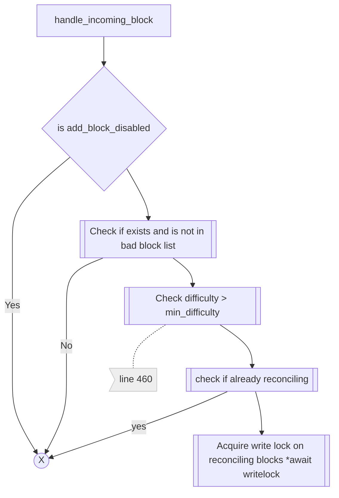

# Incoming block flow

```mermaid
flowchart TD
    A[handle_incoming_block] --> B{is add_block_disabled}
    B -- Yes --> X((X))
    B --> C[[Check if exists and is not in bad block list]]
    C -->|No| X
    C --> D[[Check difficulty > min_difficulty]]
    D -.- N1>line 460]
    N1:::note
    D --> E[[check if already reconciling]]
    E --> |yes| X
    E --> F[[Acquire write lock on reconciling blocks *await writelock]]
    classDef note fill:#eee,stroke:#ccc
```
