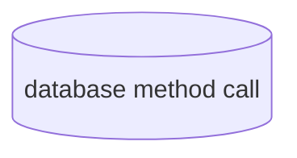
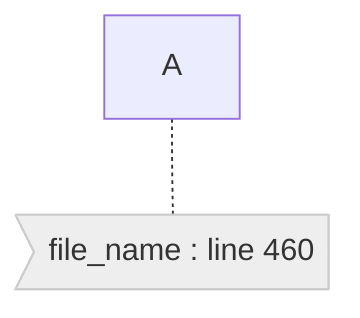
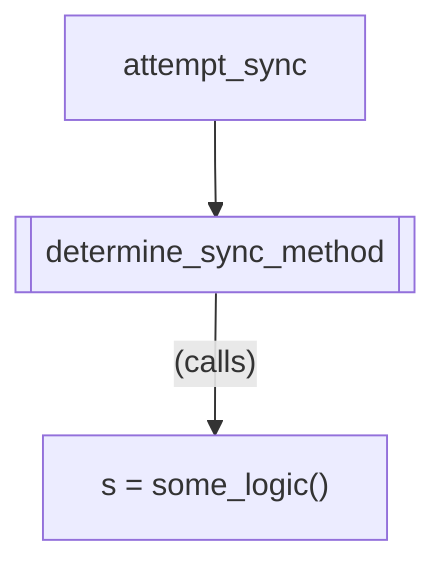
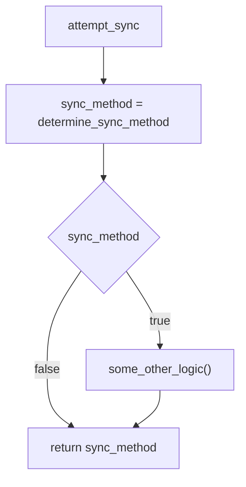
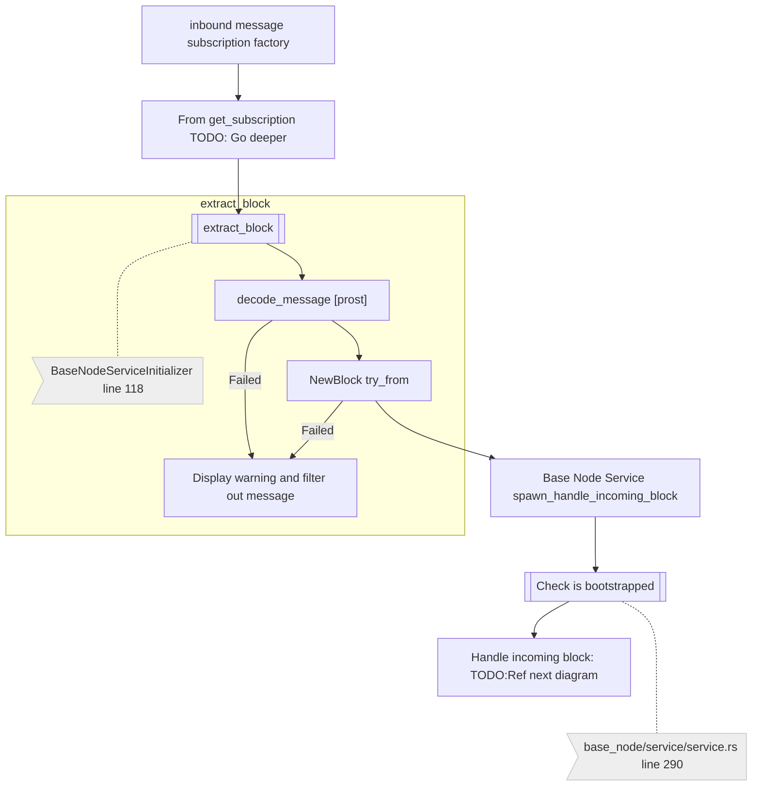
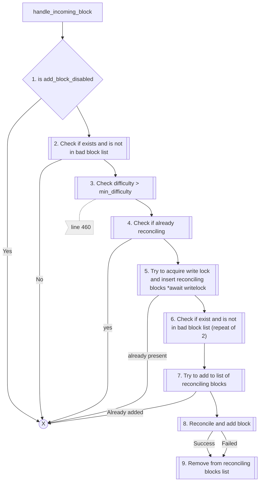

  

# Top level triggers
1. New message on messaging layer
    1. TODO: breakdown into individual messages
    2. Blocks
    3. metadata?
2. New RPC messages?
    1. Wallet messages?
4. Timed triggers
    1. Are there any of these? (Maybe in state machine)
    2. Liveness maybe?
3. Start up triggers
3. New GRPC messages
4. New CLI messages  (Maybe these can be compiled out completely)


## Other diagrams
1. Important database access methods


# Schema/Diagram key/legend Notation

Data access is denoted like this, 


Source code link


## Calling a method vs next method in flow

In a flow diagram it's not always clear if an arrow leading to another method or process  is called (as in step into) or if it is the next method called in sequence. 
We suggest using the following notation to make it clear.

For example, consider this code:

```rust
fn attempt_sync() {
    let sync_method = determine_sync_method();
    if sync_method {
        do_something();
        do_next_thing();
    }
}

fn determine_sync_method() -> bool {
    let sync_method = some_logic();
    if sync_method {
        some_other_logic();
    }
    sync_method
}
```





> A subgraph can also be used, but sometimes it might be easier to use the "(calls)" notation to show that a process is
> inside of a method call, and not the next one in sequence.

```mermaid

# pubsub connector

```mermaid

flowchart TD
   A[Start : todo]--> B[Pubsub connector]
   B --> C[if peer_message::TariMessageType is valid ]
   C --> D[forward to publisher]
   D --> E[if topic == sub topic]
   E --> F[forward to subscription]

    N2:::note
    classDef note fill:#eee,stroke:#ccc

```

# incoming block pre.




# Incoming block flow



