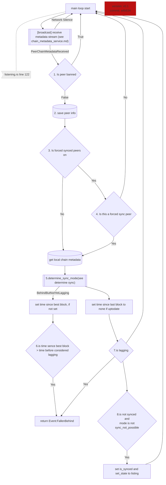
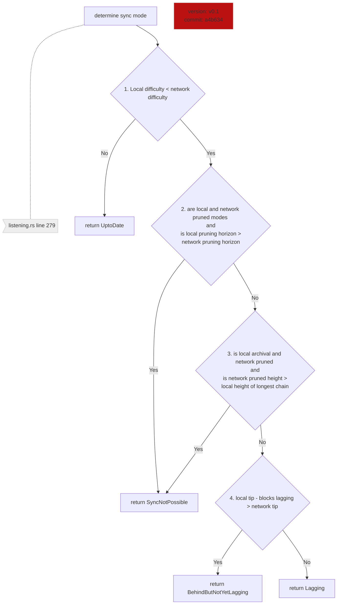

## Listening state

```mermaid
flowchart TD
    A[main loop start] -..- N1>listening.rs line 122]
    N3[version: v0.1</br>commit: a4b634]
    AA --> |Network Silence| A
    A --> AA[["[broadcast] receive metadata stream (see chain_metadata_service.md)"]]
    AA --> |PeerChainMetadataReceived| B{1. Is peer banned}
    B --> |True|A
    B --> |False| C[(2. save peer info)]
    C --> D{3. Is forced synced peers on}
    D --> |Yes|E{4. Is this a forced sync peer}
    E --> |No| A
    D --> |No| F[(get local chain metadata)]
    E --> |Yes| F
    F --> I[["5.determine_sync_mode(see determine sync)"]]
    I --> |BehindButNotYetLagging|J[set time since best block, if not set]
    J --> K{6.is time sence best block > time before considered lagging}
    K --> |Yes|M[return Event:FallenBehind]
    I --> N[set time since last block to none if uptodate]    
    N --> O{7.is lagging}
    O --> |Yes|M
    O --> P{8.is not synced </br> and </br> mode is not sync_not_possible}
    P --> |Yes|Q[set is_synced and set_state to listing]
    O --> A
    Q --> A

    
    N1:::note
    N3:::meta
   classDef note fill:#eee,stroke:#ccc
   classDef meta fill:#b11,stroke:#ccc
```

## determine sync

```mermaid
flowchart TD
    A[determine sync mode] -..- N1>listening.rs line 279]
    N3[version: v0.1</br>commit: a4b634]
    A--> B{1. Local difficulty < network difficulty}
    B --> |No| C[return UptoDate]
    B --> |Yes| D{2. are local and network pruned modes </br> and </br> is local pruning horizon > network pruning horizon}
    D --> |Yes| E[return SyncNotPossible]
    D --> |No| F{3. is local archival and network pruned </br> and </br> is network pruned height > local height of longest chain }
    F --> |Yes| E[return SyncNotPossible]
    F --> |No|G{4. local tip - blocks lagging > network tip}
    G --> |Yes| I[return BehindButNotYetLagging]
    G --> |No| J[return Lagging]

    N1:::note
    N3:::meta
   classDef note fill:#eee,stroke:#ccc
   classDef meta fill:#b11,stroke:#ccc
```