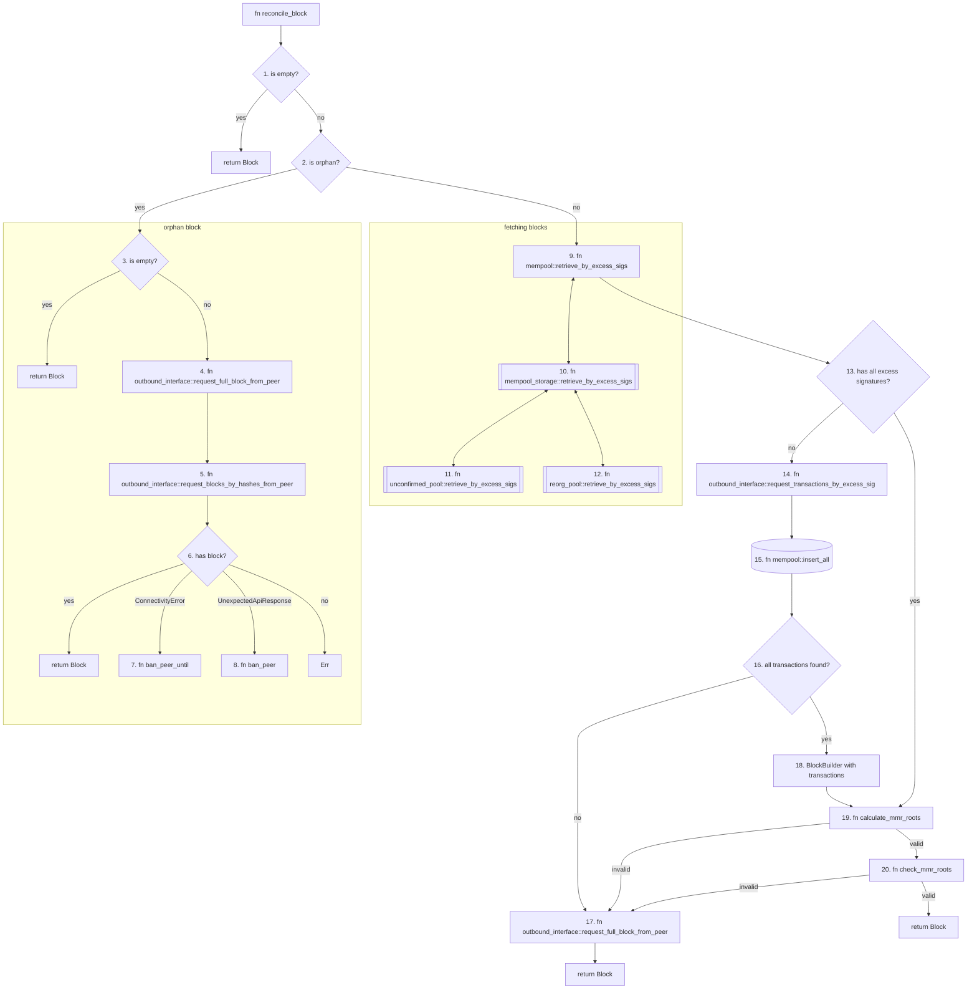

# Reconcile Block

## Overview
This flow shows us how blocks are reconciled  ...
Blocks are tirggered for reconciliation in one location via an incoming new block message.

## Prerequisites

See [Common message pipeline](common_message_pipeline.md) for details about how the messages are received and passed to this process.

## Block reconciliation and addition

