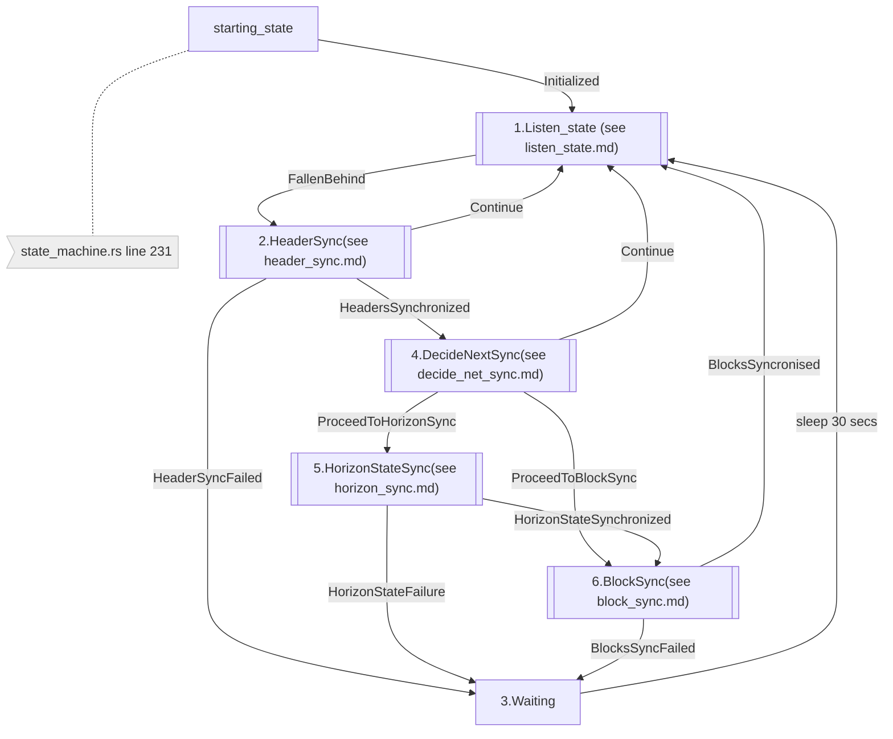

## state machine

```mermaid
flowchart TD
    A -..- N1>state_machine.rs line 231]
    A[starting_state] --> |Initialized|B[["1.Listen_state (see listen_state.md)"]]
    B --> |FallenBehind| C[["2.HeaderSync(see header_sync.md)"]]
    C --> |Continue|B
    C --> |HeaderSyncFailed|D[3.Waiting]
    D --> |sleep 30 secs|B
    C --> |HeadersSynchronized|E[["4.DecideNextSync(see decide_net_sync.md)"]]
    E --> |Continue|B
    E --> |ProceedToHorizonSync|F[["5.HorizonStateSync(see horizon_sync.md)"]]
    E --> |ProceedToBlockSync|G[["6.BlockSync(see block_sync.md)"]]
    F --> |HorizonStateSynchronized|G
    F --> |HorizonStateFailure|D
    G --> |BlocksSyncronised|B
    G --> |BlocksSyncFailed|D

    N1:::note
    classDef note fill:#eee,stroke:#ccc
```
